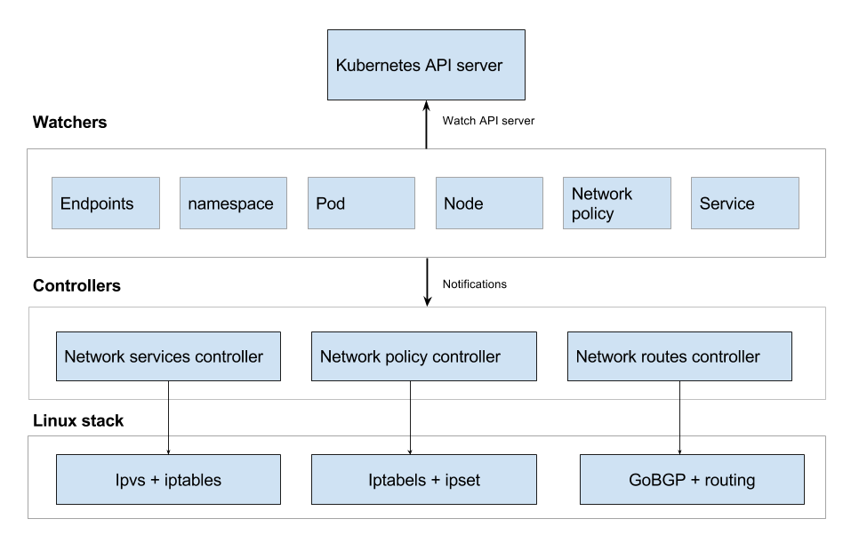

# Kube-router Documentation

## Architecture

Kube-router is built around concept of watchers and controllers. Watchers use Kubernetes watch API to get notification on events related to create, update, delete of Kubernetes objects. Each watcher gets notification related to a particular API object. On receiving an event from API server, watcher broadcasts events. Controller registers to get event updates from the watchers and act up on the events.

Kube-router consists of 3 core controllers and multiple watchers as depicted in below diagram.



## See Kube-router in action

#### Network Services Controller

Network services controller is responsible for reading the services and endpoints information from Kubernetes API server and configure IPVS on each cluster node accordingly.

Please our read blog for design details and pros and cons compared to iptables based Kube-proxy
https://cloudnativelabs.github.io/post/2017-05-10-kube-network-service-proxy/

Demo of Kube-router's IPVS based Kubernetes network service proxy

[](https://asciinema.org/a/120312)

Features:
- round robin load balancing
- client IP based session persistence
- source IP is preserved if service controller is used in conjuction with network routes controller (kube-router with --run-router flag)
- option to explicitly masquerade (SNAT) with --masquerade-all flag

#### Network Policy Controller

Network policy controller is responsible for reading the namespace, network policy and pods information from Kubernetes API server and configure iptables accordingly to provide ingress filter to the pods.

Kube-router supports the networking.k8s.io/NetworkPolicy API or network policy V1/GA
[semantics](https://github.com/kubernetes/kubernetes/pull/39164#issue-197243974) and also network policy beta semantics. 

Please read blog for design details of Network Policy controller
https://cloudnativelabs.github.io/post/2017-05-1-kube-network-policies/

Demo of Kube-router's iptables based implementaton of network policies

[](https://asciinema.org/a/120735)

#### Network Routes Controller

Network routes controller is responsible for reading pod CIDR allocated by controller manager to the node, and advertises the routes to the rest of the nodes in the cluster (BGP peers). Use of BGP is transperent to user for basic pod-to-pod networking.

[](https://asciinema.org/a/120885)

However BGP can be leveraged to other use cases like advertising the cluster ip, routable pod ip etc. Only in such use-cases understanding of BGP and configuration is required. Please see below demo how kube-router advertises cluster IP and pod cidrs to external BGP router
[](https://asciinema.org/a/121635)

## User Guide

### Try Kube-router with cluster installers

The best way to get started is to deploy Kubernetes with Kube-router is with a cluster installer.

#### kops
Please see the [steps](https://github.com/cloudnativelabs/kube-router/blob/master/Documentation/kops.md) to deploy Kubernetes cluster with Kube-router using [Kops](https://github.com/kubernetes/kops)

#### bootkube
Please see the [steps](https://github.com/cloudnativelabs/kube-router/tree/master/contrib/bootkube) to deploy Kubernetes cluster with Kube-router using [bootkube](https://github.com/kubernetes-incubator/bootkube)

#### kubeadm
Please see the [steps](https://github.com/cloudnativelabs/kube-router/blob/master/Documentation/kubeadm.md) to deploy Kubernetes cluster with Kube-router using [Kubeadm](https://kubernetes.io/docs/setup/independent/create-cluster-kubeadm/)

### deployment

Depending on what functionality of kube-router you want to use, multiple deployment options are possible. You can use the flags `--run-firewall`, `--run-router`, `--run-service-proxy` to selectively enable only required functionality of kube-router.

Also you can choose to run kube-router as agent running on each cluster node. Alternativley you can run kube-router as pod on each node through daemonset.

### command line options

```
Usage of ./kube-router:
    --advertise-cluster-ip            Add Cluster IP to the RIB and advertise to peers.
    --cleanup-config                  Cleanup iptables rules, ipvs, ipset configuration and exit.
    --cluster-asn string              ASN number under which cluster nodes will run iBGP.
    --config-sync-period duration     The delay between apiserver configuration synchronizations (e.g. '5s', '1m').  Must be greater than 0. (default 1m0s)
    --enable-pod-egress               SNAT traffic from Pods to destinations outside the cluster. (default true)
    --hairpin-mode                    Add iptable rules for every Service Endpoint to support hairpin traffic.
-h, --help                            Print usage information.
    --hostname-override string        Overrides the NodeName of the node. Set this if kube-router is unable to determine your NodeName automatically.
    --iptables-sync-period duration   The delay between iptables rule synchronizations (e.g. '5s', '1m'). Must be greater than 0. (default 1m0s)
    --ipvs-sync-period duration       The delay between ipvs config synchronizations (e.g. '5s', '1m', '2h22m'). Must be greater than 0. (default 1m0s)
    --kubeconfig string               Path to kubeconfig file with authorization information (the master location is set by the master flag).
    --masquerade-all                  SNAT all traffic to cluster IP/node port.
    --master string                   The address of the Kubernetes API server (overrides any value in kubeconfig).
    --nodes-full-mesh                 Each node in the cluster will setup BGP peering with rest of the nodes. (default true)
    --peer-asn string                 ASN number of the BGP peer to which cluster nodes will advertise cluster ip and node's pod cidr.
    --peer-router string              Comma sepereated list of ip address of the external routers to which all nodes will peer and advertise the cluster ip and pod cidr's.
    --routes-sync-period duration     The delay between route updates and advertisements (e.g. '5s', '1m', '2h22m'). Must be greater than 0. (default 1m0s)
    --run-firewall                    Enables Network Policy -- sets up iptables to provide ingress firewall for pods. (default true)
    --run-router                      Enables Pod Networking -- Advertises and learns the routes to Pods via iBGP. (default true)
    --run-service-proxy               Enables Service Proxy -- sets up IPVS for Kubernetes Services. (default true)
```

### requirements

- Kube-router need to access kubernetes API server to get information on pods, services, endpoints, network policies etc. The very minimum information it requires is the details on where to access the kubernetes API server. This information can be passed as `kube-router --master=http://192.168.1.99:8080/` or `kube-router --kubeconfig=<path to kubeconfig file>`.

- If you run kube-router as agent on the node, ipset package must be installed on each of the nodes (when run as daemonset, container image is prepackaged with ipset)

- If you choose to use kube-router for pod-to-pod network connectivity then Kubernetes controller manager need to be configured to allocate pod CIDRs by passing `--allocate-node-cidrs=true` flag and providing a `cluster-cidr` (i.e. by passing --cluster-cidr=10.1.0.0/16 for e.g.)

- If you choose to run kube-router as daemonset, then both kube-apiserver and kubelet must be run with `--allow-privileged=true` option

- If you choose to use kube-router for pod-to-pod network connecitvity then Kubernetes cluster must be configured to use CNI network plugins. On each node CNI conf file is expected to be present as /etc/cni/net.d/10-kuberouter.conf .`bridge` CNI plugin and `host-local` for IPAM should be used. A sample conf file that can be downloaded as `wget -O /etc/cni/net.d/10-kuberouter.conf https://raw.githubusercontent.com/cloudnativelabs/kube-router/master/cni/10-kuberouter.conf`

### running as daemonset

This is quickest way to deploy kube-router (**dont forget to ensure the requirements**). Just run

```
kubectl apply -f https://raw.githubusercontent.com/cloudnativelabs/kube-router/master/daemonset/kube-router-all-service-daemonset.yaml
```

Above will run kube-router as pod on each node automatically. You can change the arguments in the daemonset definition as required to suit your needs. Some samples can be found at https://github.com/cloudnativelabs/kube-router/tree/master/daemonset with different argument to select set of the services kube-router should run.

### running as agent

You can choose to run kube-router as agent runnng on each node. For e.g if you just want kube-router to provide ingress firewall for the pods then you can start kube-router as
```
kube-router --master=http://192.168.1.99:8080/ --run-firewall=true --run-service-proxy=false --run-router=false
```

### cleanup configuration

You can clean up all the configurations done (to ipvs, iptables, ip routes) by kube-router on the node by running
```
 kube-router --cleanup-config
```

### trying kube-router as alternative to kube-proxy

If you have a kube-proxy in use, and want to try kube-router just for service proxy you can do
```
kube-proxy --cleanup-iptables
```
followed by
```
kube-router --master=http://192.168.1.99:8080/ --run-service-proxy=true --run-firewall=false --run-router=false
```
and if you want to move back to kube-proxy then clean up config done by kube-router by running
```
 kube-router --cleanup-config
```
and run kube-proxy with the configuration you have.
- [General Setup](/README.md#getting-started)

### Hairpin Mode

Communication from a Pod that is behind a Service to its own ClusterIP:Port is
not supported by default.  However, It can be enabled per-service by adding the
`kube-router.io/hairpin-mode=` annotation, or for all Services in a cluster by
passing the flag `--hairpin-mode=true` to kube-router.

Additionally, the `hairpin_mode` sysctl option must be set to `1` for all veth
interfaces on each node.  This can be done by adding the `"hairpinMode": true`
option to your CNI configuration and rebooting all cluster nodes if they are
already running kubernetes.

Hairpin traffic will be seen by the pod it originated from as coming from the
Service ClusterIP if it is logging the source IP.

#### Hairpin Mode Example

10-kuberouter.conf
```json
{
    "name":"mynet",
    "type":"bridge",
    "bridge":"kube-bridge",
    "isDefaultGateway":true,
    "hairpinMode":true,
    "ipam": {
        "type":"host-local"
     }
}
```

To enable hairpin traffic for Service `my-service`:
```
kubectl annotate service my-service 'kube-router.io/hairpin-mode='
```


## BGP configuration

[Configuring BGP Peers](bgp.md)
