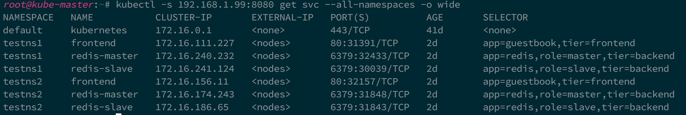
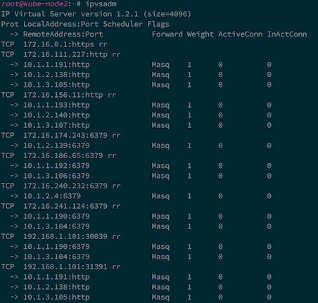
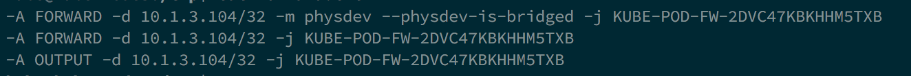
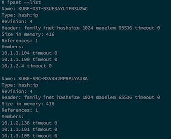

kube-router
==========
Kube-router is a distributed load balancer, firewall and router for Kubernetes. Kube-router can be configured to provide on each cluster node:

- a IPVS/LVS based service proxy on each node for *ClusterIP* and *NodePort* service types, providing service discovery and load balancing
- an ingress firewall for the pods running on the node as per the defined Kubernetes network policies using iptables and ipset
- a BGP router to advertise and learn the routes to the pod IP's for cross-node pod-to-pod connectivity

## Why Kube-router
We have Kube-proxy which provides service proxy and load balancer. We have several addons or solutions like Flannel, Calico, Weave etc to provide cross node pod-to-pod networking. Simillarly there are solutions like Calico that enforce network policies. Then why do we need Kube-router for a similar job? Here is the motivation:

- It is challenging to deploy, monitor and troubleshoot multiple solutions at runtime. These independent solution need to work well together. Kube-router aims to provide operational simplicity by combining all the networking functionality that can be provided at the node in to one cohesive solution. Run Kube-router as daemonset, by just running one command ``kubectl create -f kube-router-daemonset.yaml`` you have solution for pod-to-pod networking, service proxy and firewall on each node.

- Kube-router is motivated to provide optimized solution for performance. Kube-router uses IPVS for service proxy as compared to iptables by Kube-proxy. Kube-router uses solutions like ipsets to optimize iptables rules matching while providing ingress firewall for the pods. For inter-node pod-to-pod communication, routing rules added by kube-router ensures data path is efficient (one hop for pod-to-pod connectivity) with out overhead of overlays.

- Kube-router builds on standard Linux technologies, so you can verify the configuration and troubleshoot with Linux networking tools (ipvsadm, ip route, iptables, ipset etc).

## See it in action

<a href="https://asciinema.org/a/118056" target="_blank"></a>

## Getting Started

### building

**Go version 1.7 or above is required to build kube-router**

All the dependencies are vendored already, so just run  *make build* or *go build -o kube-router kube-router.go* to build
   
Alternatively you can download the prebuilt binary from https://github.com/cloudnativelabs/kube-router/releases

### command line options

```
  --run-firewall                    If false, kube-router won't setup iptables to provide ingress firewall for pods. true by default. 
  --run-router                      If true each node advertise routes the rest of the nodes and learn the routes for the pods. false by default
  --run-service-proxy               If false, kube-router won't setup IPVS for services proxy. true by default.
  --cleanup-config                  If true cleanup iptables rules, ipvs, ipset configuration and exit.
  --masquerade-all                  SNAT all traffic to cluster IP/node port. False by default
  --config-sync-period duration     How often configuration from the apiserver is refreshed. Must be greater than 0. (default 1m0s)
  --iptables-sync-period duration   The maximum interval of how often iptables rules are refreshed (e.g. '5s', '1m'). Must be greater than 0. (default 1m0s)
  --ipvs-sync-period duration       The maximum interval of how often ipvs config is refreshed (e.g. '5s', '1m', '2h22m'). Must be greater than 0. (default 1m0s)
  --kubeconfig string               Path to kubeconfig file with authorization information (the master location is set by the master flag).
  --master string                   The address of the Kubernetes API server (overrides any value in kubeconfig)
  --routes-sync-period duration     The maximum interval of how often routes are advertised and learned (e.g. '5s', '1m', '2h22m'). Must be greater than 0. (default 1m0s)
```

### deployment

Depending on what functionality of kube-router you want to use, multiple deployment options are possible. You can use the flags `--run-firewall`, `--run-router`, `--run-service-proxy` to selectively enable only required functionality of kube-router.

Also you can choose to run kube-router as agent running on each cluster node. Alternativley you can run kube-router as pod on each node through daemonset.

### requirements

- Kube-router need to access kubernetes API server to get information on pods, services, endpoints, network policies etc. The very minimum information it requires is the details on where to access the kubernetes API server. This information can be passed as `kube-router --master=http://192.168.1.99:8080/` or `kube-router --kubeconfig=<path to kubeconfig file>`. If neither `--master` nor `--kubeconfig` option is specified then kube-router will look for kubeconfig at `/var/lib/kube-router/kubeconfig` location.

- If you run kube-router as agent on the node, ipset package must be installed on each of the nodes (when run as daemonset, container image is prepackaged with ipset)

- If you choose to use kube-router for pod-to-pod network connectivity then Kubernetes controller manager need to be configured to allocate pod CIDRs by passing `--allocate-node-cidrs=true` flag and providing a `cluster-cidr` (i.e. by passing --cluster-cidr=10.1.0.0/16 for e.g.)

- If you choose to run kube-router as daemonset, then both kube-apiserver and kubelet must be run with `--allow-privileged=true` option

- If you choose to use kube-router for pod-to-pod network connecitvity then Kubernetes cluster must be configured to use CNI network plugins. On each node CNI conf file is expected to be present as /etc/cni/net.d/10-kuberouter.conf .`bridge` CNI plugin and `host-local` for IPAM should be used. A sample conf file that can be downloaded as `wget -O /etc/cni/net.d/10-kuberouter.conf https://raw.githubusercontent.com/cloudnativelabs/kube-router/master/cni/10-kuberouter.conf`

### running as daemonset

This is quickest way to deploy kube-router. Just run

```
kubectl apply -f https://raw.githubusercontent.com/cloudnativelabs/kube-router/master/daemonset/kube-router-all-service-daemonset.yaml
```

Above will run kube-router as pod on each node automatically. You can change the arguments in the daemonset definition as required to suit your needs. Some samples can be found at https://github.com/cloudnativelabs/kube-router/tree/master/daemonset with different argument to select set of the services kube-router should run.

### running as agent

You can choose to run kube-router as agent runnng on each node. For e.g if you just want kube-router to provide ingress firewall for the pods then you can start kube-router as 
```
kube-router --master=http://192.168.1.99:8080/ --run-firewall=true --run-service-proxy=false --run-router=false
```

### cleanup configuration

You can clean up all the configurations done (to ipvs, iptables, ip routes) by kube-router on the node by running
```
 kube-router --cleanup-config
```

### trying kube-router as alternative to kube-proxy

If you have a kube-proxy in use, and want to try kube-router just for service proxy you can do
```
kube-proxy --cleanup-iptables
```
followed by
```
kube-router --master=http://192.168.1.99:8080/ --run-service-proxy=true --run-firewall=false --run-router=false
```
and if you want to move back to kube-proxy then clean up config done by kube-router by running
```
 kube-router --cleanup-config
```
and run kube-proxy with the configuration you have.

## Theory of Operation

Kube-router can be run as a agent or a pod (through daemonset) on each node and leverages standard Linux technologies **iptables, ipvs/lvs, ipset, iproute2** 

### service proxy and load balancing 

Kube-router uses IPVS/LVS technology built in Linux to provide L4 load balancing. Each of the kubernetes service of **ClusterIP** and **NodePort** type is configured as IPVS virtual service. Each service endpoint is configured as real server to the virtual service.
Standard **ipvsadm** tool can be used to verify the configuration and monitor the active connections. 

Below is example set of services on kubernetes



and the endpoints for the services


and how they got mapped to the ipvs by kube-router



Kube-router watches kubernetes API server to get updates on the services, endpoints and automatically syncs the ipvs
configuration to reflect desired state of services. Kube-router uses IPVS masquerading mode and uses round robin scheduling
currently. Source pod IP is preserved so that appropriate network policies can be applied.

### pod ingress firewall 

Kube-router provides implementation of network policies semantics through the use of iptables, ipset and conntrack.
All the pods in a namespace with 'DefaultDeny' ingress isolation policy has ingress blocked. Only traffic that matches
whitelist rules specified in the network policies are permitted to reach pod. Following set of iptables rules and 
chains in the 'filter' table are used to achieve the network policies semantics.

Each pod running on the node, which needs ingress blocked by default is matched in FORWARD and OUTPUT chains of fliter table 
and send to pod specific firewall chain. Below rules are added to match various cases

- traffic getting switched between the pods on the same node through bridge
- traffic getting routed between the pods on different nodes
- traffic originating from a pod and going through the service proxy and getting routed to pod on same node



Each pod specific firewall chain has default rule to block the traffic. Rules are added to jump traffic to the network policy 
specific policy chains. Rules cover only policies that apply to the destination pod ip. A rule is added to accept the
the established traffic to permit the return traffic.


Each policy chain has rules expressed through source and destination ipsets. Set of pods matching ingress rule in network policy spec
forms a source pod ip ipset. set of pods matching pod selector (for destination pods) in the network policy forms
destination pod ip ipset.


Finally ipsets are created that are used in forming the rules in the network policy specific chain



Kube-router at runtime watches Kubernetes API server for changes in the namespace, network policy and pods and
dynamically updates iptables and ipset configuration to reflect desired state of ingress firewall for the the pods.

### Pod networking

Kube-router is expected to run on each node. Subnet of the node is learnt by kube-router from the CNI configuration file on the node or through the node.PodCidr. Each kube-router
instance on the node acts a BGP router and advertise the pod CIDR assigned to the node. Each node peers with rest of the 
nodes in the cluster forming full mesh. Learned routes about the pod CIDR from the other nodes (BGP peers) are injected into
local node routing table. On the data path, inter node pod-to-pod communication is done by routing stack on the node.


## TODO
- ~~convert Kube-router to docker image and run it as daemonset~~
- heathcheck pods
- ~~get pod CIDR from node.PodCidr when kube-controller-manager is run with `--allocate-node-cidrs=true` option~~
- explore the possibility of using IPVS direct routing mode
- Explore the possibilities of making Kube-router on the node a Prometheus endpoint
- session persistence

## Acknowledgement

Kube-router build upon following libraries:

- Iptables: https://github.com/coreos/go-iptables
- GoBGP: https://github.com/osrg/gobgp
- Netlink: https://github.com/vishvananda/netlink
- Ipset: https://github.com/janeczku/go-ipset
- IPVS: https://github.com/mqliang/libipvs

## Feedback
Kube-router is in active development, the most up-to-date version is HEAD.There are many more things to explore around IPVS and monitoring. If you experience any problems, feel free to leave feedback or raise questions at any time by opening an issue [here](https://github.com/cloudnativelabs/kube-router/issues).
