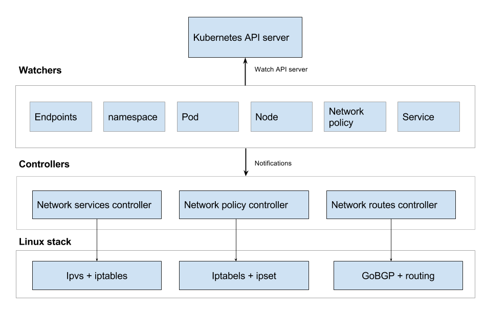

# Architecture

Kube-router is built around concept of watchers and controllers. Watchers use Kubernetes watch API to get notification on events related to create, update, delete of Kubernetes objects. Each watcher gets notification related to a particular API object. On receiving an event from API server, watcher broadcasts events. Controller registers to get event updates from the watchers and act up on the events.

Kube-router consists of 3 core controllers and multiple watchers as depicted in below diagram.



Each of the [controller](https://github.com/cloudnativelabs/kube-router/tree/master/app/controllers) follows below structure

```
func Run() {
    for {
        Sync() // control loop that runs for ever and perfom sync at periodic interval
    }
}

func OnUpdate() {
    Sync() // on receiving update of a watched API object (namespace, node, pod, network policy etc)
}

Sync() {
    //re-concile any state changes
}

Cleanup() {
    // cleanup any changes (to iptables, ipvs, network etc) done to the system
}
```
