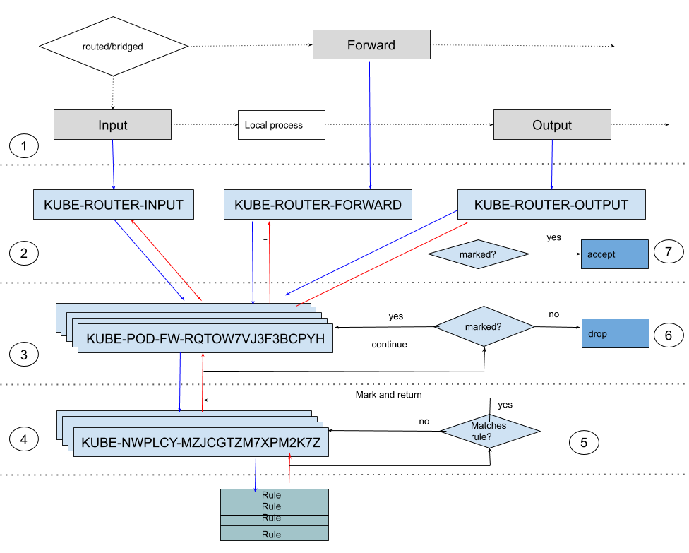

Kube-router provides an implementation of Kubernetes network policy specification for Linux. Modern Linux kernel provide several ways to filter packets. One can use predominant iptables or nftables or more recent BPF technologies etc. At the moment kube-router uses iptables to realize network policy specification. However as BPF technology and tooling mature kube-router will adopt or provide alternate implementation using BPF.

This design document captures the current implementation of network policy specification using iptables.

# Design tenets and goals:

  - full compliance to Kubernetes v1 network policy specification
  - a CNI (providing pod-to-pod networking) agnostic implementation i.e.) no assumption on any particul CNI used
  - kube-router should process the traffic from/to the pods only, and should skip any other traffic
  - any configuration changes performed should not result in accept/deny of non-pod traffic  
  - provide a stateful firewall for minimal overhead in enforcing network policies
  - ensure decoupled control/management plane from datapath so that kube-router pod restarts/crash etc does not affect data-path
  - when a new pod is launched ensure network policy enforcements are in-place before pod sends the first packet
  - be authoritative (take precedence over any other policies) in accept/deny traffic concerning the traffic from/to the pods
  - provide insight in to dropped traffic due to network policy enforcement
  - tolerant to out-of-band changes and reconcile desired state
  - fully stateless design should scale to cluster of any size with any number of network policies

# Implementation

Linux iptables `fitler` table has three built in chains `INPUT`, `OUTPUT`, `FORWARD`. On a Linux host incoming traffic, outgoing traffic and forwarded/bridged traffic gets run through these chains respectivley.

kube-router introduces three custom chains `KUBE-ROUTER-INPUT`, `KUBE-ROUTER-OUTPUT`, `KUBE-ROUTER-FORWARD` corresponding to `INPUT`, `OUTPUT`, `FORWARD` respectively that are used to intercept the respective traffic types.

Further to the custom chains mentioned above kube-router implementation of network policies is structured around two other types of custom chains. Each pod running on the node is represented with a custom `fitler` table chain that starts with prefix `KUBE-POD-FW-` followed by hash derived from pod name and namespace for e.g. KUBE-POD-FW-RQTOW7VJ3F3BCPYH. Hash ensures there is unique chain for any pod. On a node there will be such chains only for the pods running on the node. Similary each network policy is represented by custom chain in `filter` table and has a prefix `KUBE-NWPLCY-` and followed by unique hash derived from network polilicy name and namespace name for e.g. `KUBE-NWPLCY-MZJCGTZM7XPM2K7Z`

Below diagram represent the general flow of traffic across the chains.



Below is the high level description of the steps in the daigram.

1. kube-router adds rules in the `INPUT`, `FORWARD`, `OUTPUT` chains to intercept traffic from/to pods and jump to respective chains
2. rules matching specific pod IP are added to ensure traffic from/to a pod is run through pod specific firewall chain
3. each pod specific firewall chain is populated with rules to run through one or more network policy chains corresponding to applicable network policies
4. each network policy chain is configured with one or more iptables rules that represent the network policy specifcation
5. a packet matching network policy rule is marked and returned from the network policy chain and running through subsequent network policy chains is skipped
6. once a packet is run through all the network policies, check is made if at least one network policy that whitelist this traffic. If there is no match traffic is dropped. If packet matches a network policy, packet is still run through the rest of the pod firewall chain to cater to the case where both the source and destination are pods
7. at this point traffic would have been dropped if network policies corresponding to eithe of source or destination pod did not allow the traffic.traffic is explicitly accepeted at this point and further processing is done

Rest of the document elaborates each of the above steps in more details.

## intercepting traffic from/to pods

First order of the problem is how to intercept the trarffic from/to the pods in a CNI agnostic manner. Following rules are added to default chains to intercept the entire traffic

```
-A INPUT   -m comment --comment "kube-router netpol" -j KUBE-ROUTER-INPUT
-A FORWARD -m comment --comment "kube-router netpol" -j KUBE-ROUTER-FORWARD
-A OUTPUT  -m comment --comment "kube-router netpol" -j KUBE-ROUTER-OUTPUT
```
As on optimization in cases where pod CIDR allocated to the node (like in case of kube-router acting as CNI) is known below rules are added instead.

```
-A INPUT -s 10.1.2.0/24 -m comment --comment "kube-router netpol - PQPITJNHBPGOWBG3" -j KUBE-ROUTER-INPUT
-A FORWARD -s 10.1.2.0/24 -m comment --comment "kube-router netpol - B54YCUOMUZH6LGXL" -j KUBE-ROUTER-FORWARD
-A FORWARD -d 10.1.2.0/24 -m comment --comment "kube-router netpol - BEVEPCOUQNUZIPVK" -j KUBE-ROUTER-FORWARD
-A OUTPUT -d 10.1.2.0/24 -m comment --comment "kube-router netpol - AFSPBOUT2BJFJDZ3" -j KUBE-ROUTER-OUTPUT
```
Above optimization ensures only traffic to or from the pods running on the nodes are intercepted.

## running pod specifc traffic through the pod specific firewall

traffic from pod is intercepted by its IP when destination is local node

```
-A KUBE-ROUTER-INPUT -s 10.1.2.3/32 -m comment --comment "rule to jump traffic from POD name:frontend-56fc5b6b47-hmh6x namespace: default to chain KUBE-POD-FW-CUKYIYY4THTOCPLR" -j KUBE-POD-FW-CUKYIYY4THTOCPLR
```

traffic destined to pod is intercepted by its IP when source is local node

```
-A KUBE-ROUTER-OUTPUT -s 10.1.2.3/32 -m comment --comment "rule to jump traffic from POD name:frontend-56fc5b6b47-hmh6x namespace: default to chain KUBE-POD-FW-CUKYIYY4THTOCPLR" -j KUBE-POD-FW-CUKYIYY4THTOCPLR
-A KUBE-ROUTER-OUTPUT -d 10.1.2.3/32 -m comment --comment "rule to jump traffic destined to POD name:frontend-56fc5b6b47-hmh6x namespace: default to chain KUBE-POD-FW-CUKYIYY4THTOCPLR" -j KUBE-POD-FW-CUKYIYY4THTOCPLR
```

traffic from/to pod getting routed is intercepted by its IP by below rules

```
-A KUBE-ROUTER-FORWARD -s 10.1.2.3/32 -m comment --comment "rule to jump traffic from POD name:frontend-56fc5b6b47-hmh6x namespace: default to chain KUBE-POD-FW-CUKYIYY4THTOCPLR" -j KUBE-POD-FW-CUKYIYY4THTOCPLR
-A KUBE-ROUTER-FORWARD -d 10.1.2.3/32 -m comment --comment "rule to jump traffic destined to POD name:frontend-56fc5b6b47-hmh6x namespace: default to chain KUBE-POD-FW-CUKYIYY4THTOCPLR" -j KUBE-POD-FW-CUKYIYY4THTOCPLR
```

traffic from/to pod getting brdiged is intercepted by its IP by below rules

```
-A KUBE-ROUTER-FORWARD -s 10.1.2.3/32 -m physdev --physdev-is-bridged -m comment --comment "rule to jump traffic from POD name:frontend-56fc5b6b47-hmh6x namespace: default to chain KUBE-POD-FW-CUKYIYY4THTOCPLR" -j KUBE-POD-FW-CUKYIYY4THTOCPLR
-A KUBE-ROUTER-FORWARD -d 10.1.2.3/32 -m physdev --physdev-is-bridged -m comment --comment "rule to jump traffic destined to POD name:frontend-56fc5b6b47-hmh6x namespace: default to chain KUBE-POD-FW-CUKYIYY4THTOCPLR" -j KUBE-POD-FW-CUKYIYY4THTOCPLR
```

above rules ensures both ingress and egress traffic pods is intercepted and run through the chain corresponding to the pods

## running pod traffic through network policy chains

each pod firewall chain is populated with below rules:

a rule is added to ensure that we have a stateful firewall which accepts the `RELATED,ESTABLISHED` traffic with out running through the network policy chains

```
-A KUBE-POD-FW-NE7SP5Z4IWAZL7BU -m comment --comment "rule for stateful firewall for pod" -m conntrack --ctstate RELATED,ESTABLISHED -j ACCEPT
```

a rule is added that adds exception where local node should be allowed to access pods as per the kuberntes specification

```
-A KUBE-POD-FW-NE7SP5Z4IWAZL7BU -d 10.1.2.3/32 -m comment --comment "rule to permit the traffic traffic to pods when source is the pod\'s local node" -m addrtype --src-type LOCAL -j ACCEPT
```
one or more rules are added as below which run traffic through network policies

```
-A KUBE-POD-FW-NE7SP5Z4IWAZL7BU -m comment --comment "run through nw policy allow-frontend-to-backend-slave" -j KUBE-NWPLCY-2AQPO27D74WKKNXC
-A KUBE-POD-FW-NE7SP5Z4IWAZL7BU -m comment --comment "run through nw policy allow-frontend-to-backend-master" -j KUBE-NWPLCY-LLPUD4LUSY2XDF4R
```

## running pod traffic through network policy rules

one or more rules are added to network policy chain that represent the network policy specification's ingress and egress rules as below.

set of pods selected by pod selectors for the  target pods, ingress pods, egress pods are represented by ipsets

```
-A KUBE-NWPLCY-2AQPO27D74WKKNXC -m comment --comment "rule to ACCEPT traffic from source pods to dest pods selected by policy name allow-backend-slave-access-to-frontend namespace default" -m set --match-set KUBE-SRC-HXXMJKQ43MW3EL2V src -m set --match-set KUBE-DST-IZMNXX7C6SXMJM4O dst -m comment --comment "rule to mark traffic matching a network policy" -j MARK --set-xmark 0x10000/0x10000
-A KUBE-NWPLCY-2AQPO27D74WKKNXC -m comment --comment "rule to ACCEPT traffic from source pods to dest pods selected by policy name allow-backend-slave-access-to-frontend namespace default" -m set --match-set KUBE-SRC-HXXMJKQ43MW3EL2V src -m set --match-set KUBE-DST-IZMNXX7C6SXMJM4O dst -m comment --comment "rule to RETURN traffic matching a network policy" -m mark --mark 0x10000/0x10000 -j RETURN
```
above rules ensure traffic matching network policy rule is marked with `0x10000`and traffic is immediatley returned so that we dont run through the subsequnet rules


## returning back to pod firewall chain

once pod traffic is run through the network policy chains and the rules corresponding to the chains, traffic is returned back to pod firewall chains. Following rules are addedd to process the traffic that is white listed and traffic that is not white listed

```
-A KUBE-POD-FW-NE7SP5Z4IWAZL7BU -m comment --comment "rule to log dropped traffic POD name:frontend-56fc5b6b47-hmh6x namespace: default" -m mark ! --mark 0x10000/0x10000 -m limit --limit 10/min --limit-burst 10 -j NFLOG --nflog-group 100
-A KUBE-POD-FW-NE7SP5Z4IWAZL7BU -m comment --comment "rule to REJECT traffic destined for POD name:frontend-56fc5b6b47-hmh6x namespace: default" -m mark ! --mark 0x10000/0x10000 -j REJECT --reject-with icmp-port-unreachable
-A KUBE-POD-FW-NE7SP5Z4IWAZL7BU -j MARK --set-xmark 0x0/0x10000
-A KUBE-POD-FW-NE7SP5Z4IWAZL7BU -m comment --comment "set mark to ACCEPT traffic that comply to network policies" -j MARK --set-xmark 0x20000/0x20000
```

first two rules ensures that traffic that is not marked with 0x10000 i.e. not matching any network policy is dropped and logged

rest of the rules ensures that for the traffic that is white listed gets mark 0x10000 reset and also marked with `0x20000` that is used to represent that traffic matched at lease one network policy

we dont `ACCEPT` the traffic at this point to ensure traffic is run through the other pod firewall chain as well. This caters to case where traffic is from the pods and destined to the pods on same node.

## returning to back to top level chains

each of the top level chain `KUBE-ROUTER-INPUT`, `KUBE-ROUTER-FORWARD`, `KUBE-ROUTER-OUTPUT` is appended with below two rules

```
-A KUBE-ROUTER-FORWARD -m comment --comment "rule to explicitly ACCEPT traffic that comply to network policies" -m mark --mark 0x20000/0x20000 -j ACCEPT
-A KUBE-ROUTER-FORWARD -m comment --comment "rule to apply default pod firewall" -j KUBE-POD-FW-DEFAULT
```

If the traffic comes to hit this rule means, traffic is run through the pod firewall chains and corresponding network policy chains. If trafffic was not white listed then rule in the pod firewall chain already would have dropped. So only two cases of traffic hit these rules. One type of traffic that is whitelisted hence marked with 0x20000 which  accepted. Other traffic that hits second rules is traffic sent by pod when it starts and in between the network policies are setup for the pods. Default action that is performed during the winodow period is confiugrable.

# desired state syncs

## full syncs

netwrok policy controller implements a full sync logic that reads through all the network policies evaluates each rule and sets up corresponding pod firewall and network policy chains. Full syncs are run either periodically or  as part of event handlers in controllers disucssed below. below snippet of code walk through main steps performed as part of full sync

``` go

	// setup default pod firewall chain
	npc.ensureDefaultPodFWChains()

	// ensure kube-router specific top level chains and corresponding rules exist
	npc.ensureTopLevelChains()

	// ensure default network policies chains
	npc.ensureDefaultNetworkPolicyChains()

	networkPoliciesInfo, err = npc.buildNetworkPoliciesInfo()
	if err != nil {
		glog.Errorf("Aborting sync. Failed to build network policies: %v", err.Error())
		return
	}

	activePolicyChains, activePolicyIPSets, err := npc.fullSyncNetworkPolicyChains(networkPoliciesInfo, syncVersion)
	if err != nil {
		glog.Errorf("Aborting sync. Failed to sync network policy chains: %v" + err.Error())
		return
	}

	activePodFwChains, err := npc.fullSyncPodFirewallChains(networkPoliciesInfo, syncVersion)
	if err != nil {
		glog.Errorf("Aborting sync. Failed to sync pod firewalls: %v", err.Error())
		return
	}

	err = cleanupStaleRules(activePolicyChains, activePodFwChains, activePolicyIPSets)
	if err != nil {
		glog.Errorf("Aborting sync. Failed to cleanup stale iptables rules: %v", err.Error())
		return
	}
```

`fullSyncNetworkPolicyChains` and `fullSyncPodFirewallChains` forms the crux of the full sync. `fullSyncNetworkPolicyChains` is responsible for syncing/refreshing all the network policy chains as the per current specification of a network policy. `fullSyncPodFirewallChains`is responsible for sync/refreshing pod firewall chain with appropriate rules to run through all applicable network policy chains. Both the functions are built on top of helper functions `syncPodFirewall` and `syncNetworkPolicy` that just deal with single pod and network policy respectivley.

### syncPodFirewall

following are the steps that are done as part of specific pod firewall chain sync

```go
	// setup rules to run pod inbound traffic through applicable ingress network policies
	err = npc.setupPodIngressRules(pod, podFwChainName, networkPoliciesInfo, iptablesCmdHandler, version)
	if err != nil {
		return err
	}

	// setup rules to run pod outbound traffic through applicable egress network policies
	err = npc.setupPodEgressRules(pod, podFwChainName, networkPoliciesInfo, iptablesCmdHandler, version)
	if err != nil {
		return err
	}

	// setup rules to drop the traffic from/to the pods that is not expliclty whitelisted
	err = npc.processNonWhitelistedTrafficRules(pod.name, pod.namespace, podFwChainName, iptablesCmdHandler)
	if err != nil {
		return err
	}

	// setup rules to process the traffic from/to the pods that is whitelisted
	err = npc.processWhitelistedTrafficRules(pod.name, pod.namespace, podFwChainName, iptablesCmdHandler)
	if err != nil {
		return err
	}

	// setup rules to intercept inbound traffic to the pods
	err = npc.interceptPodInboundTraffic(pod, podFwChainName, iptablesCmdHandler)
	if err != nil {
		return err
	}

	// setup rules to intercept outbound traffic from the pods
	err = npc.interceptPodOutboundTraffic(pod, podFwChainName, iptablesCmdHandler)
	if err != nil {
		return err
	}
```

### syncNetworkPolicy

```go
	// ensure there is a unique chain per network policy in filter table
	policyChainName := networkPolicyChainName(policy.namespace, policy.name, version)
  
	if policy.policyType == "both" || policy.policyType == "ingress" {
		// create a ipset for all destination pod ip's matched by the policy spec PodSelector
		targetDestPodIPSetName := policyDestinationPodIPSetName(policy.namespace, policy.name)
		targetDestPodIPSet, err := npc.ipSetHandler.Create(targetDestPodIPSetName, utils.TypeHashIP, utils.OptionTimeout, "0")
		npc.processIngressRules(policy, targetDestPodIPSetName, activePolicyIPSets, version)
		activePolicyIPSets[targetDestPodIPSet.Name] = true
	}

	if policy.policyType == "both" || policy.policyType == "egress" {
		// create a ipset for all source pod ip's matched by the policy spec PodSelector
		targetSourcePodIPSetName := policySourcePodIPSetName(policy.namespace, policy.name)
		targetSourcePodIPSet, err := npc.ipSetHandler.Create(targetSourcePodIPSetName, utils.TypeHashIP, utils.OptionTimeout, "0")
		npc.processEgressRules(policy, targetSourcePodIPSetName, activePolicyIPSets, version)
		activePolicyIPSets[targetSourcePodIPSet.Name] = true
	}
```
`processIngressRules` and `processEgressRules`form the corresponding rules and populates corresponding network policy chain

# controllers

network policy controller watches pod, namespace, network policy API objects and process add/update/delete events corresponding to watched API objects

## namespace events handler

On namespace add/delete/update event complete full sync is performed. Since they are very rare events there is no significant performance impact

## network policy event handler

On network policy add/delete/update event complete full sync is performed. Since they are very rare events there is no significant performance impact

## pod events hander

Since pod add/delete/update events are fairly common occuring events compared to events from network policy, namespace. Pod event handler is optimized to perform sync only for affecting pod (i.e. pod that is getting added/updated deleted). However if any network policy pod selectors (target/ingress/egress) matches with pods labels then following steps are done

```go

	err = npc.syncAffectedNetworkPolicyChains(&podInfo, syncVersion)
	if err != nil {
		glog.Errorf("failed to refresh network policy chains affected by pod:%s event due to %s", podNamespacedName, err.Error())
	}

	// only for local pods we need to setup pod firewall chains
	if !isLocalPod(pod, npc.nodeIP.String()) {
		return
	}
	networkPoliciesInfo, err := npc.buildNetworkPoliciesInfo()
	if err != nil {
		glog.Errorf("Failed to build network policies info due to %s", err.Error())
	}
	err = npc.syncPodFirewall(&podInfo, networkPoliciesInfo, syncVersion, iptablesCmdHandler)
	if err != nil {
		glog.Errorf("Failed to sync pod:%s firewall chain due to %s", podNamespacedName, err.Error())
	}
```

affected network policies are evaluated and only for such network policy `syncNetworkPolicy` is performed. For the pod corresponding to the event `syncPodFirewall` is performed if its add/update event. In case of pod delete following steps are performed.

```go
stopInterceptingPodTraffic(podFwChainName)
iptablesCmdHandler.ClearChain("filter", podFwChainName)
iptablesCmdHandler.DeleteChain("filter", podFwChainName)
```


