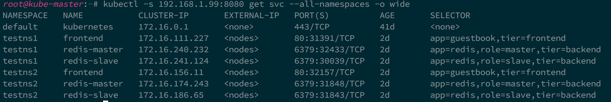
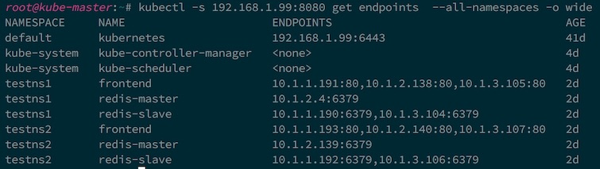
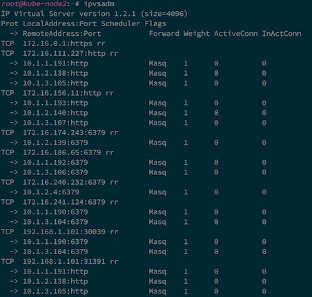
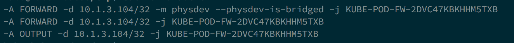
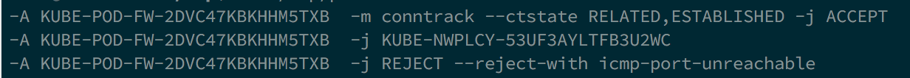
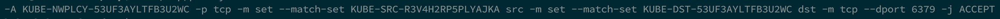
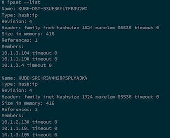

## Theory of Operation

Kube-router can be run as an agent or a Pod (via DaemonSet) on each node and
leverages standard Linux technologies **iptables, ipvs/lvs, ipset, iproute2**

### Service Proxy And Load Balancing

Blog: [Kubernetes network services proxy with IPVS/LVS](https://cloudnativelabs.github.io/post/2017-05-10-kube-network-service-proxy/)

Kube-router uses IPVS/LVS technology built in Linux to provide L4 load
balancing. Each **ClusterIP**, **NodePort**, and **LoadBalancer** Kubernetes
Service type is configured as an IPVS virtual service. Each Service Endpoint is
configured as real server to the virtual service.  The standard **ipvsadm** tool
can be used to verify the configuration and monitor the active connections.

Below is example set of Services on Kubernetes:

and the Endpoints for the Services:

and how they got mapped to the IPVS by kube-router:

Kube-router watches the Kubernetes API server to get updates on the
Services/Endpoints and automatically syncs the IPVS configuration to reflect the
desired state of Services. Kube-router uses IPVS masquerading mode and uses
round robin scheduling currently. Source pod IP is preserved so that appropriate
network policies can be applied.

### Pod Ingress Firewall

Blog: [Enforcing Kubernetes network policies with iptables](https://cloudnativelabs.github.io/post/2017-05-1-kube-network-policies/)

Kube-router provides an implementation of Kubernetes Network Policies through
the use of iptables, ipset and conntrack.  All the Pods in a Namespace with
'DefaultDeny' ingress isolation policy has ingress blocked. Only traffic that
matches whitelist rules specified in the network policies are permitted to reach
those Pods. The following set of iptables rules and chains in the 'filter' table
are used to achieve the Network Policies semantics.

Each Pod running on the Node which needs ingress blocked by default is matched
in FORWARD and OUTPUT chains of the fliter table and are sent to a pod specific
firewall chain. Below rules are added to match various cases

- Traffic getting switched between the Pods on the same Node through the local
  bridge
- Traffic getting routed between the Pods on different Nodes
- Traffic originating from a Pod and going through the Service proxy and getting
  routed to a Pod on the same Node

Each Pod specific firewall chain has default rule to block the traffic. Rules
are added to jump traffic to the Network Policy specific policy chains. Rules
cover only policies that apply to the destination pod ip. A rule is added to
accept the the established traffic to permit the return traffic.

Each policy chain has rules expressed through source and destination ipsets. Set
of pods matching ingress rule in network policy spec forms a source Pod ip
ipset. set of Pods matching pod selector (for destination Pods) in the Network
Policy forms destination Pod ip ipset.

Finally ipsets are created that are used in forming the rules in the Network
Policy specific chain

Kube-router at runtime watches Kubernetes API server for changes in the
namespace, network policy and pods and dynamically updates iptables and ipset
configuration to reflect desired state of ingress firewall for the the pods.

### Pod Networking

Blog: [Kubernetes pod networking and beyond with BGP](https://cloudnativelabs.github.io/post/2017-05-22-kube-pod-networking)

Kube-router is expected to run on each Node. The subnet of the Node is obtained
from the CNI configuration file on the Node or through the Node.PodCidr. Each
kube-router instance on the Node acts as a BGP router and advertises the Pod
CIDR assigned to the Node. Each Node peers with rest of the Nodes in the cluster
forming full mesh. Learned routes about the Pod CIDR from the other Nodes (BGP
peers) are injected into local Node routing table. On the data path, inter Node
Pod-to-Pod communication is done by the routing stack on the Node.

