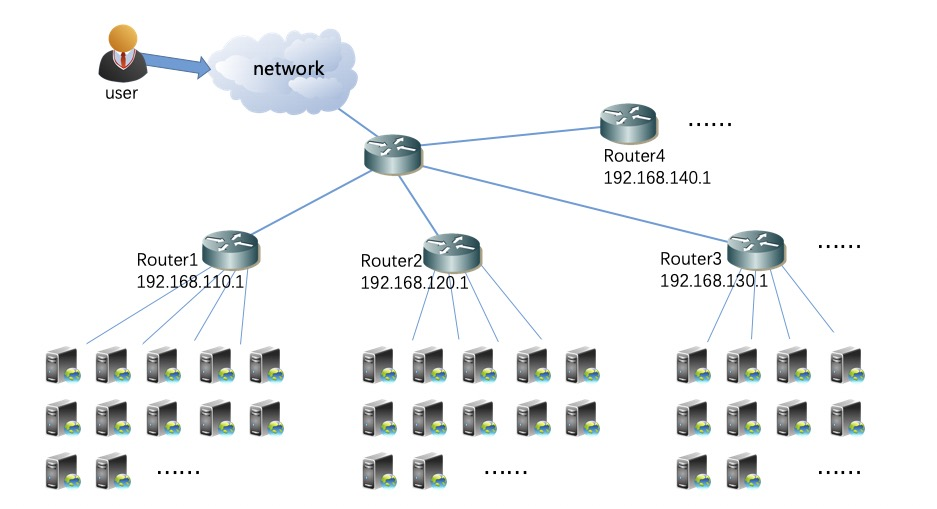

**How to optimize the neighborhood relationship and reduce the number of routes through kube-router in order to support the BGP network of large kubernetes cluster?**
 
 
 

**Introduction of cluster BGP network environment** 
<table>
<tr><td>**Item**</td><td>**Content**</td></tr>
<tr><td>Version of kube-router</td><td>Modified based on version 0.3.2</td></tr>
<tr><td>The number of kubernetes node</td><td>About 3000</td></tr>
<tr><td>Pod subnet of kubernetes cluster</td><td>172.31.0.0/16</td></tr>
<tr><td>Service subnet of kubernetes cluster</td><td>172.30.0.0/16</td></tr>
<tr><td>The number of Router Device </td><td>About 100</td></tr>
<tr><td>Router-id of Uplink Router Device</td><td>192.168.110.1(router1)、 192.168.120.1(router2)、 192.168.130.1(router3)、 192.168.140.1(router4) ......</td></tr>
</table>

The network topology is as follows:

 
**Optimization scheme of large k8s cluster BGP network** 
In order for your architecture to support a larger network, you need to do the following two things:
 
&nbsp;&nbsp;&nbsp;&nbsp;&nbsp;&nbsp;&nbsp;&nbsp;(1) Set the parameter "--enable-ibgp=false", do not let kubernetes node directly establish BGP neighbors with each other. Let your kubernetes node only build BGP neighbors with the on-line router device. See this link for details (<a href="../docs/large-networks02.md">large-networks02 documentation</a>).
 
&nbsp;&nbsp;&nbsp;&nbsp;&nbsp;&nbsp;&nbsp;&nbsp;(2) You'd better turn on the BGP ECMP function of the kubernetes node on-line router device. The effect of this method is that when the user's access traffic enters the router device, it is first balanced to the kubernetes node of the back end through ECMP load balancing, and then to the final pod through IPVS load balancing. When devices, links and nodes in the network are down, traffic can be automatically switched to other healthy devices, links and nodes. In this way, the availability, high performance and scalability of the network are realized.See this link for details (<a href="../docs/large-networks04.md">large-networks04 documentation</a>).
 
&nbsp;&nbsp;&nbsp;&nbsp;&nbsp;&nbsp;&nbsp;&nbsp;(3) You need to set both "--advertise-cluster-IP=true" and "--advertise-cluster-subnet=subnet" parameters.Let k8s node only notify k8s service aggregate routes to the upstream routers, reducing the service routing entries of the upstream routers.See this link for details (<a href="../docs/large-networks03.md">large-networks03 documentation</a>).
 
 
**YAML source files used in this document** 
For the YAML source files used in this document, please click on <a href="../daemonset/kube-router-daemonset-advertise-cluster-subnet.yaml">this link</a> to view them.
 
 
