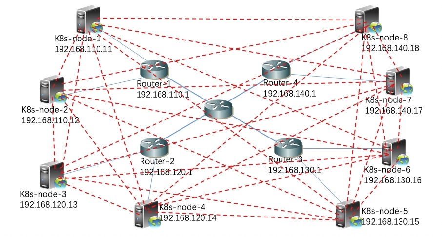

**Method of reducing BGP neighbors between each kubernetes node in AS**
 
 
 

**The number growth of BGP neighbors before optimization** 

When "--enable-ibgp=true" is set by default by kube-router, all kubernetes nodes establish BGP neighborhood relationships with each other. Suppose there are eight k8s-nodes in our network. Their topological relationships are as follows:

We can login to each kubernetes node to see the local neighborhood.
 
View on k8s-node-1:
<table><tr><td bgcolor=#000000>
[k8s-node-1 ~]# gobgp neighbor 
Peer             AS  Up/Down State       |#Received  Accepted 
192.168.110.12  64558 17:17:28 Establ      |        0         0 
192.168.120.13  64558 17:17:28 Establ      |        0         0 
192.168.120.14  64558 17:17:28 Establ      |        0         0 
192.168.130.15  64558 17:17:28 Establ      |        0         0 
192.168.130.16  64558 17:17:28 Establ      |        0         0 
192.168.140.17  64558 17:17:28 Establ      |        0         0 
192.168.140.18  64558 17:17:28 Establ      |        0         0 
[k8s-node-1 ~]#
</td></tr></table>

View on k8s-node-2:
<table><tr><td bgcolor=#000000>
[k8s-node-2 ~]# gobgp neighbor 
Peer             AS  Up/Down State       |#Received  Accepted 
192.168.110.11  64558 17:17:28 Establ      |        0         0 
192.168.120.13  64558 17:17:28 Establ      |        0         0 
192.168.120.14  64558 17:17:28 Establ      |        0         0 
192.168.130.15  64558 17:17:28 Establ      |        0         0 
192.168.130.16  64558 17:17:28 Establ      |        0         0 
192.168.140.17  64558 17:17:28 Establ      |        0         0 
192.168.140.18  64558 17:17:28 Establ      |        0         0 
[k8s-node-2 ~]#
</td></tr></table>

View on k8s-node-3:
<table><tr><td bgcolor=#000000>
[k8s-node-3 ~]# gobgp neighbor 
Peer             AS  Up/Down State       |#Received  Accepted 
192.168.110.11  64558 17:17:28 Establ      |        0         0 
192.168.110.12  64558 17:17:28 Establ      |        0         0 
192.168.120.14  64558 17:17:28 Establ      |        0         0 
192.168.130.15  64558 17:17:28 Establ      |        0         0 
192.168.130.16  64558 17:17:28 Establ      |        0         0 
192.168.140.17  64558 17:17:28 Establ      |        0         0 
192.168.140.18  64558 17:17:28 Establ      |        0         0 
[k8s-node-3 ~]#
</td></tr></table>

View on k8s-node-4:
<table><tr><td bgcolor=#000000>
[k8s-node-4 ~]# gobgp neighbor 
Peer             AS  Up/Down State       |#Received  Accepted 
192.168.110.11  64558 17:17:28 Establ      |        0         0 
192.168.110.12  64558 17:17:28 Establ      |        0         0 
192.168.120.13  64558 17:17:28 Establ      |        0         0 
192.168.130.15  64558 17:17:28 Establ      |        0         0 
192.168.130.16  64558 17:17:28 Establ      |        0         0 
192.168.140.17  64558 17:17:28 Establ      |        0         0 
192.168.140.18  64558 17:17:28 Establ      |        0         0 
[k8s-node-4 ~]#
</td></tr></table>

View on k8s-node-5:
<table><tr><td bgcolor=#000000>
[k8s-node-5 ~]# gobgp neighbor 
Peer             AS  Up/Down State       |#Received  Accepted 
192.168.110.11  64558 17:17:28 Establ      |        0         0 
192.168.110.12  64558 17:17:28 Establ      |        0         0 
192.168.120.13  64558 17:17:28 Establ      |        0         0 
192.168.120.14  64558 17:17:28 Establ      |        0         0 
192.168.130.16  64558 17:17:28 Establ      |        0         0 
192.168.140.17  64558 17:17:28 Establ      |        0         0 
192.168.140.18  64558 17:17:28 Establ      |        0         0 
[k8s-node-5 ~]#
</td></tr></table>

View on k8s-node-6:
<table><tr><td bgcolor=#000000>
[k8s-node-6 ~]# gobgp neighbor 
Peer             AS  Up/Down State       |#Received  Accepted 
192.168.110.11  64558 17:17:28 Establ      |        0         0 
192.168.110.12  64558 17:17:28 Establ      |        0         0 
192.168.120.13  64558 17:17:28 Establ      |        0         0 
192.168.120.14  64558 17:17:28 Establ      |        0         0 
192.168.130.15  64558 17:17:28 Establ      |        0         0 
192.168.140.17  64558 17:17:28 Establ      |        0         0 
192.168.140.18  64558 17:17:28 Establ      |        0         0 
[k8s-node-6 ~]#
</td></tr></table>

View on k8s-node-7:
<table><tr><td bgcolor=#000000>
[k8s-node-7 ~]# gobgp neighbor 
Peer             AS  Up/Down State       |#Received  Accepted 
192.168.110.11  64558 17:17:28 Establ      |        0         0 
192.168.110.12  64558 17:17:28 Establ      |        0         0 
192.168.120.13  64558 17:17:28 Establ      |        0         0 
192.168.120.14  64558 17:17:28 Establ      |        0         0 
192.168.130.15  64558 17:17:28 Establ      |        0         0 
192.168.130.16  64558 17:17:28 Establ      |        0         0 
192.168.140.18  64558 17:17:28 Establ      |        0         0 
[k8s-node-7 ~]#
</td></tr></table>

View on k8s-node-8:
<table><tr><td bgcolor=#000000>
[k8s-node-8 ~]# gobgp neighbor 
Peer             AS  Up/Down State       |#Received  Accepted 
192.168.110.11  64558 17:17:28 Establ      |        0         0 
192.168.110.12  64558 17:17:28 Establ      |        0         0 
192.168.120.13  64558 17:17:28 Establ      |        0         0 
192.168.120.14  64558 17:17:28 Establ      |        0         0 
192.168.130.15  64558 17:17:28 Establ      |        0         0 
192.168.130.16  64558 17:17:28 Establ      |        0         0 
192.168.140.17  64558 17:17:28 Establ      |        0         0 
 [k8s-node-8 ~]#
 </td></tr></table>

We present the neighborhood relationships between all kubernetes nodes in red dotted lines as follows:

You will find that the number of BGP peers per kubernetes node is n-1 (n is the total number of all nodes in the k8s cluster). If we had 2000 node servers in our k8s cluster, there would be 1999 BGP peers on each node. With the increasing number of kubernetes nodes in k8s cluster, the number of BGP peers per k8s-node will also increase, which is undoubtedly not a small overhead for node servers. With the increase of cluster size, the pressure of node server will increase.
 

 
 
**How to optimize the BGP neighborhood of kubernetes node?** 

To solve this problem, you need to turn on the BGP function of the router device on the node server. Moreover, hardware router devices have special chips to handle BGP routing forwarding, and its performance is better. At the same time, you need to set the parameter "--enable-ibgp=false" of kube-router. 
 
 
For example：
 
You can see the white font parameters in the configuration example below.
<table><tr><td bgcolor=#000000>
      - name: kube-router 
        image: cloudnativelabs/kube-router:0.3.2 
        imagePullPolicy: IfNotPresent 
        args: 
        - --run-router=true 
        - --run-firewall=true 
        - --run-service-proxy=true 
        - --enable-overlay=false 
        - --advertise-pod-cidr=true 
        - --advertise-cluster-ip=true 
        - --bgp-graceful-restart=true 
        - --enable-ibgp=false         
        - --nodes-full-mesh=true 
        - --cluster-asn=64558 
        - --peer-router-ips=192.168.110.1 
        - --peer-router-asns=64558 
        ...... 
</td></tr></table>
       
When you set this parameter, all kubernetes nodes will not establish BGP neighborhood relationships with each other. Each kubernetes node establishes a BGP peer only between the router it is connected to.
 
We can log in to each kubernetes node and router to see the local neighborhood.
 
View on router1:
<table><tr><td bgcolor=#000000>
<router1>dis bgp peer 
 BGP local router ID        : 192.168.110.1 
 Local AS number            : 64558 
 Total number of peers      : 2                 
 Peers in established state : 2 

  Peer            V          AS  MsgRcvd  MsgSent  OutQ  Up/Down       State  PrefRcv 
  192.168.110.11  4       64558     2203     2524     0 17:57:52 Established        1 
  192.168.110.12  4       64558     2203     2524     0 17:57:57 Established        1 
<router1>
</td></tr></table>

View on router2:
<table><tr><td bgcolor=#000000>
<router2>dis bgp peer 
 BGP local router ID        : 192.168.120.1 
 Local AS number            : 64558 
 Total number of peers      : 2                 
 Peers in established state : 2 

  Peer            V          AS  MsgRcvd  MsgSent  OutQ  Up/Down       State  PrefRcv 
  192.168.120.13  4       64558     2203     2524     0 17:57:52 Established        1 
  192.168.120.14  4       64558     2203     2524     0 17:57:57 Established        1 
<router2>
</td></tr></table>

View on router3:
<table><tr><td bgcolor=#000000>
<router3>dis bgp peer 
 BGP local router ID        : 192.168.130.1 
 Local AS number            : 64558 
 Total number of peers      : 2                 
 Peers in established state : 2 

  Peer            V          AS  MsgRcvd  MsgSent  OutQ  Up/Down       State  PrefRcv 
  192.168.130.15  4       64558     2203     2524     0 17:57:52 Established        1 
  192.168.130.16  4       64558     2203     2524     0 17:57:57 Established        1 
<router3>
</td></tr></table>

View on router4:
<table><tr><td bgcolor=#000000>
<router4>dis bgp peer 
 BGP local router ID        : 192.168.140.1 
 Local AS number            : 64558 
 Total number of peers      : 2                 
 Peers in established state : 2 

  Peer            V          AS  MsgRcvd  MsgSent  OutQ  Up/Down       State  PrefRcv 
  192.168.140.17  4       64558     2203     2524     0 17:57:52 Established        1 
  192.168.140.18  4       64558     2203     2524     0 17:57:57 Established        1 
<router1>
</td></tr></table>

View on k8s-node-1:
<table><tr><td bgcolor=#000000>
[k8s-node-1 ~]# gobgp neighbor 
Peer             AS  Up/Down State       |#Received  Accepted 
192.168.110.1  64558 17:17:28 Establ      |        0         0 
[k8s-node-1 ~]#
</td></tr></table>

View on k8s-node-2:
<table><tr><td bgcolor=#000000>
[k8s-node-2 ~]# gobgp neighbor 
Peer             AS  Up/Down State       |#Received  Accepted 
192.168.110.1  64558 17:17:28 Establ      |        0         0 
[k8s-node-2 ~]#
</td></tr></table>

View on k8s-node-3:
<table><tr><td bgcolor=#000000>
[k8s-node-3 ~]# gobgp neighbor 
Peer             AS  Up/Down State       |#Received  Accepted 
192.168.120.1  64558 17:17:28 Establ      |        0         0 
[k8s-node-3~]#
</td></tr></table>

View on k8s-node-4:
<table><tr><td bgcolor=#000000>
[k8s-node-4 ~]# gobgp neighbor 
Peer             AS  Up/Down State       |#Received  Accepted 
192.168.120.1  64558 17:17:28 Establ      |        0         0 
[k8s-node-4 ~]#
</td></tr></table>

View on k8s-node-5:
<table><tr><td bgcolor=#000000>
[k8s-node-5 ~]# gobgp neighbor 
Peer             AS  Up/Down State       |#Received  Accepted 
192.168.130.1  64558 17:17:28 Establ      |        0         0 
[k8s-node-5 ~]#
</td></tr></table>

View on k8s-node-6:
<table><tr><td bgcolor=#000000>
[k8s-node-6 ~]# gobgp neighbor 
Peer             AS  Up/Down State       |#Received  Accepted 
192.168.130.1  64558 17:17:28 Establ      |        0         0 
[k8s-node-6 ~]#
</td></tr></table>

View on k8s-node-7:
<table><tr><td bgcolor=#000000>
[k8s-node-7 ~]# gobgp neighbor 
Peer             AS  Up/Down State       |#Received  Accepted 
192.168.140.1  64558 17:17:28 Establ      |        0         0 
[k8s-node-7 ~]#
</td></tr></table>

View on k8s-node-8:
<table><tr><td bgcolor=#000000>
[k8s-node-8 ~]# gobgp neighbor 
Peer             AS  Up/Down State       |#Received  Accepted 
192.168.140.1  64558 17:17:28 Establ      |        0         0 
[k8s-node-8 ~]#
</td></tr></table>

We present the neighborhood relationships between all kubernetes nodes in red dotted lines as follows:

You will find that no matter how many kubernetes nodes you have in your k8s cluster, there is only one BGP neighbor on each kubernetes node. Each router has only BGP neighbors to the downlink kubernetes node and a small number of BGP neighbors to the downlink. In the actual production environment, due to the number of interfaces of router devices, the number of kubernetes nodes that can be connected to each router is very limited, generally less than 100.
 
By setting the parameter "--enable-ibgp=false", we achieve the effect of BGP neighbor control on each kubernetes node in the same AS. This reduces the pressure on the kubernetes node server.
 
 

