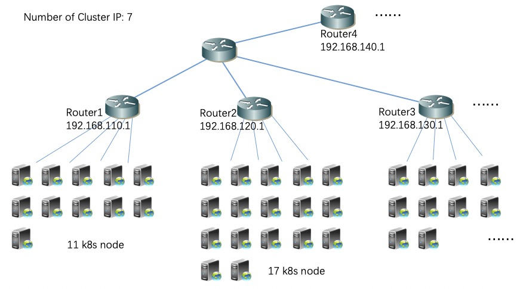
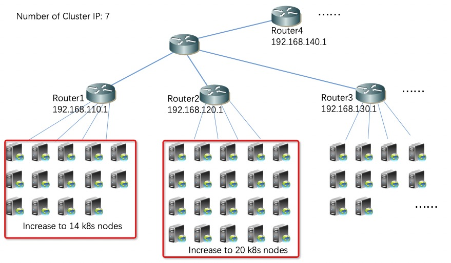
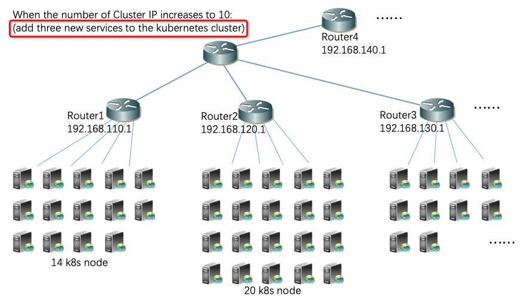

**Each node announces only the method of aggregating BGP routes to the upstream router device**
 
 
 

**1 Introduction of cluster BGP network environment** 
<table>
<tr><td>**Item**</td><td>**Content**</td></tr>
<tr><td>Version of kube-router</td><td>Modified based on version 0.3.2</td></tr>
<tr><td>The number of kubernetes node</td><td>About 3000(46 kubernetes nodes are listed as examples in this document)</td></tr>
<tr><td>Pod subnet of kubernetes cluster</td><td>172.31.0.0/16</td></tr>
<tr><td>Service subnet of kubernetes cluster</td><td>172.30.0.0/16</td></tr>
<tr><td>The number of Router Device </td><td>About 100(Four router devices are listed as examples in this document.)</td></tr>
<tr><td>Router-id of Uplink Router Device</td><td>192.168.110.1(Router1)、 192.168.120.1(Router2)、 192.168.130.1(Router3)、 192.168.140.1(Router4) ......</td></tr>
</table>

The network topology is as follows:

Look at all nodes in the cluster as follows:
<table><tr><td bgcolor=#000000>
[root@k8s-master ~]# kubectl get node 
NAME             STATUS   ROLES    AGE    VERSION 
192.168.120.10   Ready    <none>   282d   v1.14.0 
192.168.120.11   Ready    <none>   282d   v1.14.0 
192.168.120.12   Ready    <none>   282d   v1.14.0 
192.168.120.13   Ready    <none>   282d   v1.14.0 
192.168.120.14   Ready    <none>   282d   v1.14.0 
192.168.120.15   Ready    <none>   282d   v1.14.0 
192.168.120.16   Ready    <none>   282d   v1.14.0 
192.168.120.17   Ready    <none>   282d   v1.14.0 
192.168.120.18   Ready    <none>   282d   v1.14.0 
192.168.120.19   Ready    <none>   282d   v1.14.0 
192.168.120.20   Ready    <none>   282d   v1.14.0 
192.168.120.21   Ready    <none>   282d   v1.14.0 
192.168.120.22   Ready    <none>   282d   v1.14.0 
192.168.120.23   Ready    <none>   282d   v1.14.0 
192.168.120.24   Ready    <none>   282d   v1.14.0 
192.168.120.25   Ready    <none>   282d   v1.14.0 
192.168.120.26   Ready    <none>   282d   v1.14.0 
192.168.110.50   Ready    <none>   282d   v1.14.0 
192.168.110.51   Ready    <none>   282d   v1.14.0 
192.168.110.52   Ready    <none>   49d    v1.14.0 
192.168.110.53   Ready    <none>   282d   v1.14.0 
192.168.110.54   Ready    <none>   282d   v1.14.0 
192.168.110.55   Ready    <none>   49d    v1.14.0 
192.168.110.56   Ready    <none>   282d   v1.14.0 
192.168.110.57   Ready    <none>   282d   v1.14.0 
192.168.110.58   Ready    <none>   49d    v1.14.0 
192.168.110.59   Ready    <none>   282d   v1.14.0 
192.168.110.60   Ready    <none>   282d   v1.14.0 
 [root@k8s-master ~]# 
</td></tr></table>

Look at all the services in the cluster as follows:
<table><tr><td bgcolor=#000000>
[root@k8s-master ~]# kubectl get service --all-namespaces 
NAMESPACE     NAME                                TYPE        CLUSTER-IP       EXTERNAL-IP   PORT(S)                  AGE 
ci             jenkins                                ClusterIP     172.30.2.11       <none>        80/TCP,50000/TCP         34d 
db            data-comp                             ClusterIP     172.30.5.27       <none>        80/TCP                   43d 
db            redis                                  ClusterIP     172.30.47.53       <none>        6379/TCP                 145d 
coredns       corednsdev                             ClusterIP     172.30.0.2        <none>         53/UDP,53/TCP,9153/TCP   93d 
default        guestbook-ui                           ClusterIP     172.30.12.213      <none>        80/TCP                   145d 
default        kubernetes                             ClusterIP     172.30.0.1         <none>        443/TCP                  145d 
default        nginx01                                ClusterIP     172.30.28.176      <none>        80/TCP                   143d 
 [root@k8s-master ~]#
</td></tr></table>

 
 
**2  Bad conditions before optimization using the "advertise-cluster-subnet" parameter** 

**2.1  A Brief Introduction to Bad Conditions** 

 
The configuration parameters of kube-router are as follows:
<table><tr><td bgcolor=#000000>
      - name: kube-router 
        image: cloudnativelabs/kube-router:0.3.2 
        imagePullPolicy: IfNotPresent 
        args: 
        - --run-router=true 
        - --run-firewall=true 
        - --run-service-proxy=true 
        - --enable-overlay=false 
        - --advertise-pod-cidr=true 
        - --advertise-cluster-ip=true         
        - --bgp-graceful-restart=true 
        - --enable-ibgp=false 
        - --nodes-full-mesh=true 
        - --cluster-asn=64558 
        - --peer-router-ips=192.168.110.1 
        - --peer-router-asns=64558 
        ...... 
</td></tr></table>

Create kube-router daemonset using "kubectl create":
<table><tr><td bgcolor=#000000>
[root@k8s-master kube-router]# kubectl create -f kube-router-daemonset-old.yaml 
daemonset.extensions/kube-system-kube-router-old created 
[root@k8s-master kube-router]#  
</td></tr></table>

After creation, use "kubectl get" to view kube-router pod:

<table><tr><td bgcolor=#000000>
[root@k8s-master kube-router]# kubectl get pod -o wide -n kube-system                   
NAME                                          READY   STATUS    RESTARTS   AGE    IP               NODE             NOMINATED NODE   READINESS GATES 
kube-system-kube-router-old-7f2qm    1/1      Running    0          73s     192.168.120.10    192.168.120.10      <none>             <none> 
kube-system-kube-router-old-9tz2b     1/1     Running    0          73s     192.168.120.11    192.168.120.11      <none>             <none> 
kube-system-kube-router-old-7f2qq    1/1      Running    0          73s     192.168.120.12    192.168.120.12      <none>             <none> 
kube-system-kube-router-old-9tz2w     1/1     Running    0          73s     192.168.120.13    192.168.120.13      <none>             <none> 
kube-system-kube-router-old-7f2qe    1/1      Running    0          73s     192.168.120.14    192.168.120.14      <none>             <none> 
kube-system-kube-router-old-9tz2r     1/1     Running    0          73s     192.168.120.15    192.168.120.15      <none>             <none> 
kube-system-kube-router-old-7f2qt    1/1      Running    0          73s     192.168.120.16    192.168.120.16      <none>             <none> 
kube-system-kube-router-old-9tz2y     1/1     Running    0          73s     192.168.120.17    192.168.120.17      <none>             <none> 
kube-system-kube-router-old-7f2qu    1/1      Running    0          73s     192.168.120.18    192.168.120.18      <none>             <none> 
kube-system-kube-router-old-9tz2i     1/1     Running    0          73s     192.168.120.19    192.168.120.19      <none>             <none> 
kube-system-kube-router-old-7f2qo    1/1      Running    0          73s     192.168.120.20    192.168.120.20      <none>             <none> 
kube-system-kube-router-old-9tz2p     1/1     Running    0          73s     192.168.120.21    192.168.120.21      <none>             <none> 
kube-system-kube-router-old-7f2qa    1/1      Running    0          73s     192.168.120.22    192.168.120.22      <none>             <none> 
kube-system-kube-router-old-9tz2s     1/1     Running    0          73s     192.168.120.23    192.168.120.23      <none>             <none> 
kube-system-kube-router-old-7f2qd    1/1      Running    0          73s     192.168.120.24    192.168.120.24      <none>             <none> 
kube-system-kube-router-old-9tz2f     1/1     Running    0          73s     192.168.120.25    192.168.120.25      <none>             <none> 
kube-system-kube-router-old-7f2qg    1/1      Running    0          73s     192.168.120.26    192.168.120.26      <none>             <none> 
kube-system-kube-router-old-9tz2h     1/1     Running    0          73s     192.168.110.50    192.168.110.50      <none>             <none> 
kube-system-kube-router-old-9tz2j     1/1     Running    0          73s     192.168.110.51    192.168.110.51      <none>             <none> 
kube-system-kube-router-old-9tz2k     1/1     Running    0          73s     192.168.110.52    192.168.110.52      <none>             <none> 
kube-system-kube-router-old-9tz2l     1/1     Running    0          73s     192.168.110.53    192.168.110.53      <none>             <none> 
kube-system-kube-router-old-9tz2z     1/1     Running    0          73s     192.168.110.54    192.168.110.54      <none>             <none> 
kube-system-kube-router-old-9tzxx     1/1     Running    0          73s     192.168.110.55    192.168.110.55      <none>             <none> 
kube-system-kube-router-old-9tz2c     1/1     Running    0          73s     192.168.110.56    192.168.110.56      <none>             <none> 
kube-system-kube-router-old-9tz2v     1/1     Running    0          73s     192.168.110.57    192.168.110.57      <none>             <none> 
kube-system-kube-router-old-9tz2n     1/1     Running    0          73s     192.168.110.58    192.168.110.58      <none>             <none> 
kube-system-kube-router-old-9tzkk     1/1     Running    0          73s     192.168.110.59    192.168.110.59      <none>             <none> 
kube-system-kube-router-old-9tzsd     1/1     Running    0          73s     192.168.110.60    192.168.110.60      <none>             <none> 
[root@k8s-master kube-router]# 
</td></tr></table>

View the content of the routing table on Router1:

<table><tr><td bgcolor=#000000>
[Router1] display ip route  
Proto: Protocol        Pre: Preference
Route Flags: R - relay, D - download to fib, T - to vpn-instance, B - black hole route 
------------------------------------------------------------------------------ 
Routing Table : _public_ 

Destination/Mask    Proto   Pre  Cost        Flags NextHop         Interface 
…… 
172.30.0.1/32  IBGP    255  0             RD  192.168.110.50  Vlanif110  
&nbsp;&nbsp;&nbsp;&nbsp;&nbsp;&nbsp;&nbsp;&nbsp;&nbsp;&nbsp;&nbsp;&nbsp;&nbsp;&nbsp;&nbsp;&nbsp;IBGP    255  0             RD  192.168.110.51  Vlanif110  
&nbsp;&nbsp;&nbsp;&nbsp;&nbsp;&nbsp;&nbsp;&nbsp;&nbsp;&nbsp;&nbsp;&nbsp;&nbsp;&nbsp;&nbsp;&nbsp;IBGP    255  0             RD  192.168.110.52  Vlanif110  
&nbsp;&nbsp;&nbsp;&nbsp;&nbsp;&nbsp;&nbsp;&nbsp;&nbsp;&nbsp;&nbsp;&nbsp;&nbsp;&nbsp;&nbsp;&nbsp;IBGP    255  0             RD  192.168.110.53  Vlanif110  
&nbsp;&nbsp;&nbsp;&nbsp;&nbsp;&nbsp;&nbsp;&nbsp;&nbsp;&nbsp;&nbsp;&nbsp;&nbsp;&nbsp;&nbsp;&nbsp;IBGP    255  0             RD  192.168.110.54  Vlanif110  
&nbsp;&nbsp;&nbsp;&nbsp;&nbsp;&nbsp;&nbsp;&nbsp;&nbsp;&nbsp;&nbsp;&nbsp;&nbsp;&nbsp;&nbsp;&nbsp;IBGP    255  0             RD  192.168.110.55  Vlanif110  
&nbsp;&nbsp;&nbsp;&nbsp;&nbsp;&nbsp;&nbsp;&nbsp;&nbsp;&nbsp;&nbsp;&nbsp;&nbsp;&nbsp;&nbsp;&nbsp;IBGP    255  0             RD  192.168.110.56  Vlanif110  
&nbsp;&nbsp;&nbsp;&nbsp;&nbsp;&nbsp;&nbsp;&nbsp;&nbsp;&nbsp;&nbsp;&nbsp;&nbsp;&nbsp;&nbsp;&nbsp;IBGP    255  0             RD  192.168.110.57  Vlanif110  
&nbsp;&nbsp;&nbsp;&nbsp;&nbsp;&nbsp;&nbsp;&nbsp;&nbsp;&nbsp;&nbsp;&nbsp;&nbsp;&nbsp;&nbsp;&nbsp;IBGP    255  0             RD  192.168.110.58  Vlanif110  
&nbsp;&nbsp;&nbsp;&nbsp;&nbsp;&nbsp;&nbsp;&nbsp;&nbsp;&nbsp;&nbsp;&nbsp;&nbsp;&nbsp;&nbsp;&nbsp;IBGP    255  0             RD  192.168.110.59  Vlanif110  
&nbsp;&nbsp;&nbsp;&nbsp;&nbsp;&nbsp;&nbsp;&nbsp;&nbsp;&nbsp;&nbsp;&nbsp;&nbsp;&nbsp;&nbsp;&nbsp;IBGP    255  0             RD  192.168.110.60  Vlanif110  
172.30.0.2/32  IBGP    255  0             RD  192.168.110.50  Vlanif110  
&nbsp;&nbsp;&nbsp;&nbsp;&nbsp;&nbsp;&nbsp;&nbsp;&nbsp;&nbsp;&nbsp;&nbsp;&nbsp;&nbsp;&nbsp;&nbsp;IBGP    255  0             RD  192.168.110.51  Vlanif110  
&nbsp;&nbsp;&nbsp;&nbsp;&nbsp;&nbsp;&nbsp;&nbsp;&nbsp;&nbsp;&nbsp;&nbsp;&nbsp;&nbsp;&nbsp;&nbsp;IBGP    255  0             RD  192.168.110.52  Vlanif110  
&nbsp;&nbsp;&nbsp;&nbsp;&nbsp;&nbsp;&nbsp;&nbsp;&nbsp;&nbsp;&nbsp;&nbsp;&nbsp;&nbsp;&nbsp;&nbsp;IBGP    255  0             RD  192.168.110.53  Vlanif110  
&nbsp;&nbsp;&nbsp;&nbsp;&nbsp;&nbsp;&nbsp;&nbsp;&nbsp;&nbsp;&nbsp;&nbsp;&nbsp;&nbsp;&nbsp;&nbsp;IBGP    255  0             RD  192.168.110.54  Vlanif110  
&nbsp;&nbsp;&nbsp;&nbsp;&nbsp;&nbsp;&nbsp;&nbsp;&nbsp;&nbsp;&nbsp;&nbsp;&nbsp;&nbsp;&nbsp;&nbsp;IBGP    255  0             RD  192.168.110.55  Vlanif110  
&nbsp;&nbsp;&nbsp;&nbsp;&nbsp;&nbsp;&nbsp;&nbsp;&nbsp;&nbsp;&nbsp;&nbsp;&nbsp;&nbsp;&nbsp;&nbsp;IBGP    255  0             RD  192.168.110.56  Vlanif110  
&nbsp;&nbsp;&nbsp;&nbsp;&nbsp;&nbsp;&nbsp;&nbsp;&nbsp;&nbsp;&nbsp;&nbsp;&nbsp;&nbsp;&nbsp;&nbsp;IBGP    255  0             RD  192.168.110.57  Vlanif110  
&nbsp;&nbsp;&nbsp;&nbsp;&nbsp;&nbsp;&nbsp;&nbsp;&nbsp;&nbsp;&nbsp;&nbsp;&nbsp;&nbsp;&nbsp;&nbsp;IBGP    255  0             RD  192.168.110.58  Vlanif110  
&nbsp;&nbsp;&nbsp;&nbsp;&nbsp;&nbsp;&nbsp;&nbsp;&nbsp;&nbsp;&nbsp;&nbsp;&nbsp;&nbsp;&nbsp;&nbsp;IBGP    255  0             RD  192.168.110.59  Vlanif110  
&nbsp;&nbsp;&nbsp;&nbsp;&nbsp;&nbsp;&nbsp;&nbsp;&nbsp;&nbsp;&nbsp;&nbsp;&nbsp;&nbsp;&nbsp;&nbsp;IBGP    255  0             RD  192.168.110.60  Vlanif110  
172.30.0.9/32  IBGP    255  0             RD  192.168.110.50  Vlanif110  
&nbsp;&nbsp;&nbsp;&nbsp;&nbsp;&nbsp;&nbsp;&nbsp;&nbsp;&nbsp;&nbsp;&nbsp;&nbsp;&nbsp;&nbsp;&nbsp;IBGP    255  0             RD  192.168.110.51  Vlanif110  
&nbsp;&nbsp;&nbsp;&nbsp;&nbsp;&nbsp;&nbsp;&nbsp;&nbsp;&nbsp;&nbsp;&nbsp;&nbsp;&nbsp;&nbsp;&nbsp;IBGP    255  0             RD  192.168.110.52  Vlanif110  
&nbsp;&nbsp;&nbsp;&nbsp;&nbsp;&nbsp;&nbsp;&nbsp;&nbsp;&nbsp;&nbsp;&nbsp;&nbsp;&nbsp;&nbsp;&nbsp;IBGP    255  0             RD  192.168.110.53  Vlanif110  
&nbsp;&nbsp;&nbsp;&nbsp;&nbsp;&nbsp;&nbsp;&nbsp;&nbsp;&nbsp;&nbsp;&nbsp;&nbsp;&nbsp;&nbsp;&nbsp;IBGP    255  0             RD  192.168.110.54  Vlanif110  
&nbsp;&nbsp;&nbsp;&nbsp;&nbsp;&nbsp;&nbsp;&nbsp;&nbsp;&nbsp;&nbsp;&nbsp;&nbsp;&nbsp;&nbsp;&nbsp;IBGP    255  0             RD  192.168.110.55  Vlanif110  
&nbsp;&nbsp;&nbsp;&nbsp;&nbsp;&nbsp;&nbsp;&nbsp;&nbsp;&nbsp;&nbsp;&nbsp;&nbsp;&nbsp;&nbsp;&nbsp;IBGP    255  0             RD  192.168.110.56  Vlanif110  
&nbsp;&nbsp;&nbsp;&nbsp;&nbsp;&nbsp;&nbsp;&nbsp;&nbsp;&nbsp;&nbsp;&nbsp;&nbsp;&nbsp;&nbsp;&nbsp;IBGP    255  0             RD  192.168.110.57  Vlanif110  
&nbsp;&nbsp;&nbsp;&nbsp;&nbsp;&nbsp;&nbsp;&nbsp;&nbsp;&nbsp;&nbsp;&nbsp;&nbsp;&nbsp;&nbsp;&nbsp;IBGP    255  0             RD  192.168.110.58  Vlanif110  
&nbsp;&nbsp;&nbsp;&nbsp;&nbsp;&nbsp;&nbsp;&nbsp;&nbsp;&nbsp;&nbsp;&nbsp;&nbsp;&nbsp;&nbsp;&nbsp;IBGP    255  0             RD  192.168.110.59  Vlanif110  
&nbsp;&nbsp;&nbsp;&nbsp;&nbsp;&nbsp;&nbsp;&nbsp;&nbsp;&nbsp;&nbsp;&nbsp;&nbsp;&nbsp;&nbsp;&nbsp;IBGP    255  0             RD  192.168.110.60  Vlanif110  
172.30.5.27/32  IBGP    255  0             RD  192.168.110.50  Vlanif110  
&nbsp;&nbsp;&nbsp;&nbsp;&nbsp;&nbsp;&nbsp;&nbsp;&nbsp;&nbsp;&nbsp;&nbsp;&nbsp;&nbsp;&nbsp;&nbsp;IBGP    255  0             RD  192.168.110.51  Vlanif110  
&nbsp;&nbsp;&nbsp;&nbsp;&nbsp;&nbsp;&nbsp;&nbsp;&nbsp;&nbsp;&nbsp;&nbsp;&nbsp;&nbsp;&nbsp;&nbsp;IBGP    255  0             RD  192.168.110.52  Vlanif110  
&nbsp;&nbsp;&nbsp;&nbsp;&nbsp;&nbsp;&nbsp;&nbsp;&nbsp;&nbsp;&nbsp;&nbsp;&nbsp;&nbsp;&nbsp;&nbsp;IBGP    255  0             RD  192.168.110.53  Vlanif110  
&nbsp;&nbsp;&nbsp;&nbsp;&nbsp;&nbsp;&nbsp;&nbsp;&nbsp;&nbsp;&nbsp;&nbsp;&nbsp;&nbsp;&nbsp;&nbsp;IBGP    255  0             RD  192.168.110.54  Vlanif110  
&nbsp;&nbsp;&nbsp;&nbsp;&nbsp;&nbsp;&nbsp;&nbsp;&nbsp;&nbsp;&nbsp;&nbsp;&nbsp;&nbsp;&nbsp;&nbsp;IBGP    255  0             RD  192.168.110.55  Vlanif110  
&nbsp;&nbsp;&nbsp;&nbsp;&nbsp;&nbsp;&nbsp;&nbsp;&nbsp;&nbsp;&nbsp;&nbsp;&nbsp;&nbsp;&nbsp;&nbsp;IBGP    255  0             RD  192.168.110.56  Vlanif110  
&nbsp;&nbsp;&nbsp;&nbsp;&nbsp;&nbsp;&nbsp;&nbsp;&nbsp;&nbsp;&nbsp;&nbsp;&nbsp;&nbsp;&nbsp;&nbsp;IBGP    255  0             RD  192.168.110.57  Vlanif110  
&nbsp;&nbsp;&nbsp;&nbsp;&nbsp;&nbsp;&nbsp;&nbsp;&nbsp;&nbsp;&nbsp;&nbsp;&nbsp;&nbsp;&nbsp;&nbsp;IBGP    255  0             RD  192.168.110.58  Vlanif110  
&nbsp;&nbsp;&nbsp;&nbsp;&nbsp;&nbsp;&nbsp;&nbsp;&nbsp;&nbsp;&nbsp;&nbsp;&nbsp;&nbsp;&nbsp;&nbsp;IBGP    255  0             RD  192.168.110.59  Vlanif110  
&nbsp;&nbsp;&nbsp;&nbsp;&nbsp;&nbsp;&nbsp;&nbsp;&nbsp;&nbsp;&nbsp;&nbsp;&nbsp;&nbsp;&nbsp;&nbsp;IBGP    255  0             RD  192.168.110.60  Vlanif110  
172.30.12.213/32  IBGP    255  0             RD  192.168.110.50  Vlanif110  
&nbsp;&nbsp;&nbsp;&nbsp;&nbsp;&nbsp;&nbsp;&nbsp;&nbsp;&nbsp;&nbsp;&nbsp;&nbsp;&nbsp;&nbsp;&nbsp;IBGP    255  0             RD  192.168.110.51  Vlanif110  
&nbsp;&nbsp;&nbsp;&nbsp;&nbsp;&nbsp;&nbsp;&nbsp;&nbsp;&nbsp;&nbsp;&nbsp;&nbsp;&nbsp;&nbsp;&nbsp;IBGP    255  0             RD  192.168.110.52  Vlanif110  
&nbsp;&nbsp;&nbsp;&nbsp;&nbsp;&nbsp;&nbsp;&nbsp;&nbsp;&nbsp;&nbsp;&nbsp;&nbsp;&nbsp;&nbsp;&nbsp;IBGP    255  0             RD  192.168.110.53  Vlanif110  
&nbsp;&nbsp;&nbsp;&nbsp;&nbsp;&nbsp;&nbsp;&nbsp;&nbsp;&nbsp;&nbsp;&nbsp;&nbsp;&nbsp;&nbsp;&nbsp;IBGP    255  0             RD  192.168.110.54  Vlanif110  
&nbsp;&nbsp;&nbsp;&nbsp;&nbsp;&nbsp;&nbsp;&nbsp;&nbsp;&nbsp;&nbsp;&nbsp;&nbsp;&nbsp;&nbsp;&nbsp;IBGP    255  0             RD  192.168.110.55  Vlanif110  
&nbsp;&nbsp;&nbsp;&nbsp;&nbsp;&nbsp;&nbsp;&nbsp;&nbsp;&nbsp;&nbsp;&nbsp;&nbsp;&nbsp;&nbsp;&nbsp;IBGP    255  0             RD  192.168.110.56  Vlanif110  
&nbsp;&nbsp;&nbsp;&nbsp;&nbsp;&nbsp;&nbsp;&nbsp;&nbsp;&nbsp;&nbsp;&nbsp;&nbsp;&nbsp;&nbsp;&nbsp;IBGP    255  0             RD  192.168.110.57  Vlanif110  
&nbsp;&nbsp;&nbsp;&nbsp;&nbsp;&nbsp;&nbsp;&nbsp;&nbsp;&nbsp;&nbsp;&nbsp;&nbsp;&nbsp;&nbsp;&nbsp;IBGP    255  0             RD  192.168.110.58  Vlanif110  
&nbsp;&nbsp;&nbsp;&nbsp;&nbsp;&nbsp;&nbsp;&nbsp;&nbsp;&nbsp;&nbsp;&nbsp;&nbsp;&nbsp;&nbsp;&nbsp;IBGP    255  0             RD  192.168.110.59  Vlanif110  
&nbsp;&nbsp;&nbsp;&nbsp;&nbsp;&nbsp;&nbsp;&nbsp;&nbsp;&nbsp;&nbsp;&nbsp;&nbsp;&nbsp;&nbsp;&nbsp;IBGP    255  0             RD  192.168.110.60  Vlanif110  
172.30.28.176/32  IBGP    255  0             RD  192.168.110.50  Vlanif110  
&nbsp;&nbsp;&nbsp;&nbsp;&nbsp;&nbsp;&nbsp;&nbsp;&nbsp;&nbsp;&nbsp;&nbsp;&nbsp;&nbsp;&nbsp;&nbsp;IBGP    255  0             RD  192.168.110.51  Vlanif110  
&nbsp;&nbsp;&nbsp;&nbsp;&nbsp;&nbsp;&nbsp;&nbsp;&nbsp;&nbsp;&nbsp;&nbsp;&nbsp;&nbsp;&nbsp;&nbsp;IBGP    255  0             RD  192.168.110.52  Vlanif110  
&nbsp;&nbsp;&nbsp;&nbsp;&nbsp;&nbsp;&nbsp;&nbsp;&nbsp;&nbsp;&nbsp;&nbsp;&nbsp;&nbsp;&nbsp;&nbsp;IBGP    255  0             RD  192.168.110.53  Vlanif110  
&nbsp;&nbsp;&nbsp;&nbsp;&nbsp;&nbsp;&nbsp;&nbsp;&nbsp;&nbsp;&nbsp;&nbsp;&nbsp;&nbsp;&nbsp;&nbsp;IBGP    255  0             RD  192.168.110.54  Vlanif110  
&nbsp;&nbsp;&nbsp;&nbsp;&nbsp;&nbsp;&nbsp;&nbsp;&nbsp;&nbsp;&nbsp;&nbsp;&nbsp;&nbsp;&nbsp;&nbsp;IBGP    255  0             RD  192.168.110.55  Vlanif110  
&nbsp;&nbsp;&nbsp;&nbsp;&nbsp;&nbsp;&nbsp;&nbsp;&nbsp;&nbsp;&nbsp;&nbsp;&nbsp;&nbsp;&nbsp;&nbsp;IBGP    255  0             RD  192.168.110.56  Vlanif110  
&nbsp;&nbsp;&nbsp;&nbsp;&nbsp;&nbsp;&nbsp;&nbsp;&nbsp;&nbsp;&nbsp;&nbsp;&nbsp;&nbsp;&nbsp;&nbsp;IBGP    255  0             RD  192.168.110.57  Vlanif110  
&nbsp;&nbsp;&nbsp;&nbsp;&nbsp;&nbsp;&nbsp;&nbsp;&nbsp;&nbsp;&nbsp;&nbsp;&nbsp;&nbsp;&nbsp;&nbsp;IBGP    255  0             RD  192.168.110.58  Vlanif110  
&nbsp;&nbsp;&nbsp;&nbsp;&nbsp;&nbsp;&nbsp;&nbsp;&nbsp;&nbsp;&nbsp;&nbsp;&nbsp;&nbsp;&nbsp;&nbsp;IBGP    255  0             RD  192.168.110.59  Vlanif110  
&nbsp;&nbsp;&nbsp;&nbsp;&nbsp;&nbsp;&nbsp;&nbsp;&nbsp;&nbsp;&nbsp;&nbsp;&nbsp;&nbsp;&nbsp;&nbsp;IBGP    255  0             RD  192.168.110.60  Vlanif110  
172.30.47.53/32  IBGP    255  0             RD  192.168.110.50  Vlanif110  
&nbsp;&nbsp;&nbsp;&nbsp;&nbsp;&nbsp;&nbsp;&nbsp;&nbsp;&nbsp;&nbsp;&nbsp;&nbsp;&nbsp;&nbsp;&nbsp;IBGP    255  0             RD  192.168.110.51  Vlanif110  
&nbsp;&nbsp;&nbsp;&nbsp;&nbsp;&nbsp;&nbsp;&nbsp;&nbsp;&nbsp;&nbsp;&nbsp;&nbsp;&nbsp;&nbsp;&nbsp;IBGP    255  0             RD  192.168.110.52  Vlanif110  
&nbsp;&nbsp;&nbsp;&nbsp;&nbsp;&nbsp;&nbsp;&nbsp;&nbsp;&nbsp;&nbsp;&nbsp;&nbsp;&nbsp;&nbsp;&nbsp;IBGP    255  0             RD  192.168.110.53  Vlanif110  
&nbsp;&nbsp;&nbsp;&nbsp;&nbsp;&nbsp;&nbsp;&nbsp;&nbsp;&nbsp;&nbsp;&nbsp;&nbsp;&nbsp;&nbsp;&nbsp;IBGP    255  0             RD  192.168.110.54  Vlanif110  
&nbsp;&nbsp;&nbsp;&nbsp;&nbsp;&nbsp;&nbsp;&nbsp;&nbsp;&nbsp;&nbsp;&nbsp;&nbsp;&nbsp;&nbsp;&nbsp;IBGP    255  0             RD  192.168.110.55  Vlanif110  
&nbsp;&nbsp;&nbsp;&nbsp;&nbsp;&nbsp;&nbsp;&nbsp;&nbsp;&nbsp;&nbsp;&nbsp;&nbsp;&nbsp;&nbsp;&nbsp;IBGP    255  0             RD  192.168.110.56  Vlanif110  
&nbsp;&nbsp;&nbsp;&nbsp;&nbsp;&nbsp;&nbsp;&nbsp;&nbsp;&nbsp;&nbsp;&nbsp;&nbsp;&nbsp;&nbsp;&nbsp;IBGP    255  0             RD  192.168.110.57  Vlanif110  
&nbsp;&nbsp;&nbsp;&nbsp;&nbsp;&nbsp;&nbsp;&nbsp;&nbsp;&nbsp;&nbsp;&nbsp;&nbsp;&nbsp;&nbsp;&nbsp;IBGP    255  0             RD  192.168.110.58  Vlanif110  
&nbsp;&nbsp;&nbsp;&nbsp;&nbsp;&nbsp;&nbsp;&nbsp;&nbsp;&nbsp;&nbsp;&nbsp;&nbsp;&nbsp;&nbsp;&nbsp;IBGP    255  0             RD  192.168.110.59  Vlanif110  
&nbsp;&nbsp;&nbsp;&nbsp;&nbsp;&nbsp;&nbsp;&nbsp;&nbsp;&nbsp;&nbsp;&nbsp;&nbsp;&nbsp;&nbsp;&nbsp;IBGP    255  0             RD  192.168.110.60  Vlanif110  
172.31.0.64/26  IBGP    255  0             RD  192.168.110.50  Vlanif110  
172.31.3.128/26  IBGP    255  0             RD  192.168.110.51  Vlanif110  
172.31.5.192/26  IBGP    255  0             RD  192.168.110.52  Vlanif110  
172.31.6.0/26  IBGP    255  0             RD  192.168.110.53  Vlanif110  
172.31.6.64/26  IBGP    255  0             RD  192.168.110.54  Vlanif110  
172.31.7.0/26  IBGP    255  0             RD  192.168.110.55  Vlanif110  
172.31.7.192/26  IBGP    255  0             RD  192.168.110.56  Vlanif110  
172.31.8.64/26  IBGP    255  0             RD  192.168.110.57  Vlanif110  
172.31.9.64/26  IBGP    255  0             RD  192.168.110.58  Vlanif110  
172.31.9.128/26  IBGP    255  0             RD  192.168.110.59  Vlanif110  
172.31.16.64/26  IBGP    255  0             RD  192.168.110.60  Vlanif110  
…… 
255.255.255.255/32  Direct  0    0             D   127.0.0.1       InLoopBack0  
[Router1]   
</td></tr></table>

As can be seen from the routing table on Router1, there are 77 service IP 32-bit host routes.
<table>
<tr><td >Calculation formula</td><td >Describe</td></tr>
<tr><td >7x11=77</td><td >Seven k8s services correspond to seven cluster ips, each cluster IP balances its load to 11 next hop routes through the ECMP function.</td></tr>
</table>

View the content of the routing table on Router2:
<table><tr><td bgcolor=#000000>
[Router2] display ip route  
Proto: Protocol        Pre: Preference 
Route Flags: R - relay, D - download to fib, T - to vpn-instance, B - black hole route 
------------------------------------------------------------------------------ 
Routing Table : _public_ 

Destination/Mask    Proto   Pre  Cost        Flags NextHop         Interface 
…… 
172.30.0.1/32  IBGP    255  0             RD  192.168.120.10  Vlanif120  
&nbsp;&nbsp;&nbsp;&nbsp;&nbsp;&nbsp;&nbsp;&nbsp;&nbsp;&nbsp;&nbsp;&nbsp;&nbsp;&nbsp;&nbsp;&nbsp;IBGP    255  0             RD  192.168.120.11  Vlanif120  
&nbsp;&nbsp;&nbsp;&nbsp;&nbsp;&nbsp;&nbsp;&nbsp;&nbsp;&nbsp;&nbsp;&nbsp;&nbsp;&nbsp;&nbsp;&nbsp;IBGP    255  0             RD  192.168.120.12  Vlanif120  
&nbsp;&nbsp;&nbsp;&nbsp;&nbsp;&nbsp;&nbsp;&nbsp;&nbsp;&nbsp;&nbsp;&nbsp;&nbsp;&nbsp;&nbsp;&nbsp;IBGP    255  0             RD  192.168.120.13  Vlanif120  
&nbsp;&nbsp;&nbsp;&nbsp;&nbsp;&nbsp;&nbsp;&nbsp;&nbsp;&nbsp;&nbsp;&nbsp;&nbsp;&nbsp;&nbsp;&nbsp;IBGP    255  0             RD  192.168.120.14  Vlanif120  
&nbsp;&nbsp;&nbsp;&nbsp;&nbsp;&nbsp;&nbsp;&nbsp;&nbsp;&nbsp;&nbsp;&nbsp;&nbsp;&nbsp;&nbsp;&nbsp;IBGP    255  0             RD  192.168.120.15  Vlanif120  
&nbsp;&nbsp;&nbsp;&nbsp;&nbsp;&nbsp;&nbsp;&nbsp;&nbsp;&nbsp;&nbsp;&nbsp;&nbsp;&nbsp;&nbsp;&nbsp;IBGP    255  0             RD  192.168.120.16  Vlanif120  
&nbsp;&nbsp;&nbsp;&nbsp;&nbsp;&nbsp;&nbsp;&nbsp;&nbsp;&nbsp;&nbsp;&nbsp;&nbsp;&nbsp;&nbsp;&nbsp;IBGP    255  0             RD  192.168.120.17  Vlanif120  
&nbsp;&nbsp;&nbsp;&nbsp;&nbsp;&nbsp;&nbsp;&nbsp;&nbsp;&nbsp;&nbsp;&nbsp;&nbsp;&nbsp;&nbsp;&nbsp;IBGP    255  0             RD  192.168.120.18  Vlanif120  
&nbsp;&nbsp;&nbsp;&nbsp;&nbsp;&nbsp;&nbsp;&nbsp;&nbsp;&nbsp;&nbsp;&nbsp;&nbsp;&nbsp;&nbsp;&nbsp;IBGP    255  0             RD  192.168.120.19  Vlanif120  
&nbsp;&nbsp;&nbsp;&nbsp;&nbsp;&nbsp;&nbsp;&nbsp;&nbsp;&nbsp;&nbsp;&nbsp;&nbsp;&nbsp;&nbsp;&nbsp;IBGP    255  0             RD  192.168.120.20  Vlanif120  
&nbsp;&nbsp;&nbsp;&nbsp;&nbsp;&nbsp;&nbsp;&nbsp;&nbsp;&nbsp;&nbsp;&nbsp;&nbsp;&nbsp;&nbsp;&nbsp;IBGP    255  0             RD  192.168.120.21  Vlanif120  
&nbsp;&nbsp;&nbsp;&nbsp;&nbsp;&nbsp;&nbsp;&nbsp;&nbsp;&nbsp;&nbsp;&nbsp;&nbsp;&nbsp;&nbsp;&nbsp;IBGP    255  0             RD  192.168.120.22  Vlanif120  
&nbsp;&nbsp;&nbsp;&nbsp;&nbsp;&nbsp;&nbsp;&nbsp;&nbsp;&nbsp;&nbsp;&nbsp;&nbsp;&nbsp;&nbsp;&nbsp;IBGP    255  0             RD  192.168.120.23  Vlanif120  
&nbsp;&nbsp;&nbsp;&nbsp;&nbsp;&nbsp;&nbsp;&nbsp;&nbsp;&nbsp;&nbsp;&nbsp;&nbsp;&nbsp;&nbsp;&nbsp;IBGP    255  0             RD  192.168.120.24  Vlanif120  
&nbsp;&nbsp;&nbsp;&nbsp;&nbsp;&nbsp;&nbsp;&nbsp;&nbsp;&nbsp;&nbsp;&nbsp;&nbsp;&nbsp;&nbsp;&nbsp;IBGP    255  0             RD  192.168.120.25  Vlanif120  
&nbsp;&nbsp;&nbsp;&nbsp;&nbsp;&nbsp;&nbsp;&nbsp;&nbsp;&nbsp;&nbsp;&nbsp;&nbsp;&nbsp;&nbsp;&nbsp;IBGP    255  0             RD  192.168.120.26  Vlanif120  
172.30.0.2/32  IBGP    255  0             RD  192.168.120.10  Vlanif120  
&nbsp;&nbsp;&nbsp;&nbsp;&nbsp;&nbsp;&nbsp;&nbsp;&nbsp;&nbsp;&nbsp;&nbsp;&nbsp;&nbsp;&nbsp;&nbsp;IBGP    255  0             RD  192.168.120.11  Vlanif120  
&nbsp;&nbsp;&nbsp;&nbsp;&nbsp;&nbsp;&nbsp;&nbsp;&nbsp;&nbsp;&nbsp;&nbsp;&nbsp;&nbsp;&nbsp;&nbsp;IBGP    255  0             RD  192.168.120.12  Vlanif120  
&nbsp;&nbsp;&nbsp;&nbsp;&nbsp;&nbsp;&nbsp;&nbsp;&nbsp;&nbsp;&nbsp;&nbsp;&nbsp;&nbsp;&nbsp;&nbsp;IBGP    255  0             RD  192.168.120.13  Vlanif120  
&nbsp;&nbsp;&nbsp;&nbsp;&nbsp;&nbsp;&nbsp;&nbsp;&nbsp;&nbsp;&nbsp;&nbsp;&nbsp;&nbsp;&nbsp;&nbsp;IBGP    255  0             RD  192.168.120.14  Vlanif120  
&nbsp;&nbsp;&nbsp;&nbsp;&nbsp;&nbsp;&nbsp;&nbsp;&nbsp;&nbsp;&nbsp;&nbsp;&nbsp;&nbsp;&nbsp;&nbsp;IBGP    255  0             RD  192.168.120.15  Vlanif120  
&nbsp;&nbsp;&nbsp;&nbsp;&nbsp;&nbsp;&nbsp;&nbsp;&nbsp;&nbsp;&nbsp;&nbsp;&nbsp;&nbsp;&nbsp;&nbsp;IBGP    255  0             RD  192.168.120.16  Vlanif120  
&nbsp;&nbsp;&nbsp;&nbsp;&nbsp;&nbsp;&nbsp;&nbsp;&nbsp;&nbsp;&nbsp;&nbsp;&nbsp;&nbsp;&nbsp;&nbsp;IBGP    255  0             RD  192.168.120.17  Vlanif120  
&nbsp;&nbsp;&nbsp;&nbsp;&nbsp;&nbsp;&nbsp;&nbsp;&nbsp;&nbsp;&nbsp;&nbsp;&nbsp;&nbsp;&nbsp;&nbsp;IBGP    255  0             RD  192.168.120.18  Vlanif120  
&nbsp;&nbsp;&nbsp;&nbsp;&nbsp;&nbsp;&nbsp;&nbsp;&nbsp;&nbsp;&nbsp;&nbsp;&nbsp;&nbsp;&nbsp;&nbsp;IBGP    255  0             RD  192.168.120.19  Vlanif120  
&nbsp;&nbsp;&nbsp;&nbsp;&nbsp;&nbsp;&nbsp;&nbsp;&nbsp;&nbsp;&nbsp;&nbsp;&nbsp;&nbsp;&nbsp;&nbsp;IBGP    255  0             RD  192.168.120.20  Vlanif120  
&nbsp;&nbsp;&nbsp;&nbsp;&nbsp;&nbsp;&nbsp;&nbsp;&nbsp;&nbsp;&nbsp;&nbsp;&nbsp;&nbsp;&nbsp;&nbsp;IBGP    255  0             RD  192.168.120.21  Vlanif120  
&nbsp;&nbsp;&nbsp;&nbsp;&nbsp;&nbsp;&nbsp;&nbsp;&nbsp;&nbsp;&nbsp;&nbsp;&nbsp;&nbsp;&nbsp;&nbsp;IBGP    255  0             RD  192.168.120.22  Vlanif120  
&nbsp;&nbsp;&nbsp;&nbsp;&nbsp;&nbsp;&nbsp;&nbsp;&nbsp;&nbsp;&nbsp;&nbsp;&nbsp;&nbsp;&nbsp;&nbsp;IBGP    255  0             RD  192.168.120.23  Vlanif120  
&nbsp;&nbsp;&nbsp;&nbsp;&nbsp;&nbsp;&nbsp;&nbsp;&nbsp;&nbsp;&nbsp;&nbsp;&nbsp;&nbsp;&nbsp;&nbsp;IBGP    255  0             RD  192.168.120.24  Vlanif120  
&nbsp;&nbsp;&nbsp;&nbsp;&nbsp;&nbsp;&nbsp;&nbsp;&nbsp;&nbsp;&nbsp;&nbsp;&nbsp;&nbsp;&nbsp;&nbsp;IBGP    255  0             RD  192.168.120.25  Vlanif120  
&nbsp;&nbsp;&nbsp;&nbsp;&nbsp;&nbsp;&nbsp;&nbsp;&nbsp;&nbsp;&nbsp;&nbsp;&nbsp;&nbsp;&nbsp;&nbsp;IBGP    255  0             RD  192.168.120.26  Vlanif120  
172.30.0.9/32  IBGP    255  0             RD  192.168.120.10  Vlanif120  
&nbsp;&nbsp;&nbsp;&nbsp;&nbsp;&nbsp;&nbsp;&nbsp;&nbsp;&nbsp;&nbsp;&nbsp;&nbsp;&nbsp;&nbsp;&nbsp;IBGP    255  0             RD  192.168.120.11  Vlanif120  
&nbsp;&nbsp;&nbsp;&nbsp;&nbsp;&nbsp;&nbsp;&nbsp;&nbsp;&nbsp;&nbsp;&nbsp;&nbsp;&nbsp;&nbsp;&nbsp;IBGP    255  0             RD  192.168.120.12  Vlanif120  
&nbsp;&nbsp;&nbsp;&nbsp;&nbsp;&nbsp;&nbsp;&nbsp;&nbsp;&nbsp;&nbsp;&nbsp;&nbsp;&nbsp;&nbsp;&nbsp;IBGP    255  0             RD  192.168.120.13  Vlanif120  
&nbsp;&nbsp;&nbsp;&nbsp;&nbsp;&nbsp;&nbsp;&nbsp;&nbsp;&nbsp;&nbsp;&nbsp;&nbsp;&nbsp;&nbsp;&nbsp;IBGP    255  0             RD  192.168.120.14  Vlanif120  
&nbsp;&nbsp;&nbsp;&nbsp;&nbsp;&nbsp;&nbsp;&nbsp;&nbsp;&nbsp;&nbsp;&nbsp;&nbsp;&nbsp;&nbsp;&nbsp;IBGP    255  0             RD  192.168.120.15  Vlanif120  
&nbsp;&nbsp;&nbsp;&nbsp;&nbsp;&nbsp;&nbsp;&nbsp;&nbsp;&nbsp;&nbsp;&nbsp;&nbsp;&nbsp;&nbsp;&nbsp;IBGP    255  0             RD  192.168.120.16  Vlanif120  
&nbsp;&nbsp;&nbsp;&nbsp;&nbsp;&nbsp;&nbsp;&nbsp;&nbsp;&nbsp;&nbsp;&nbsp;&nbsp;&nbsp;&nbsp;&nbsp;IBGP    255  0             RD  192.168.120.17  Vlanif120  
&nbsp;&nbsp;&nbsp;&nbsp;&nbsp;&nbsp;&nbsp;&nbsp;&nbsp;&nbsp;&nbsp;&nbsp;&nbsp;&nbsp;&nbsp;&nbsp;IBGP    255  0             RD  192.168.120.18  Vlanif120  
&nbsp;&nbsp;&nbsp;&nbsp;&nbsp;&nbsp;&nbsp;&nbsp;&nbsp;&nbsp;&nbsp;&nbsp;&nbsp;&nbsp;&nbsp;&nbsp;IBGP    255  0             RD  192.168.120.19  Vlanif120  
&nbsp;&nbsp;&nbsp;&nbsp;&nbsp;&nbsp;&nbsp;&nbsp;&nbsp;&nbsp;&nbsp;&nbsp;&nbsp;&nbsp;&nbsp;&nbsp;IBGP    255  0             RD  192.168.120.20  Vlanif120  
&nbsp;&nbsp;&nbsp;&nbsp;&nbsp;&nbsp;&nbsp;&nbsp;&nbsp;&nbsp;&nbsp;&nbsp;&nbsp;&nbsp;&nbsp;&nbsp;IBGP    255  0             RD  192.168.120.21  Vlanif120  
&nbsp;&nbsp;&nbsp;&nbsp;&nbsp;&nbsp;&nbsp;&nbsp;&nbsp;&nbsp;&nbsp;&nbsp;&nbsp;&nbsp;&nbsp;&nbsp;IBGP    255  0             RD  192.168.120.22  Vlanif120  
&nbsp;&nbsp;&nbsp;&nbsp;&nbsp;&nbsp;&nbsp;&nbsp;&nbsp;&nbsp;&nbsp;&nbsp;&nbsp;&nbsp;&nbsp;&nbsp;IBGP    255  0             RD  192.168.120.23  Vlanif120  
&nbsp;&nbsp;&nbsp;&nbsp;&nbsp;&nbsp;&nbsp;&nbsp;&nbsp;&nbsp;&nbsp;&nbsp;&nbsp;&nbsp;&nbsp;&nbsp;IBGP    255  0             RD  192.168.120.24  Vlanif120  
&nbsp;&nbsp;&nbsp;&nbsp;&nbsp;&nbsp;&nbsp;&nbsp;&nbsp;&nbsp;&nbsp;&nbsp;&nbsp;&nbsp;&nbsp;&nbsp;IBGP    255  0             RD  192.168.120.25  Vlanif120  
&nbsp;&nbsp;&nbsp;&nbsp;&nbsp;&nbsp;&nbsp;&nbsp;&nbsp;&nbsp;&nbsp;&nbsp;&nbsp;&nbsp;&nbsp;&nbsp;IBGP    255  0             RD  192.168.120.26  Vlanif120  
172.30.5.27/32  IBGP    255  0             RD  192.168.120.10  Vlanif120  
&nbsp;&nbsp;&nbsp;&nbsp;&nbsp;&nbsp;&nbsp;&nbsp;&nbsp;&nbsp;&nbsp;&nbsp;&nbsp;&nbsp;&nbsp;&nbsp;IBGP    255  0             RD  192.168.120.11  Vlanif120  
&nbsp;&nbsp;&nbsp;&nbsp;&nbsp;&nbsp;&nbsp;&nbsp;&nbsp;&nbsp;&nbsp;&nbsp;&nbsp;&nbsp;&nbsp;&nbsp;IBGP    255  0             RD  192.168.120.12  Vlanif120  
&nbsp;&nbsp;&nbsp;&nbsp;&nbsp;&nbsp;&nbsp;&nbsp;&nbsp;&nbsp;&nbsp;&nbsp;&nbsp;&nbsp;&nbsp;&nbsp;IBGP    255  0             RD  192.168.120.13  Vlanif120  
&nbsp;&nbsp;&nbsp;&nbsp;&nbsp;&nbsp;&nbsp;&nbsp;&nbsp;&nbsp;&nbsp;&nbsp;&nbsp;&nbsp;&nbsp;&nbsp;IBGP    255  0             RD  192.168.120.14  Vlanif120  
&nbsp;&nbsp;&nbsp;&nbsp;&nbsp;&nbsp;&nbsp;&nbsp;&nbsp;&nbsp;&nbsp;&nbsp;&nbsp;&nbsp;&nbsp;&nbsp;IBGP    255  0             RD  192.168.120.15  Vlanif120  
&nbsp;&nbsp;&nbsp;&nbsp;&nbsp;&nbsp;&nbsp;&nbsp;&nbsp;&nbsp;&nbsp;&nbsp;&nbsp;&nbsp;&nbsp;&nbsp;IBGP    255  0             RD  192.168.120.16  Vlanif120  
&nbsp;&nbsp;&nbsp;&nbsp;&nbsp;&nbsp;&nbsp;&nbsp;&nbsp;&nbsp;&nbsp;&nbsp;&nbsp;&nbsp;&nbsp;&nbsp;IBGP    255  0             RD  192.168.120.17  Vlanif120  
&nbsp;&nbsp;&nbsp;&nbsp;&nbsp;&nbsp;&nbsp;&nbsp;&nbsp;&nbsp;&nbsp;&nbsp;&nbsp;&nbsp;&nbsp;&nbsp;IBGP    255  0             RD  192.168.120.18  Vlanif120  
&nbsp;&nbsp;&nbsp;&nbsp;&nbsp;&nbsp;&nbsp;&nbsp;&nbsp;&nbsp;&nbsp;&nbsp;&nbsp;&nbsp;&nbsp;&nbsp;IBGP    255  0             RD  192.168.120.19  Vlanif120  
&nbsp;&nbsp;&nbsp;&nbsp;&nbsp;&nbsp;&nbsp;&nbsp;&nbsp;&nbsp;&nbsp;&nbsp;&nbsp;&nbsp;&nbsp;&nbsp;IBGP    255  0             RD  192.168.120.20  Vlanif120  
&nbsp;&nbsp;&nbsp;&nbsp;&nbsp;&nbsp;&nbsp;&nbsp;&nbsp;&nbsp;&nbsp;&nbsp;&nbsp;&nbsp;&nbsp;&nbsp;IBGP    255  0             RD  192.168.120.21  Vlanif120  
&nbsp;&nbsp;&nbsp;&nbsp;&nbsp;&nbsp;&nbsp;&nbsp;&nbsp;&nbsp;&nbsp;&nbsp;&nbsp;&nbsp;&nbsp;&nbsp;IBGP    255  0             RD  192.168.120.22  Vlanif120  
&nbsp;&nbsp;&nbsp;&nbsp;&nbsp;&nbsp;&nbsp;&nbsp;&nbsp;&nbsp;&nbsp;&nbsp;&nbsp;&nbsp;&nbsp;&nbsp;IBGP    255  0             RD  192.168.120.23  Vlanif120  
&nbsp;&nbsp;&nbsp;&nbsp;&nbsp;&nbsp;&nbsp;&nbsp;&nbsp;&nbsp;&nbsp;&nbsp;&nbsp;&nbsp;&nbsp;&nbsp;IBGP    255  0             RD  192.168.120.24  Vlanif120  
&nbsp;&nbsp;&nbsp;&nbsp;&nbsp;&nbsp;&nbsp;&nbsp;&nbsp;&nbsp;&nbsp;&nbsp;&nbsp;&nbsp;&nbsp;&nbsp;IBGP    255  0             RD  192.168.120.25  Vlanif120  
&nbsp;&nbsp;&nbsp;&nbsp;&nbsp;&nbsp;&nbsp;&nbsp;&nbsp;&nbsp;&nbsp;&nbsp;&nbsp;&nbsp;&nbsp;&nbsp;IBGP    255  0             RD  192.168.120.26  Vlanif120  
172.30.12.213/32  IBGP    255  0             RD  192.168.120.10  Vlanif120  
&nbsp;&nbsp;&nbsp;&nbsp;&nbsp;&nbsp;&nbsp;&nbsp;&nbsp;&nbsp;&nbsp;&nbsp;&nbsp;&nbsp;&nbsp;&nbsp;IBGP    255  0             RD  192.168.120.11  Vlanif120  
&nbsp;&nbsp;&nbsp;&nbsp;&nbsp;&nbsp;&nbsp;&nbsp;&nbsp;&nbsp;&nbsp;&nbsp;&nbsp;&nbsp;&nbsp;&nbsp;IBGP    255  0             RD  192.168.120.12  Vlanif120  
&nbsp;&nbsp;&nbsp;&nbsp;&nbsp;&nbsp;&nbsp;&nbsp;&nbsp;&nbsp;&nbsp;&nbsp;&nbsp;&nbsp;&nbsp;&nbsp;IBGP    255  0             RD  192.168.120.13  Vlanif120  
&nbsp;&nbsp;&nbsp;&nbsp;&nbsp;&nbsp;&nbsp;&nbsp;&nbsp;&nbsp;&nbsp;&nbsp;&nbsp;&nbsp;&nbsp;&nbsp;IBGP    255  0             RD  192.168.120.14  Vlanif120  
&nbsp;&nbsp;&nbsp;&nbsp;&nbsp;&nbsp;&nbsp;&nbsp;&nbsp;&nbsp;&nbsp;&nbsp;&nbsp;&nbsp;&nbsp;&nbsp;IBGP    255  0             RD  192.168.120.15  Vlanif120  
&nbsp;&nbsp;&nbsp;&nbsp;&nbsp;&nbsp;&nbsp;&nbsp;&nbsp;&nbsp;&nbsp;&nbsp;&nbsp;&nbsp;&nbsp;&nbsp;IBGP    255  0             RD  192.168.120.16  Vlanif120  
&nbsp;&nbsp;&nbsp;&nbsp;&nbsp;&nbsp;&nbsp;&nbsp;&nbsp;&nbsp;&nbsp;&nbsp;&nbsp;&nbsp;&nbsp;&nbsp;IBGP    255  0             RD  192.168.120.17  Vlanif120  
&nbsp;&nbsp;&nbsp;&nbsp;&nbsp;&nbsp;&nbsp;&nbsp;&nbsp;&nbsp;&nbsp;&nbsp;&nbsp;&nbsp;&nbsp;&nbsp;IBGP    255  0             RD  192.168.120.18  Vlanif120  
&nbsp;&nbsp;&nbsp;&nbsp;&nbsp;&nbsp;&nbsp;&nbsp;&nbsp;&nbsp;&nbsp;&nbsp;&nbsp;&nbsp;&nbsp;&nbsp;IBGP    255  0             RD  192.168.120.19  Vlanif120  
&nbsp;&nbsp;&nbsp;&nbsp;&nbsp;&nbsp;&nbsp;&nbsp;&nbsp;&nbsp;&nbsp;&nbsp;&nbsp;&nbsp;&nbsp;&nbsp;IBGP    255  0             RD  192.168.120.20  Vlanif120  
&nbsp;&nbsp;&nbsp;&nbsp;&nbsp;&nbsp;&nbsp;&nbsp;&nbsp;&nbsp;&nbsp;&nbsp;&nbsp;&nbsp;&nbsp;&nbsp;IBGP    255  0             RD  192.168.120.21  Vlanif120  
&nbsp;&nbsp;&nbsp;&nbsp;&nbsp;&nbsp;&nbsp;&nbsp;&nbsp;&nbsp;&nbsp;&nbsp;&nbsp;&nbsp;&nbsp;&nbsp;IBGP    255  0             RD  192.168.120.22  Vlanif120  
&nbsp;&nbsp;&nbsp;&nbsp;&nbsp;&nbsp;&nbsp;&nbsp;&nbsp;&nbsp;&nbsp;&nbsp;&nbsp;&nbsp;&nbsp;&nbsp;IBGP    255  0             RD  192.168.120.23  Vlanif120  
&nbsp;&nbsp;&nbsp;&nbsp;&nbsp;&nbsp;&nbsp;&nbsp;&nbsp;&nbsp;&nbsp;&nbsp;&nbsp;&nbsp;&nbsp;&nbsp;IBGP    255  0             RD  192.168.120.24  Vlanif120  
&nbsp;&nbsp;&nbsp;&nbsp;&nbsp;&nbsp;&nbsp;&nbsp;&nbsp;&nbsp;&nbsp;&nbsp;&nbsp;&nbsp;&nbsp;&nbsp;IBGP    255  0             RD  192.168.120.25  Vlanif120  
&nbsp;&nbsp;&nbsp;&nbsp;&nbsp;&nbsp;&nbsp;&nbsp;&nbsp;&nbsp;&nbsp;&nbsp;&nbsp;&nbsp;&nbsp;&nbsp;IBGP    255  0             RD  192.168.120.26  Vlanif120  
172.30.28.176/32  IBGP    255  0             RD  192.168.120.10  Vlanif120  
&nbsp;&nbsp;&nbsp;&nbsp;&nbsp;&nbsp;&nbsp;&nbsp;&nbsp;&nbsp;&nbsp;&nbsp;&nbsp;&nbsp;&nbsp;&nbsp;IBGP    255  0             RD  192.168.120.11  Vlanif120  
&nbsp;&nbsp;&nbsp;&nbsp;&nbsp;&nbsp;&nbsp;&nbsp;&nbsp;&nbsp;&nbsp;&nbsp;&nbsp;&nbsp;&nbsp;&nbsp;IBGP    255  0             RD  192.168.120.12  Vlanif120  
&nbsp;&nbsp;&nbsp;&nbsp;&nbsp;&nbsp;&nbsp;&nbsp;&nbsp;&nbsp;&nbsp;&nbsp;&nbsp;&nbsp;&nbsp;&nbsp;IBGP    255  0             RD  192.168.120.13  Vlanif120  
&nbsp;&nbsp;&nbsp;&nbsp;&nbsp;&nbsp;&nbsp;&nbsp;&nbsp;&nbsp;&nbsp;&nbsp;&nbsp;&nbsp;&nbsp;&nbsp;IBGP    255  0             RD  192.168.120.14  Vlanif120  
&nbsp;&nbsp;&nbsp;&nbsp;&nbsp;&nbsp;&nbsp;&nbsp;&nbsp;&nbsp;&nbsp;&nbsp;&nbsp;&nbsp;&nbsp;&nbsp;IBGP    255  0             RD  192.168.120.15  Vlanif120  
&nbsp;&nbsp;&nbsp;&nbsp;&nbsp;&nbsp;&nbsp;&nbsp;&nbsp;&nbsp;&nbsp;&nbsp;&nbsp;&nbsp;&nbsp;&nbsp;IBGP    255  0             RD  192.168.120.16  Vlanif120  
&nbsp;&nbsp;&nbsp;&nbsp;&nbsp;&nbsp;&nbsp;&nbsp;&nbsp;&nbsp;&nbsp;&nbsp;&nbsp;&nbsp;&nbsp;&nbsp;IBGP    255  0             RD  192.168.120.17  Vlanif120  
&nbsp;&nbsp;&nbsp;&nbsp;&nbsp;&nbsp;&nbsp;&nbsp;&nbsp;&nbsp;&nbsp;&nbsp;&nbsp;&nbsp;&nbsp;&nbsp;IBGP    255  0             RD  192.168.120.18  Vlanif120  
&nbsp;&nbsp;&nbsp;&nbsp;&nbsp;&nbsp;&nbsp;&nbsp;&nbsp;&nbsp;&nbsp;&nbsp;&nbsp;&nbsp;&nbsp;&nbsp;IBGP    255  0             RD  192.168.120.19  Vlanif120  
&nbsp;&nbsp;&nbsp;&nbsp;&nbsp;&nbsp;&nbsp;&nbsp;&nbsp;&nbsp;&nbsp;&nbsp;&nbsp;&nbsp;&nbsp;&nbsp;IBGP    255  0             RD  192.168.120.20  Vlanif120  
&nbsp;&nbsp;&nbsp;&nbsp;&nbsp;&nbsp;&nbsp;&nbsp;&nbsp;&nbsp;&nbsp;&nbsp;&nbsp;&nbsp;&nbsp;&nbsp;IBGP    255  0             RD  192.168.120.21  Vlanif120  
&nbsp;&nbsp;&nbsp;&nbsp;&nbsp;&nbsp;&nbsp;&nbsp;&nbsp;&nbsp;&nbsp;&nbsp;&nbsp;&nbsp;&nbsp;&nbsp;IBGP    255  0             RD  192.168.120.22  Vlanif120  
&nbsp;&nbsp;&nbsp;&nbsp;&nbsp;&nbsp;&nbsp;&nbsp;&nbsp;&nbsp;&nbsp;&nbsp;&nbsp;&nbsp;&nbsp;&nbsp;IBGP    255  0             RD  192.168.120.23  Vlanif120  
&nbsp;&nbsp;&nbsp;&nbsp;&nbsp;&nbsp;&nbsp;&nbsp;&nbsp;&nbsp;&nbsp;&nbsp;&nbsp;&nbsp;&nbsp;&nbsp;IBGP    255  0             RD  192.168.120.24  Vlanif120  
&nbsp;&nbsp;&nbsp;&nbsp;&nbsp;&nbsp;&nbsp;&nbsp;&nbsp;&nbsp;&nbsp;&nbsp;&nbsp;&nbsp;&nbsp;&nbsp;IBGP    255  0             RD  192.168.120.25  Vlanif120  
&nbsp;&nbsp;&nbsp;&nbsp;&nbsp;&nbsp;&nbsp;&nbsp;&nbsp;&nbsp;&nbsp;&nbsp;&nbsp;&nbsp;&nbsp;&nbsp;IBGP    255  0             RD  192.168.120.26  Vlanif120  
172.30.47.53/32  IBGP    255  0             RD  192.168.120.10  Vlanif120  
&nbsp;&nbsp;&nbsp;&nbsp;&nbsp;&nbsp;&nbsp;&nbsp;&nbsp;&nbsp;&nbsp;&nbsp;&nbsp;&nbsp;&nbsp;&nbsp;IBGP    255  0             RD  192.168.120.11  Vlanif120  
&nbsp;&nbsp;&nbsp;&nbsp;&nbsp;&nbsp;&nbsp;&nbsp;&nbsp;&nbsp;&nbsp;&nbsp;&nbsp;&nbsp;&nbsp;&nbsp;IBGP    255  0             RD  192.168.120.12  Vlanif120  
&nbsp;&nbsp;&nbsp;&nbsp;&nbsp;&nbsp;&nbsp;&nbsp;&nbsp;&nbsp;&nbsp;&nbsp;&nbsp;&nbsp;&nbsp;&nbsp;IBGP    255  0             RD  192.168.120.13  Vlanif120  
&nbsp;&nbsp;&nbsp;&nbsp;&nbsp;&nbsp;&nbsp;&nbsp;&nbsp;&nbsp;&nbsp;&nbsp;&nbsp;&nbsp;&nbsp;&nbsp;IBGP    255  0             RD  192.168.120.14  Vlanif120  
&nbsp;&nbsp;&nbsp;&nbsp;&nbsp;&nbsp;&nbsp;&nbsp;&nbsp;&nbsp;&nbsp;&nbsp;&nbsp;&nbsp;&nbsp;&nbsp;IBGP    255  0             RD  192.168.120.15  Vlanif120  
&nbsp;&nbsp;&nbsp;&nbsp;&nbsp;&nbsp;&nbsp;&nbsp;&nbsp;&nbsp;&nbsp;&nbsp;&nbsp;&nbsp;&nbsp;&nbsp;IBGP    255  0             RD  192.168.120.16  Vlanif120  
&nbsp;&nbsp;&nbsp;&nbsp;&nbsp;&nbsp;&nbsp;&nbsp;&nbsp;&nbsp;&nbsp;&nbsp;&nbsp;&nbsp;&nbsp;&nbsp;IBGP    255  0             RD  192.168.120.17  Vlanif120  
&nbsp;&nbsp;&nbsp;&nbsp;&nbsp;&nbsp;&nbsp;&nbsp;&nbsp;&nbsp;&nbsp;&nbsp;&nbsp;&nbsp;&nbsp;&nbsp;IBGP    255  0             RD  192.168.120.18  Vlanif120  
&nbsp;&nbsp;&nbsp;&nbsp;&nbsp;&nbsp;&nbsp;&nbsp;&nbsp;&nbsp;&nbsp;&nbsp;&nbsp;&nbsp;&nbsp;&nbsp;IBGP    255  0             RD  192.168.120.19  Vlanif120  
&nbsp;&nbsp;&nbsp;&nbsp;&nbsp;&nbsp;&nbsp;&nbsp;&nbsp;&nbsp;&nbsp;&nbsp;&nbsp;&nbsp;&nbsp;&nbsp;IBGP    255  0             RD  192.168.120.20  Vlanif120  
&nbsp;&nbsp;&nbsp;&nbsp;&nbsp;&nbsp;&nbsp;&nbsp;&nbsp;&nbsp;&nbsp;&nbsp;&nbsp;&nbsp;&nbsp;&nbsp;IBGP    255  0             RD  192.168.120.21  Vlanif120  
&nbsp;&nbsp;&nbsp;&nbsp;&nbsp;&nbsp;&nbsp;&nbsp;&nbsp;&nbsp;&nbsp;&nbsp;&nbsp;&nbsp;&nbsp;&nbsp;IBGP    255  0             RD  192.168.120.22  Vlanif120  
&nbsp;&nbsp;&nbsp;&nbsp;&nbsp;&nbsp;&nbsp;&nbsp;&nbsp;&nbsp;&nbsp;&nbsp;&nbsp;&nbsp;&nbsp;&nbsp;IBGP    255  0             RD  192.168.120.23  Vlanif120  
&nbsp;&nbsp;&nbsp;&nbsp;&nbsp;&nbsp;&nbsp;&nbsp;&nbsp;&nbsp;&nbsp;&nbsp;&nbsp;&nbsp;&nbsp;&nbsp;IBGP    255  0             RD  192.168.120.24  Vlanif120  
&nbsp;&nbsp;&nbsp;&nbsp;&nbsp;&nbsp;&nbsp;&nbsp;&nbsp;&nbsp;&nbsp;&nbsp;&nbsp;&nbsp;&nbsp;&nbsp;IBGP    255  0             RD  192.168.120.25  Vlanif120  
&nbsp;&nbsp;&nbsp;&nbsp;&nbsp;&nbsp;&nbsp;&nbsp;&nbsp;&nbsp;&nbsp;&nbsp;&nbsp;&nbsp;&nbsp;&nbsp;IBGP    255  0             RD  192.168.120.26  Vlanif120  
172.31.0.0/26  IBGP    255  0             RD  192.168.120.10  Vlanif120  
172.31.2.64/26  IBGP    255  0             RD  192.168.120.11  Vlanif120  
172.31.3.0/26  IBGP    255  0             RD  192.168.120.12  Vlanif120  
172.31.4.192/26  IBGP    255  0             RD  192.168.120.13  Vlanif120  
172.31.5.64/26  IBGP    255  0             RD  192.168.120.14  Vlanif120  
172.31.6.128/26  IBGP    255  0             RD  192.168.120.15  Vlanif120  
172.31.6.192/26  IBGP    255  0             RD  192.168.120.16  Vlanif120  
172.31.7.64/26  IBGP    255  0             RD  192.168.120.17  Vlanif120  
172.31.7.128/26  IBGP    255  0             RD  192.168.120.18  Vlanif120  
172.31.9.0/26  IBGP    255  0             RD  192.168.120.19  Vlanif120  
172.31.10.0/26  IBGP    255  0             RD  192.168.120.20  Vlanif120  
172.31.10.64/26  IBGP    255  0             RD  192.168.120.21  Vlanif120  
172.31.11.0/26  IBGP    255  0             RD  192.168.120.22  Vlanif120  
172.31.11.192/26  IBGP    255  0             RD  192.168.120.23  Vlanif120  
172.31.12.64/26  IBGP    255  0             RD  192.168.120.24  Vlanif120  
172.31.13.128/26  IBGP    255  0             RD  192.168.120.25  Vlanif120  
172.31.14.0/26  IBGP    255  0             RD  192.168.120.26  Vlanif120  
……
255.255.255.255/32  Direct  0    0             D   127.0.0.1       InLoopBack0  
[Router2]   
</td></tr></table>

As can be seen from the routing table on Router2, there are 77 service IP 32-bit host routes.
<table>
<tr><td >Calculation formula</td><td >Describe</td></tr>
<tr><td >7x11=77</td><td >Seven k8s services correspond to seven cluster ips, each cluster IP balances its load to 11 next hop routes through the ECMP function.</td></tr>
</table>

Similarly, we look at the kubernetes service routing on Router3 and Router4, and the results are the same as those on Router1 and Router2.

**2.2 Problems after adding kubernetes node nodes：** 

At this time, we will add three kubernetes nodes to Router1, Router2 and Router3 devices respectively.

Using the "kubectl get node" command, you can see three new kubernetes nodes in the white font section:
<table><tr><td bgcolor=#000000>
[root@k8s-master ~]# kubectl get node 
NAME             STATUS   ROLES    AGE    VERSION 
192.168.120.10   Ready    <none>   282d   v1.14.0 
192.168.120.11   Ready    <none>   282d   v1.14.0 
192.168.120.12   Ready    <none>   282d   v1.14.0 
192.168.120.13   Ready    <none>   282d   v1.14.0 
192.168.120.14   Ready    <none>   282d   v1.14.0 
192.168.120.15   Ready    <none>   282d   v1.14.0 
192.168.120.16   Ready    <none>   282d   v1.14.0 
192.168.120.17   Ready    <none>   282d   v1.14.0 
192.168.120.18   Ready    <none>   282d   v1.14.0 
192.168.120.19   Ready    <none>   282d   v1.14.0 
192.168.120.20   Ready    <none>   282d   v1.14.0 
192.168.120.21   Ready    <none>   282d   v1.14.0 
192.168.120.22   Ready    <none>   282d   v1.14.0 
192.168.120.23   Ready    <none>   282d   v1.14.0 
192.168.120.24   Ready    <none>   282d   v1.14.0 
192.168.120.25   Ready    <none>   282d   v1.14.0 
192.168.120.26   Ready    <none>   282d   v1.14.0 
192.168.110.50   Ready    <none>   282d   v1.14.0 
192.168.110.51   Ready    <none>   282d   v1.14.0 
192.168.110.52   Ready    <none>   49d    v1.14.0 
192.168.110.53   Ready    <none>   282d   v1.14.0 
192.168.110.54   Ready    <none>   282d   v1.14.0 
192.168.110.55   Ready    <none>   49d    v1.14.0 
192.168.110.56   Ready    <none>   282d   v1.14.0 
192.168.110.57   Ready    <none>   282d   v1.14.0 
192.168.110.58   Ready    <none>   49d    v1.14.0 
192.168.110.59   Ready    <none>   282d   v1.14.0 
192.168.110.60   Ready    <none>   282d   v1.14.0 
 
192.168.120.81   Ready    <none>   282d   v1.14.0 
192.168.120.82   Ready    <none>   282d   v1.14.0 
192.168.120.83   Ready    <none>   282d   v1.14.0 
192.168.110.81   Ready    <none>   49d    v1.14.0 
192.168.110.82   Ready    <none>   282d   v1.14.0 
192.168.110.83   Ready    <none>   282d   v1.14.0 
 
 [root@k8s-master ~]#
 </td></tr></table>

Using the "kubectl get pod" command, you can see that the white font part is the three new kube-router pods:
<table><tr><td bgcolor=#000000>
[root@k8s-master kube-router]# kubectl get pod -o wide -n kube-system                   
NAME                                          READY   STATUS    RESTARTS   AGE    IP               NODE             NOMINATED NODE   READINESS GATES 
kube-system-kube-router-old-7f2qm    1/1      Running    0          73s     192.168.120.10    192.168.120.10      <none>             <none> 
kube-system-kube-router-old-9tz2b     1/1     Running    0          73s     192.168.120.11    192.168.120.11      <none>             <none> 
kube-system-kube-router-old-7f2qq    1/1      Running    0          73s     192.168.120.12    192.168.120.12      <none>             <none> 
kube-system-kube-router-old-9tz2w     1/1     Running    0          73s     192.168.120.13    192.168.120.13      <none>             <none> 
kube-system-kube-router-old-7f2qe    1/1      Running    0          73s     192.168.120.14    192.168.120.14      <none>             <none> 
kube-system-kube-router-old-9tz2r     1/1     Running    0          73s     192.168.120.15    192.168.120.15      <none>             <none> 
kube-system-kube-router-old-7f2qt    1/1      Running    0          73s     192.168.120.16    192.168.120.16      <none>             <none> 
kube-system-kube-router-old-9tz2y     1/1     Running    0          73s     192.168.120.17    192.168.120.17      <none>             <none> 
kube-system-kube-router-old-7f2qu    1/1      Running    0          73s     192.168.120.18    192.168.120.18      <none>             <none> 
kube-system-kube-router-old-9tz2i     1/1     Running    0          73s     192.168.120.19    192.168.120.19      <none>             <none> 
kube-system-kube-router-old-7f2qo    1/1      Running    0          73s     192.168.120.20    192.168.120.20      <none>             <none> 
kube-system-kube-router-old-9tz2p     1/1     Running    0          73s     192.168.120.21    192.168.120.21      <none>             <none> 
kube-system-kube-router-old-7f2qa    1/1      Running    0          73s     192.168.120.22    192.168.120.22      <none>             <none> 
kube-system-kube-router-old-9tz2s     1/1     Running    0          73s     192.168.120.23    192.168.120.23      <none>             <none> 
kube-system-kube-router-old-7f2qd    1/1      Running    0          73s     192.168.120.24    192.168.120.24      <none>             <none> 
kube-system-kube-router-old-9tz2f     1/1     Running    0          73s     192.168.120.25    192.168.120.25      <none>             <none> 
kube-system-kube-router-old-7f2qg    1/1      Running    0          73s     192.168.120.26    192.168.120.26      <none>             <none> 
kube-system-kube-router-old-9tz2h     1/1     Running    0          73s     192.168.110.50    192.168.110.50      <none>             <none> 
kube-system-kube-router-old-9tz2j     1/1     Running    0          73s     192.168.110.51    192.168.110.51      <none>             <none> 
kube-system-kube-router-old-9tz2k     1/1     Running    0          73s     192.168.110.52    192.168.110.52      <none>             <none> 
kube-system-kube-router-old-9tz2l     1/1     Running    0          73s     192.168.110.53    192.168.110.53      <none>             <none> 
kube-system-kube-router-old-9tz2z     1/1     Running    0          73s     192.168.110.54    192.168.110.54      <none>             <none> 
kube-system-kube-router-old-9tzxx     1/1     Running    0          73s     192.168.110.55    192.168.110.55      <none>             <none> 
kube-system-kube-router-old-9tz2c     1/1     Running    0          73s     192.168.110.56    192.168.110.56      <none>             <none> 
kube-system-kube-router-old-9tz2v     1/1     Running    0          73s     192.168.110.57    192.168.110.57      <none>             <none> 
kube-system-kube-router-old-9tz2n     1/1     Running    0          73s     192.168.110.58    192.168.110.58      <none>             <none> 
kube-system-kube-router-old-9tzkk     1/1     Running    0          73s     192.168.110.59    192.168.110.59      <none>             <none> 
kube-system-kube-router-old-9tzsd     1/1     Running    0          73s     192.168.110.60    192.168.110.60      <none>             <none> 
 
kube-system-kube-router-old-qf2q1    1/1      Running    0          73s     192.168.120.81    192.168.120.81      <none>             <none> 
kube-system-kube-router-old-wtz22     1/1     Running    0          73s     192.168.120.82    192.168.120.82      <none>             <none> 
kube-system-kube-router-old-ef2qe    1/1      Running    0          73s     192.168.120.83    192.168.120.83      <none>             <none> 
kube-system-kube-router-old-rtz2g     1/1     Running    0          73s     192.168.110.81    192.168.110.81      <none>             <none> 
kube-system-kube-router-old-ttz2p     1/1     Running    0          73s     192.168.110.82    192.168.110.82      <none>             <none> 
kube-system-kube-router-old-ytz2o     1/1     Running    0          73s     192.168.110.83    192.168.110.83      <none>             <none> 
 
[root@k8s-master kube-router]# 
</td></tr></table>

Look at Router 1's routing table again:
<table><tr><td bgcolor=#000000>
[Router1] display ip route  
Proto: Protocol        Pre: Preference 
Route Flags: R - relay, D - download to fib, T - to vpn-instance, B - black hole route 
------------------------------------------------------------------------------ 
Routing Table : _public_ 

Destination/Mask    Proto   Pre  Cost        Flags NextHop         Interface 
…… 
172.30.0.1/32  IBGP    255  0             RD  192.168.110.50  Vlanif110  
&nbsp;&nbsp;&nbsp;&nbsp;&nbsp;&nbsp;&nbsp;&nbsp;&nbsp;&nbsp;&nbsp;&nbsp;&nbsp;&nbsp;&nbsp;&nbsp;IBGP    255  0             RD  192.168.110.51  Vlanif110  
&nbsp;&nbsp;&nbsp;&nbsp;&nbsp;&nbsp;&nbsp;&nbsp;&nbsp;&nbsp;&nbsp;&nbsp;&nbsp;&nbsp;&nbsp;&nbsp;IBGP    255  0             RD  192.168.110.52  Vlanif110  
&nbsp;&nbsp;&nbsp;&nbsp;&nbsp;&nbsp;&nbsp;&nbsp;&nbsp;&nbsp;&nbsp;&nbsp;&nbsp;&nbsp;&nbsp;&nbsp;IBGP    255  0             RD  192.168.110.53  Vlanif110  
&nbsp;&nbsp;&nbsp;&nbsp;&nbsp;&nbsp;&nbsp;&nbsp;&nbsp;&nbsp;&nbsp;&nbsp;&nbsp;&nbsp;&nbsp;&nbsp;IBGP    255  0             RD  192.168.110.54  Vlanif110  
&nbsp;&nbsp;&nbsp;&nbsp;&nbsp;&nbsp;&nbsp;&nbsp;&nbsp;&nbsp;&nbsp;&nbsp;&nbsp;&nbsp;&nbsp;&nbsp;IBGP    255  0             RD  192.168.110.55  Vlanif110  
&nbsp;&nbsp;&nbsp;&nbsp;&nbsp;&nbsp;&nbsp;&nbsp;&nbsp;&nbsp;&nbsp;&nbsp;&nbsp;&nbsp;&nbsp;&nbsp;IBGP    255  0             RD  192.168.110.56  Vlanif110  
&nbsp;&nbsp;&nbsp;&nbsp;&nbsp;&nbsp;&nbsp;&nbsp;&nbsp;&nbsp;&nbsp;&nbsp;&nbsp;&nbsp;&nbsp;&nbsp;IBGP    255  0             RD  192.168.110.57  Vlanif110  
&nbsp;&nbsp;&nbsp;&nbsp;&nbsp;&nbsp;&nbsp;&nbsp;&nbsp;&nbsp;&nbsp;&nbsp;&nbsp;&nbsp;&nbsp;&nbsp;IBGP    255  0             RD  192.168.110.58  Vlanif110  
&nbsp;&nbsp;&nbsp;&nbsp;&nbsp;&nbsp;&nbsp;&nbsp;&nbsp;&nbsp;&nbsp;&nbsp;&nbsp;&nbsp;&nbsp;&nbsp;IBGP    255  0             RD  192.168.110.59  Vlanif110  
&nbsp;&nbsp;&nbsp;&nbsp;&nbsp;&nbsp;&nbsp;&nbsp;&nbsp;&nbsp;&nbsp;&nbsp;&nbsp;&nbsp;&nbsp;&nbsp;IBGP    255  0             RD  192.168.110.60  Vlanif110  
              
&nbsp;&nbsp;&nbsp;&nbsp;&nbsp;&nbsp;&nbsp;&nbsp;&nbsp;&nbsp;&nbsp;&nbsp;&nbsp;&nbsp;&nbsp;&nbsp;IBGP    255  0             RD  192.168.110.81  Vlanif110  
&nbsp;&nbsp;&nbsp;&nbsp;&nbsp;&nbsp;&nbsp;&nbsp;&nbsp;&nbsp;&nbsp;&nbsp;&nbsp;&nbsp;&nbsp;&nbsp;IBGP    255  0             RD  192.168.110.82  Vlanif110  
&nbsp;&nbsp;&nbsp;&nbsp;&nbsp;&nbsp;&nbsp;&nbsp;&nbsp;&nbsp;&nbsp;&nbsp;&nbsp;&nbsp;&nbsp;&nbsp;IBGP    255  0             RD  192.168.110.83  Vlanif110  
              
172.30.0.2/32  IBGP    255  0             RD  192.168.110.50  Vlanif110  
&nbsp;&nbsp;&nbsp;&nbsp;&nbsp;&nbsp;&nbsp;&nbsp;&nbsp;&nbsp;&nbsp;&nbsp;&nbsp;&nbsp;&nbsp;&nbsp;IBGP    255  0             RD  192.168.110.51  Vlanif110  
&nbsp;&nbsp;&nbsp;&nbsp;&nbsp;&nbsp;&nbsp;&nbsp;&nbsp;&nbsp;&nbsp;&nbsp;&nbsp;&nbsp;&nbsp;&nbsp;IBGP    255  0             RD  192.168.110.52  Vlanif110  
&nbsp;&nbsp;&nbsp;&nbsp;&nbsp;&nbsp;&nbsp;&nbsp;&nbsp;&nbsp;&nbsp;&nbsp;&nbsp;&nbsp;&nbsp;&nbsp;IBGP    255  0             RD  192.168.110.53  Vlanif110  
&nbsp;&nbsp;&nbsp;&nbsp;&nbsp;&nbsp;&nbsp;&nbsp;&nbsp;&nbsp;&nbsp;&nbsp;&nbsp;&nbsp;&nbsp;&nbsp;IBGP    255  0             RD  192.168.110.54  Vlanif110  
&nbsp;&nbsp;&nbsp;&nbsp;&nbsp;&nbsp;&nbsp;&nbsp;&nbsp;&nbsp;&nbsp;&nbsp;&nbsp;&nbsp;&nbsp;&nbsp;IBGP    255  0             RD  192.168.110.55  Vlanif110  
&nbsp;&nbsp;&nbsp;&nbsp;&nbsp;&nbsp;&nbsp;&nbsp;&nbsp;&nbsp;&nbsp;&nbsp;&nbsp;&nbsp;&nbsp;&nbsp;IBGP    255  0             RD  192.168.110.56  Vlanif110  
&nbsp;&nbsp;&nbsp;&nbsp;&nbsp;&nbsp;&nbsp;&nbsp;&nbsp;&nbsp;&nbsp;&nbsp;&nbsp;&nbsp;&nbsp;&nbsp;IBGP    255  0             RD  192.168.110.57  Vlanif110  
&nbsp;&nbsp;&nbsp;&nbsp;&nbsp;&nbsp;&nbsp;&nbsp;&nbsp;&nbsp;&nbsp;&nbsp;&nbsp;&nbsp;&nbsp;&nbsp;IBGP    255  0             RD  192.168.110.58  Vlanif110  
&nbsp;&nbsp;&nbsp;&nbsp;&nbsp;&nbsp;&nbsp;&nbsp;&nbsp;&nbsp;&nbsp;&nbsp;&nbsp;&nbsp;&nbsp;&nbsp;IBGP    255  0             RD  192.168.110.59  Vlanif110  
&nbsp;&nbsp;&nbsp;&nbsp;&nbsp;&nbsp;&nbsp;&nbsp;&nbsp;&nbsp;&nbsp;&nbsp;&nbsp;&nbsp;&nbsp;&nbsp;IBGP    255  0             RD  192.168.110.60  Vlanif110  
              
&nbsp;&nbsp;&nbsp;&nbsp;&nbsp;&nbsp;&nbsp;&nbsp;&nbsp;&nbsp;&nbsp;&nbsp;&nbsp;&nbsp;&nbsp;&nbsp;IBGP    255  0             RD  192.168.110.81  Vlanif110  
&nbsp;&nbsp;&nbsp;&nbsp;&nbsp;&nbsp;&nbsp;&nbsp;&nbsp;&nbsp;&nbsp;&nbsp;&nbsp;&nbsp;&nbsp;&nbsp;IBGP    255  0             RD  192.168.110.82  Vlanif110  
&nbsp;&nbsp;&nbsp;&nbsp;&nbsp;&nbsp;&nbsp;&nbsp;&nbsp;&nbsp;&nbsp;&nbsp;&nbsp;&nbsp;&nbsp;&nbsp;IBGP    255  0             RD  192.168.110.83  Vlanif110  
              
172.30.0.9/32  IBGP    255  0             RD  192.168.110.50  Vlanif110  
&nbsp;&nbsp;&nbsp;&nbsp;&nbsp;&nbsp;&nbsp;&nbsp;&nbsp;&nbsp;&nbsp;&nbsp;&nbsp;&nbsp;&nbsp;&nbsp;IBGP    255  0             RD  192.168.110.51  Vlanif110  
&nbsp;&nbsp;&nbsp;&nbsp;&nbsp;&nbsp;&nbsp;&nbsp;&nbsp;&nbsp;&nbsp;&nbsp;&nbsp;&nbsp;&nbsp;&nbsp;IBGP    255  0             RD  192.168.110.52  Vlanif110  
&nbsp;&nbsp;&nbsp;&nbsp;&nbsp;&nbsp;&nbsp;&nbsp;&nbsp;&nbsp;&nbsp;&nbsp;&nbsp;&nbsp;&nbsp;&nbsp;IBGP    255  0             RD  192.168.110.53  Vlanif110  
&nbsp;&nbsp;&nbsp;&nbsp;&nbsp;&nbsp;&nbsp;&nbsp;&nbsp;&nbsp;&nbsp;&nbsp;&nbsp;&nbsp;&nbsp;&nbsp;IBGP    255  0             RD  192.168.110.54  Vlanif110  
&nbsp;&nbsp;&nbsp;&nbsp;&nbsp;&nbsp;&nbsp;&nbsp;&nbsp;&nbsp;&nbsp;&nbsp;&nbsp;&nbsp;&nbsp;&nbsp;IBGP    255  0             RD  192.168.110.55  Vlanif110  
&nbsp;&nbsp;&nbsp;&nbsp;&nbsp;&nbsp;&nbsp;&nbsp;&nbsp;&nbsp;&nbsp;&nbsp;&nbsp;&nbsp;&nbsp;&nbsp;IBGP    255  0             RD  192.168.110.56  Vlanif110  
&nbsp;&nbsp;&nbsp;&nbsp;&nbsp;&nbsp;&nbsp;&nbsp;&nbsp;&nbsp;&nbsp;&nbsp;&nbsp;&nbsp;&nbsp;&nbsp;IBGP    255  0             RD  192.168.110.57  Vlanif110  
&nbsp;&nbsp;&nbsp;&nbsp;&nbsp;&nbsp;&nbsp;&nbsp;&nbsp;&nbsp;&nbsp;&nbsp;&nbsp;&nbsp;&nbsp;&nbsp;IBGP    255  0             RD  192.168.110.58  Vlanif110  
&nbsp;&nbsp;&nbsp;&nbsp;&nbsp;&nbsp;&nbsp;&nbsp;&nbsp;&nbsp;&nbsp;&nbsp;&nbsp;&nbsp;&nbsp;&nbsp;IBGP    255  0             RD  192.168.110.59  Vlanif110  
&nbsp;&nbsp;&nbsp;&nbsp;&nbsp;&nbsp;&nbsp;&nbsp;&nbsp;&nbsp;&nbsp;&nbsp;&nbsp;&nbsp;&nbsp;&nbsp;IBGP    255  0             RD  192.168.110.60  Vlanif110  
              
&nbsp;&nbsp;&nbsp;&nbsp;&nbsp;&nbsp;&nbsp;&nbsp;&nbsp;&nbsp;&nbsp;&nbsp;&nbsp;&nbsp;&nbsp;&nbsp;IBGP    255  0             RD  192.168.110.81  Vlanif110  
&nbsp;&nbsp;&nbsp;&nbsp;&nbsp;&nbsp;&nbsp;&nbsp;&nbsp;&nbsp;&nbsp;&nbsp;&nbsp;&nbsp;&nbsp;&nbsp;IBGP    255  0             RD  192.168.110.82  Vlanif110  
&nbsp;&nbsp;&nbsp;&nbsp;&nbsp;&nbsp;&nbsp;&nbsp;&nbsp;&nbsp;&nbsp;&nbsp;&nbsp;&nbsp;&nbsp;&nbsp;IBGP    255  0             RD  192.168.110.83  Vlanif110  
              
172.30.5.27/32  IBGP    255  0             RD  192.168.110.50  Vlanif110  
&nbsp;&nbsp;&nbsp;&nbsp;&nbsp;&nbsp;&nbsp;&nbsp;&nbsp;&nbsp;&nbsp;&nbsp;&nbsp;&nbsp;&nbsp;&nbsp;IBGP    255  0             RD  192.168.110.51  Vlanif110  
&nbsp;&nbsp;&nbsp;&nbsp;&nbsp;&nbsp;&nbsp;&nbsp;&nbsp;&nbsp;&nbsp;&nbsp;&nbsp;&nbsp;&nbsp;&nbsp;IBGP    255  0             RD  192.168.110.52  Vlanif110  
&nbsp;&nbsp;&nbsp;&nbsp;&nbsp;&nbsp;&nbsp;&nbsp;&nbsp;&nbsp;&nbsp;&nbsp;&nbsp;&nbsp;&nbsp;&nbsp;IBGP    255  0             RD  192.168.110.53  Vlanif110  
&nbsp;&nbsp;&nbsp;&nbsp;&nbsp;&nbsp;&nbsp;&nbsp;&nbsp;&nbsp;&nbsp;&nbsp;&nbsp;&nbsp;&nbsp;&nbsp;IBGP    255  0             RD  192.168.110.54  Vlanif110  
&nbsp;&nbsp;&nbsp;&nbsp;&nbsp;&nbsp;&nbsp;&nbsp;&nbsp;&nbsp;&nbsp;&nbsp;&nbsp;&nbsp;&nbsp;&nbsp;IBGP    255  0             RD  192.168.110.55  Vlanif110  
&nbsp;&nbsp;&nbsp;&nbsp;&nbsp;&nbsp;&nbsp;&nbsp;&nbsp;&nbsp;&nbsp;&nbsp;&nbsp;&nbsp;&nbsp;&nbsp;IBGP    255  0             RD  192.168.110.56  Vlanif110  
&nbsp;&nbsp;&nbsp;&nbsp;&nbsp;&nbsp;&nbsp;&nbsp;&nbsp;&nbsp;&nbsp;&nbsp;&nbsp;&nbsp;&nbsp;&nbsp;IBGP    255  0             RD  192.168.110.57  Vlanif110  
&nbsp;&nbsp;&nbsp;&nbsp;&nbsp;&nbsp;&nbsp;&nbsp;&nbsp;&nbsp;&nbsp;&nbsp;&nbsp;&nbsp;&nbsp;&nbsp;IBGP    255  0             RD  192.168.110.58  Vlanif110  
&nbsp;&nbsp;&nbsp;&nbsp;&nbsp;&nbsp;&nbsp;&nbsp;&nbsp;&nbsp;&nbsp;&nbsp;&nbsp;&nbsp;&nbsp;&nbsp;IBGP    255  0             RD  192.168.110.59  Vlanif110  
&nbsp;&nbsp;&nbsp;&nbsp;&nbsp;&nbsp;&nbsp;&nbsp;&nbsp;&nbsp;&nbsp;&nbsp;&nbsp;&nbsp;&nbsp;&nbsp;IBGP    255  0             RD  192.168.110.60  Vlanif110  
              
&nbsp;&nbsp;&nbsp;&nbsp;&nbsp;&nbsp;&nbsp;&nbsp;&nbsp;&nbsp;&nbsp;&nbsp;&nbsp;&nbsp;&nbsp;&nbsp;IBGP    255  0             RD  192.168.110.81  Vlanif110  
&nbsp;&nbsp;&nbsp;&nbsp;&nbsp;&nbsp;&nbsp;&nbsp;&nbsp;&nbsp;&nbsp;&nbsp;&nbsp;&nbsp;&nbsp;&nbsp;IBGP    255  0             RD  192.168.110.82  Vlanif110  
&nbsp;&nbsp;&nbsp;&nbsp;&nbsp;&nbsp;&nbsp;&nbsp;&nbsp;&nbsp;&nbsp;&nbsp;&nbsp;&nbsp;&nbsp;&nbsp;IBGP    255  0             RD  192.168.110.83  Vlanif110  
              
172.30.12.213/32  IBGP    255  0             RD  192.168.110.50  Vlanif110  
&nbsp;&nbsp;&nbsp;&nbsp;&nbsp;&nbsp;&nbsp;&nbsp;&nbsp;&nbsp;&nbsp;&nbsp;&nbsp;&nbsp;&nbsp;&nbsp;IBGP    255  0             RD  192.168.110.51  Vlanif110  
&nbsp;&nbsp;&nbsp;&nbsp;&nbsp;&nbsp;&nbsp;&nbsp;&nbsp;&nbsp;&nbsp;&nbsp;&nbsp;&nbsp;&nbsp;&nbsp;IBGP    255  0             RD  192.168.110.52  Vlanif110  
&nbsp;&nbsp;&nbsp;&nbsp;&nbsp;&nbsp;&nbsp;&nbsp;&nbsp;&nbsp;&nbsp;&nbsp;&nbsp;&nbsp;&nbsp;&nbsp;IBGP    255  0             RD  192.168.110.53  Vlanif110  
&nbsp;&nbsp;&nbsp;&nbsp;&nbsp;&nbsp;&nbsp;&nbsp;&nbsp;&nbsp;&nbsp;&nbsp;&nbsp;&nbsp;&nbsp;&nbsp;IBGP    255  0             RD  192.168.110.54  Vlanif110  
&nbsp;&nbsp;&nbsp;&nbsp;&nbsp;&nbsp;&nbsp;&nbsp;&nbsp;&nbsp;&nbsp;&nbsp;&nbsp;&nbsp;&nbsp;&nbsp;IBGP    255  0             RD  192.168.110.55  Vlanif110  
&nbsp;&nbsp;&nbsp;&nbsp;&nbsp;&nbsp;&nbsp;&nbsp;&nbsp;&nbsp;&nbsp;&nbsp;&nbsp;&nbsp;&nbsp;&nbsp;IBGP    255  0             RD  192.168.110.56  Vlanif110  
&nbsp;&nbsp;&nbsp;&nbsp;&nbsp;&nbsp;&nbsp;&nbsp;&nbsp;&nbsp;&nbsp;&nbsp;&nbsp;&nbsp;&nbsp;&nbsp;IBGP    255  0             RD  192.168.110.57  Vlanif110  
&nbsp;&nbsp;&nbsp;&nbsp;&nbsp;&nbsp;&nbsp;&nbsp;&nbsp;&nbsp;&nbsp;&nbsp;&nbsp;&nbsp;&nbsp;&nbsp;IBGP    255  0             RD  192.168.110.58  Vlanif110  
&nbsp;&nbsp;&nbsp;&nbsp;&nbsp;&nbsp;&nbsp;&nbsp;&nbsp;&nbsp;&nbsp;&nbsp;&nbsp;&nbsp;&nbsp;&nbsp;IBGP    255  0             RD  192.168.110.59  Vlanif110  
&nbsp;&nbsp;&nbsp;&nbsp;&nbsp;&nbsp;&nbsp;&nbsp;&nbsp;&nbsp;&nbsp;&nbsp;&nbsp;&nbsp;&nbsp;&nbsp;IBGP    255  0             RD  192.168.110.60  Vlanif110  
              
&nbsp;&nbsp;&nbsp;&nbsp;&nbsp;&nbsp;&nbsp;&nbsp;&nbsp;&nbsp;&nbsp;&nbsp;&nbsp;&nbsp;&nbsp;&nbsp;IBGP    255  0             RD  192.168.110.81  Vlanif110  
&nbsp;&nbsp;&nbsp;&nbsp;&nbsp;&nbsp;&nbsp;&nbsp;&nbsp;&nbsp;&nbsp;&nbsp;&nbsp;&nbsp;&nbsp;&nbsp;IBGP    255  0             RD  192.168.110.82  Vlanif110  
&nbsp;&nbsp;&nbsp;&nbsp;&nbsp;&nbsp;&nbsp;&nbsp;&nbsp;&nbsp;&nbsp;&nbsp;&nbsp;&nbsp;&nbsp;&nbsp;IBGP    255  0             RD  192.168.110.83  Vlanif110  
              
172.30.28.176/32  IBGP    255  0             RD  192.168.110.50  Vlanif110  
&nbsp;&nbsp;&nbsp;&nbsp;&nbsp;&nbsp;&nbsp;&nbsp;&nbsp;&nbsp;&nbsp;&nbsp;&nbsp;&nbsp;&nbsp;&nbsp;IBGP    255  0             RD  192.168.110.51  Vlanif110  
&nbsp;&nbsp;&nbsp;&nbsp;&nbsp;&nbsp;&nbsp;&nbsp;&nbsp;&nbsp;&nbsp;&nbsp;&nbsp;&nbsp;&nbsp;&nbsp;IBGP    255  0             RD  192.168.110.52  Vlanif110  
&nbsp;&nbsp;&nbsp;&nbsp;&nbsp;&nbsp;&nbsp;&nbsp;&nbsp;&nbsp;&nbsp;&nbsp;&nbsp;&nbsp;&nbsp;&nbsp;IBGP    255  0             RD  192.168.110.53  Vlanif110  
&nbsp;&nbsp;&nbsp;&nbsp;&nbsp;&nbsp;&nbsp;&nbsp;&nbsp;&nbsp;&nbsp;&nbsp;&nbsp;&nbsp;&nbsp;&nbsp;IBGP    255  0             RD  192.168.110.54  Vlanif110  
&nbsp;&nbsp;&nbsp;&nbsp;&nbsp;&nbsp;&nbsp;&nbsp;&nbsp;&nbsp;&nbsp;&nbsp;&nbsp;&nbsp;&nbsp;&nbsp;IBGP    255  0             RD  192.168.110.55  Vlanif110  
&nbsp;&nbsp;&nbsp;&nbsp;&nbsp;&nbsp;&nbsp;&nbsp;&nbsp;&nbsp;&nbsp;&nbsp;&nbsp;&nbsp;&nbsp;&nbsp;IBGP    255  0             RD  192.168.110.56  Vlanif110  
&nbsp;&nbsp;&nbsp;&nbsp;&nbsp;&nbsp;&nbsp;&nbsp;&nbsp;&nbsp;&nbsp;&nbsp;&nbsp;&nbsp;&nbsp;&nbsp;IBGP    255  0             RD  192.168.110.57  Vlanif110  
&nbsp;&nbsp;&nbsp;&nbsp;&nbsp;&nbsp;&nbsp;&nbsp;&nbsp;&nbsp;&nbsp;&nbsp;&nbsp;&nbsp;&nbsp;&nbsp;IBGP    255  0             RD  192.168.110.58  Vlanif110  
&nbsp;&nbsp;&nbsp;&nbsp;&nbsp;&nbsp;&nbsp;&nbsp;&nbsp;&nbsp;&nbsp;&nbsp;&nbsp;&nbsp;&nbsp;&nbsp;IBGP    255  0             RD  192.168.110.59  Vlanif110  
&nbsp;&nbsp;&nbsp;&nbsp;&nbsp;&nbsp;&nbsp;&nbsp;&nbsp;&nbsp;&nbsp;&nbsp;&nbsp;&nbsp;&nbsp;&nbsp;IBGP    255  0             RD  192.168.110.60  Vlanif110  
              
&nbsp;&nbsp;&nbsp;&nbsp;&nbsp;&nbsp;&nbsp;&nbsp;&nbsp;&nbsp;&nbsp;&nbsp;&nbsp;&nbsp;&nbsp;&nbsp;IBGP    255  0             RD  192.168.110.81  Vlanif110  
&nbsp;&nbsp;&nbsp;&nbsp;&nbsp;&nbsp;&nbsp;&nbsp;&nbsp;&nbsp;&nbsp;&nbsp;&nbsp;&nbsp;&nbsp;&nbsp;IBGP    255  0             RD  192.168.110.82  Vlanif110  
&nbsp;&nbsp;&nbsp;&nbsp;&nbsp;&nbsp;&nbsp;&nbsp;&nbsp;&nbsp;&nbsp;&nbsp;&nbsp;&nbsp;&nbsp;&nbsp;IBGP    255  0             RD  192.168.110.83  Vlanif110  
              
172.30.47.53/32  IBGP    255  0             RD  192.168.110.50  Vlanif110  
&nbsp;&nbsp;&nbsp;&nbsp;&nbsp;&nbsp;&nbsp;&nbsp;&nbsp;&nbsp;&nbsp;&nbsp;&nbsp;&nbsp;&nbsp;&nbsp;IBGP    255  0             RD  192.168.110.51  Vlanif110  
&nbsp;&nbsp;&nbsp;&nbsp;&nbsp;&nbsp;&nbsp;&nbsp;&nbsp;&nbsp;&nbsp;&nbsp;&nbsp;&nbsp;&nbsp;&nbsp;IBGP    255  0             RD  192.168.110.52  Vlanif110  
&nbsp;&nbsp;&nbsp;&nbsp;&nbsp;&nbsp;&nbsp;&nbsp;&nbsp;&nbsp;&nbsp;&nbsp;&nbsp;&nbsp;&nbsp;&nbsp;IBGP    255  0             RD  192.168.110.53  Vlanif110  
&nbsp;&nbsp;&nbsp;&nbsp;&nbsp;&nbsp;&nbsp;&nbsp;&nbsp;&nbsp;&nbsp;&nbsp;&nbsp;&nbsp;&nbsp;&nbsp;IBGP    255  0             RD  192.168.110.54  Vlanif110  
&nbsp;&nbsp;&nbsp;&nbsp;&nbsp;&nbsp;&nbsp;&nbsp;&nbsp;&nbsp;&nbsp;&nbsp;&nbsp;&nbsp;&nbsp;&nbsp;IBGP    255  0             RD  192.168.110.55  Vlanif110  
&nbsp;&nbsp;&nbsp;&nbsp;&nbsp;&nbsp;&nbsp;&nbsp;&nbsp;&nbsp;&nbsp;&nbsp;&nbsp;&nbsp;&nbsp;&nbsp;IBGP    255  0             RD  192.168.110.56  Vlanif110  
&nbsp;&nbsp;&nbsp;&nbsp;&nbsp;&nbsp;&nbsp;&nbsp;&nbsp;&nbsp;&nbsp;&nbsp;&nbsp;&nbsp;&nbsp;&nbsp;IBGP    255  0             RD  192.168.110.57  Vlanif110  
&nbsp;&nbsp;&nbsp;&nbsp;&nbsp;&nbsp;&nbsp;&nbsp;&nbsp;&nbsp;&nbsp;&nbsp;&nbsp;&nbsp;&nbsp;&nbsp;IBGP    255  0             RD  192.168.110.58  Vlanif110  
&nbsp;&nbsp;&nbsp;&nbsp;&nbsp;&nbsp;&nbsp;&nbsp;&nbsp;&nbsp;&nbsp;&nbsp;&nbsp;&nbsp;&nbsp;&nbsp;IBGP    255  0             RD  192.168.110.59  Vlanif110  
&nbsp;&nbsp;&nbsp;&nbsp;&nbsp;&nbsp;&nbsp;&nbsp;&nbsp;&nbsp;&nbsp;&nbsp;&nbsp;&nbsp;&nbsp;&nbsp;IBGP    255  0             RD  192.168.110.60  Vlanif110  
              
&nbsp;&nbsp;&nbsp;&nbsp;&nbsp;&nbsp;&nbsp;&nbsp;&nbsp;&nbsp;&nbsp;&nbsp;&nbsp;&nbsp;&nbsp;&nbsp;IBGP    255  0             RD  192.168.110.81  Vlanif110  
&nbsp;&nbsp;&nbsp;&nbsp;&nbsp;&nbsp;&nbsp;&nbsp;&nbsp;&nbsp;&nbsp;&nbsp;&nbsp;&nbsp;&nbsp;&nbsp;IBGP    255  0             RD  192.168.110.82  Vlanif110  
&nbsp;&nbsp;&nbsp;&nbsp;&nbsp;&nbsp;&nbsp;&nbsp;&nbsp;&nbsp;&nbsp;&nbsp;&nbsp;&nbsp;&nbsp;&nbsp;IBGP    255  0             RD  192.168.110.83  Vlanif110  
              
172.31.0.64/26  IBGP    255  0             RD  192.168.110.50  Vlanif110  
172.31.3.128/26  IBGP    255  0             RD  192.168.110.51  Vlanif110  
172.31.5.192/26  IBGP    255  0             RD  192.168.110.52  Vlanif110  
172.31.6.0/26  IBGP    255  0             RD  192.168.110.53  Vlanif110  
172.31.6.64/26  IBGP    255  0             RD  192.168.110.54  Vlanif110  
172.31.7.0/26  IBGP    255  0             RD  192.168.110.55  Vlanif110  
172.31.7.192/26  IBGP    255  0             RD  192.168.110.56  Vlanif110  
172.31.8.64/26  IBGP    255  0             RD  192.168.110.57  Vlanif110  
172.31.9.64/26  IBGP    255  0             RD  192.168.110.58  Vlanif110  
172.31.9.128/26  IBGP    255  0             RD  192.168.110.59  Vlanif110  
172.31.16.64/26  IBGP    255  0             RD  192.168.110.60  Vlanif110  
72.31.17.64/26  IBGP    255  0             RD  192.168.110.81  Vlanif110  
172.31.17.128/26  IBGP    255  0             RD  192.168.110.82  Vlanif110  
172.31.17.64/26  IBGP    255  0             RD  192.168.110.83  Vlanif110  
…… 
255.255.255.255/32  Direct  0    0             D   127.0.0.1       InLoopBack0  
[Router1]   
</td></tr></table>

As can be seen from the routing table on Router1, there are 98 service IP 32-bit host routes.On the original basis, 21 routes have been added.
<table>
<tr><td >Calculation formula</td><td >Describe</td></tr>
<tr><td >7x14=98</td><td >Seven k8s services correspond to seven cluster ips, each cluster IP has 14 routes for the next hop.</td></tr>
</table>

Look at Router2's routing table again:
<table><tr><td bgcolor=#000000>
[Router2] display ip route  
Proto: Protocol        Pre: Preference 
Route Flags: R - relay, D - download to fib, T - to vpn-instance, B - black hole route 
------------------------------------------------------------------------------ 
Routing Table : _public_ 

Destination/Mask    Proto   Pre  Cost        Flags NextHop         Interface 
…… 
172.30.0.1/32  IBGP    255  0             RD  192.168.120.10  Vlanif120  
&nbsp;&nbsp;&nbsp;&nbsp;&nbsp;&nbsp;&nbsp;&nbsp;&nbsp;&nbsp;&nbsp;&nbsp;&nbsp;&nbsp;&nbsp;&nbsp;IBGP    255  0             RD  192.168.120.11  Vlanif120  
&nbsp;&nbsp;&nbsp;&nbsp;&nbsp;&nbsp;&nbsp;&nbsp;&nbsp;&nbsp;&nbsp;&nbsp;&nbsp;&nbsp;&nbsp;&nbsp;IBGP    255  0             RD  192.168.120.12  Vlanif120  
&nbsp;&nbsp;&nbsp;&nbsp;&nbsp;&nbsp;&nbsp;&nbsp;&nbsp;&nbsp;&nbsp;&nbsp;&nbsp;&nbsp;&nbsp;&nbsp;IBGP    255  0             RD  192.168.120.13  Vlanif120  
&nbsp;&nbsp;&nbsp;&nbsp;&nbsp;&nbsp;&nbsp;&nbsp;&nbsp;&nbsp;&nbsp;&nbsp;&nbsp;&nbsp;&nbsp;&nbsp;IBGP    255  0             RD  192.168.120.14  Vlanif120  
&nbsp;&nbsp;&nbsp;&nbsp;&nbsp;&nbsp;&nbsp;&nbsp;&nbsp;&nbsp;&nbsp;&nbsp;&nbsp;&nbsp;&nbsp;&nbsp;IBGP    255  0             RD  192.168.120.15  Vlanif120  
&nbsp;&nbsp;&nbsp;&nbsp;&nbsp;&nbsp;&nbsp;&nbsp;&nbsp;&nbsp;&nbsp;&nbsp;&nbsp;&nbsp;&nbsp;&nbsp;IBGP    255  0             RD  192.168.120.16  Vlanif120  
&nbsp;&nbsp;&nbsp;&nbsp;&nbsp;&nbsp;&nbsp;&nbsp;&nbsp;&nbsp;&nbsp;&nbsp;&nbsp;&nbsp;&nbsp;&nbsp;IBGP    255  0             RD  192.168.120.17  Vlanif120  
&nbsp;&nbsp;&nbsp;&nbsp;&nbsp;&nbsp;&nbsp;&nbsp;&nbsp;&nbsp;&nbsp;&nbsp;&nbsp;&nbsp;&nbsp;&nbsp;IBGP    255  0             RD  192.168.120.18  Vlanif120  
&nbsp;&nbsp;&nbsp;&nbsp;&nbsp;&nbsp;&nbsp;&nbsp;&nbsp;&nbsp;&nbsp;&nbsp;&nbsp;&nbsp;&nbsp;&nbsp;IBGP    255  0             RD  192.168.120.19  Vlanif120  
&nbsp;&nbsp;&nbsp;&nbsp;&nbsp;&nbsp;&nbsp;&nbsp;&nbsp;&nbsp;&nbsp;&nbsp;&nbsp;&nbsp;&nbsp;&nbsp;IBGP    255  0             RD  192.168.120.20  Vlanif120  
&nbsp;&nbsp;&nbsp;&nbsp;&nbsp;&nbsp;&nbsp;&nbsp;&nbsp;&nbsp;&nbsp;&nbsp;&nbsp;&nbsp;&nbsp;&nbsp;IBGP    255  0             RD  192.168.120.21  Vlanif120  
&nbsp;&nbsp;&nbsp;&nbsp;&nbsp;&nbsp;&nbsp;&nbsp;&nbsp;&nbsp;&nbsp;&nbsp;&nbsp;&nbsp;&nbsp;&nbsp;IBGP    255  0             RD  192.168.120.22  Vlanif120  
&nbsp;&nbsp;&nbsp;&nbsp;&nbsp;&nbsp;&nbsp;&nbsp;&nbsp;&nbsp;&nbsp;&nbsp;&nbsp;&nbsp;&nbsp;&nbsp;IBGP    255  0             RD  192.168.120.23  Vlanif120  
&nbsp;&nbsp;&nbsp;&nbsp;&nbsp;&nbsp;&nbsp;&nbsp;&nbsp;&nbsp;&nbsp;&nbsp;&nbsp;&nbsp;&nbsp;&nbsp;IBGP    255  0             RD  192.168.120.24  Vlanif120  
&nbsp;&nbsp;&nbsp;&nbsp;&nbsp;&nbsp;&nbsp;&nbsp;&nbsp;&nbsp;&nbsp;&nbsp;&nbsp;&nbsp;&nbsp;&nbsp;IBGP    255  0             RD  192.168.120.25  Vlanif120  
&nbsp;&nbsp;&nbsp;&nbsp;&nbsp;&nbsp;&nbsp;&nbsp;&nbsp;&nbsp;&nbsp;&nbsp;&nbsp;&nbsp;&nbsp;&nbsp;IBGP    255  0             RD  192.168.120.26  Vlanif120  
              
&nbsp;&nbsp;&nbsp;&nbsp;&nbsp;&nbsp;&nbsp;&nbsp;&nbsp;&nbsp;&nbsp;&nbsp;&nbsp;&nbsp;&nbsp;&nbsp;IBGP    255  0             RD  192.168.120.81  Vlanif120  
&nbsp;&nbsp;&nbsp;&nbsp;&nbsp;&nbsp;&nbsp;&nbsp;&nbsp;&nbsp;&nbsp;&nbsp;&nbsp;&nbsp;&nbsp;&nbsp;IBGP    255  0             RD  192.168.120.82  Vlanif120  
&nbsp;&nbsp;&nbsp;&nbsp;&nbsp;&nbsp;&nbsp;&nbsp;&nbsp;&nbsp;&nbsp;&nbsp;&nbsp;&nbsp;&nbsp;&nbsp;IBGP    255  0             RD  192.168.120.83  Vlanif120  
              
172.30.0.2/32  IBGP    255  0             RD  192.168.120.10  Vlanif120  
&nbsp;&nbsp;&nbsp;&nbsp;&nbsp;&nbsp;&nbsp;&nbsp;&nbsp;&nbsp;&nbsp;&nbsp;&nbsp;&nbsp;&nbsp;&nbsp;IBGP    255  0             RD  192.168.120.11  Vlanif120  
&nbsp;&nbsp;&nbsp;&nbsp;&nbsp;&nbsp;&nbsp;&nbsp;&nbsp;&nbsp;&nbsp;&nbsp;&nbsp;&nbsp;&nbsp;&nbsp;IBGP    255  0             RD  192.168.120.12  Vlanif120  
&nbsp;&nbsp;&nbsp;&nbsp;&nbsp;&nbsp;&nbsp;&nbsp;&nbsp;&nbsp;&nbsp;&nbsp;&nbsp;&nbsp;&nbsp;&nbsp;IBGP    255  0             RD  192.168.120.13  Vlanif120  
&nbsp;&nbsp;&nbsp;&nbsp;&nbsp;&nbsp;&nbsp;&nbsp;&nbsp;&nbsp;&nbsp;&nbsp;&nbsp;&nbsp;&nbsp;&nbsp;IBGP    255  0             RD  192.168.120.14  Vlanif120  
&nbsp;&nbsp;&nbsp;&nbsp;&nbsp;&nbsp;&nbsp;&nbsp;&nbsp;&nbsp;&nbsp;&nbsp;&nbsp;&nbsp;&nbsp;&nbsp;IBGP    255  0             RD  192.168.120.15  Vlanif120  
&nbsp;&nbsp;&nbsp;&nbsp;&nbsp;&nbsp;&nbsp;&nbsp;&nbsp;&nbsp;&nbsp;&nbsp;&nbsp;&nbsp;&nbsp;&nbsp;IBGP    255  0             RD  192.168.120.16  Vlanif120  
&nbsp;&nbsp;&nbsp;&nbsp;&nbsp;&nbsp;&nbsp;&nbsp;&nbsp;&nbsp;&nbsp;&nbsp;&nbsp;&nbsp;&nbsp;&nbsp;IBGP    255  0             RD  192.168.120.17  Vlanif120  
&nbsp;&nbsp;&nbsp;&nbsp;&nbsp;&nbsp;&nbsp;&nbsp;&nbsp;&nbsp;&nbsp;&nbsp;&nbsp;&nbsp;&nbsp;&nbsp;IBGP    255  0             RD  192.168.120.18  Vlanif120  
&nbsp;&nbsp;&nbsp;&nbsp;&nbsp;&nbsp;&nbsp;&nbsp;&nbsp;&nbsp;&nbsp;&nbsp;&nbsp;&nbsp;&nbsp;&nbsp;IBGP    255  0             RD  192.168.120.19  Vlanif120  
&nbsp;&nbsp;&nbsp;&nbsp;&nbsp;&nbsp;&nbsp;&nbsp;&nbsp;&nbsp;&nbsp;&nbsp;&nbsp;&nbsp;&nbsp;&nbsp;IBGP    255  0             RD  192.168.120.20  Vlanif120  
&nbsp;&nbsp;&nbsp;&nbsp;&nbsp;&nbsp;&nbsp;&nbsp;&nbsp;&nbsp;&nbsp;&nbsp;&nbsp;&nbsp;&nbsp;&nbsp;IBGP    255  0             RD  192.168.120.21  Vlanif120  
&nbsp;&nbsp;&nbsp;&nbsp;&nbsp;&nbsp;&nbsp;&nbsp;&nbsp;&nbsp;&nbsp;&nbsp;&nbsp;&nbsp;&nbsp;&nbsp;IBGP    255  0             RD  192.168.120.22  Vlanif120  
&nbsp;&nbsp;&nbsp;&nbsp;&nbsp;&nbsp;&nbsp;&nbsp;&nbsp;&nbsp;&nbsp;&nbsp;&nbsp;&nbsp;&nbsp;&nbsp;IBGP    255  0             RD  192.168.120.23  Vlanif120  
&nbsp;&nbsp;&nbsp;&nbsp;&nbsp;&nbsp;&nbsp;&nbsp;&nbsp;&nbsp;&nbsp;&nbsp;&nbsp;&nbsp;&nbsp;&nbsp;IBGP    255  0             RD  192.168.120.24  Vlanif120  
&nbsp;&nbsp;&nbsp;&nbsp;&nbsp;&nbsp;&nbsp;&nbsp;&nbsp;&nbsp;&nbsp;&nbsp;&nbsp;&nbsp;&nbsp;&nbsp;IBGP    255  0             RD  192.168.120.25  Vlanif120  
&nbsp;&nbsp;&nbsp;&nbsp;&nbsp;&nbsp;&nbsp;&nbsp;&nbsp;&nbsp;&nbsp;&nbsp;&nbsp;&nbsp;&nbsp;&nbsp;IBGP    255  0             RD  192.168.120.26  Vlanif120  
              
&nbsp;&nbsp;&nbsp;&nbsp;&nbsp;&nbsp;&nbsp;&nbsp;&nbsp;&nbsp;&nbsp;&nbsp;&nbsp;&nbsp;&nbsp;&nbsp;IBGP    255  0             RD  192.168.120.81  Vlanif120  
&nbsp;&nbsp;&nbsp;&nbsp;&nbsp;&nbsp;&nbsp;&nbsp;&nbsp;&nbsp;&nbsp;&nbsp;&nbsp;&nbsp;&nbsp;&nbsp;IBGP    255  0             RD  192.168.120.82  Vlanif120  
&nbsp;&nbsp;&nbsp;&nbsp;&nbsp;&nbsp;&nbsp;&nbsp;&nbsp;&nbsp;&nbsp;&nbsp;&nbsp;&nbsp;&nbsp;&nbsp;IBGP    255  0             RD  192.168.120.83  Vlanif120  
              
172.30.0.9/32  IBGP    255  0             RD  192.168.120.10  Vlanif120  
&nbsp;&nbsp;&nbsp;&nbsp;&nbsp;&nbsp;&nbsp;&nbsp;&nbsp;&nbsp;&nbsp;&nbsp;&nbsp;&nbsp;&nbsp;&nbsp;IBGP    255  0             RD  192.168.120.11  Vlanif120  
&nbsp;&nbsp;&nbsp;&nbsp;&nbsp;&nbsp;&nbsp;&nbsp;&nbsp;&nbsp;&nbsp;&nbsp;&nbsp;&nbsp;&nbsp;&nbsp;IBGP    255  0             RD  192.168.120.12  Vlanif120  
&nbsp;&nbsp;&nbsp;&nbsp;&nbsp;&nbsp;&nbsp;&nbsp;&nbsp;&nbsp;&nbsp;&nbsp;&nbsp;&nbsp;&nbsp;&nbsp;IBGP    255  0             RD  192.168.120.13  Vlanif120  
&nbsp;&nbsp;&nbsp;&nbsp;&nbsp;&nbsp;&nbsp;&nbsp;&nbsp;&nbsp;&nbsp;&nbsp;&nbsp;&nbsp;&nbsp;&nbsp;IBGP    255  0             RD  192.168.120.14  Vlanif120  
&nbsp;&nbsp;&nbsp;&nbsp;&nbsp;&nbsp;&nbsp;&nbsp;&nbsp;&nbsp;&nbsp;&nbsp;&nbsp;&nbsp;&nbsp;&nbsp;IBGP    255  0             RD  192.168.120.15  Vlanif120  
&nbsp;&nbsp;&nbsp;&nbsp;&nbsp;&nbsp;&nbsp;&nbsp;&nbsp;&nbsp;&nbsp;&nbsp;&nbsp;&nbsp;&nbsp;&nbsp;IBGP    255  0             RD  192.168.120.16  Vlanif120  
&nbsp;&nbsp;&nbsp;&nbsp;&nbsp;&nbsp;&nbsp;&nbsp;&nbsp;&nbsp;&nbsp;&nbsp;&nbsp;&nbsp;&nbsp;&nbsp;IBGP    255  0             RD  192.168.120.17  Vlanif120  
&nbsp;&nbsp;&nbsp;&nbsp;&nbsp;&nbsp;&nbsp;&nbsp;&nbsp;&nbsp;&nbsp;&nbsp;&nbsp;&nbsp;&nbsp;&nbsp;IBGP    255  0             RD  192.168.120.18  Vlanif120  
&nbsp;&nbsp;&nbsp;&nbsp;&nbsp;&nbsp;&nbsp;&nbsp;&nbsp;&nbsp;&nbsp;&nbsp;&nbsp;&nbsp;&nbsp;&nbsp;IBGP    255  0             RD  192.168.120.19  Vlanif120  
&nbsp;&nbsp;&nbsp;&nbsp;&nbsp;&nbsp;&nbsp;&nbsp;&nbsp;&nbsp;&nbsp;&nbsp;&nbsp;&nbsp;&nbsp;&nbsp;IBGP    255  0             RD  192.168.120.20  Vlanif120  
&nbsp;&nbsp;&nbsp;&nbsp;&nbsp;&nbsp;&nbsp;&nbsp;&nbsp;&nbsp;&nbsp;&nbsp;&nbsp;&nbsp;&nbsp;&nbsp;IBGP    255  0             RD  192.168.120.21  Vlanif120  
&nbsp;&nbsp;&nbsp;&nbsp;&nbsp;&nbsp;&nbsp;&nbsp;&nbsp;&nbsp;&nbsp;&nbsp;&nbsp;&nbsp;&nbsp;&nbsp;IBGP    255  0             RD  192.168.120.22  Vlanif120  
&nbsp;&nbsp;&nbsp;&nbsp;&nbsp;&nbsp;&nbsp;&nbsp;&nbsp;&nbsp;&nbsp;&nbsp;&nbsp;&nbsp;&nbsp;&nbsp;IBGP    255  0             RD  192.168.120.23  Vlanif120  
&nbsp;&nbsp;&nbsp;&nbsp;&nbsp;&nbsp;&nbsp;&nbsp;&nbsp;&nbsp;&nbsp;&nbsp;&nbsp;&nbsp;&nbsp;&nbsp;IBGP    255  0             RD  192.168.120.24  Vlanif120  
&nbsp;&nbsp;&nbsp;&nbsp;&nbsp;&nbsp;&nbsp;&nbsp;&nbsp;&nbsp;&nbsp;&nbsp;&nbsp;&nbsp;&nbsp;&nbsp;IBGP    255  0             RD  192.168.120.25  Vlanif120  
&nbsp;&nbsp;&nbsp;&nbsp;&nbsp;&nbsp;&nbsp;&nbsp;&nbsp;&nbsp;&nbsp;&nbsp;&nbsp;&nbsp;&nbsp;&nbsp;IBGP    255  0             RD  192.168.120.26  Vlanif120  
              
&nbsp;&nbsp;&nbsp;&nbsp;&nbsp;&nbsp;&nbsp;&nbsp;&nbsp;&nbsp;&nbsp;&nbsp;&nbsp;&nbsp;&nbsp;&nbsp;IBGP    255  0             RD  192.168.120.81  Vlanif120  
&nbsp;&nbsp;&nbsp;&nbsp;&nbsp;&nbsp;&nbsp;&nbsp;&nbsp;&nbsp;&nbsp;&nbsp;&nbsp;&nbsp;&nbsp;&nbsp;IBGP    255  0             RD  192.168.120.82  Vlanif120  
&nbsp;&nbsp;&nbsp;&nbsp;&nbsp;&nbsp;&nbsp;&nbsp;&nbsp;&nbsp;&nbsp;&nbsp;&nbsp;&nbsp;&nbsp;&nbsp;IBGP    255  0             RD  192.168.120.83  Vlanif120  
              
172.30.5.27/32  IBGP    255  0             RD  192.168.120.10  Vlanif120  
&nbsp;&nbsp;&nbsp;&nbsp;&nbsp;&nbsp;&nbsp;&nbsp;&nbsp;&nbsp;&nbsp;&nbsp;&nbsp;&nbsp;&nbsp;&nbsp;IBGP    255  0             RD  192.168.120.11  Vlanif120  
&nbsp;&nbsp;&nbsp;&nbsp;&nbsp;&nbsp;&nbsp;&nbsp;&nbsp;&nbsp;&nbsp;&nbsp;&nbsp;&nbsp;&nbsp;&nbsp;IBGP    255  0             RD  192.168.120.12  Vlanif120  
&nbsp;&nbsp;&nbsp;&nbsp;&nbsp;&nbsp;&nbsp;&nbsp;&nbsp;&nbsp;&nbsp;&nbsp;&nbsp;&nbsp;&nbsp;&nbsp;IBGP    255  0             RD  192.168.120.13  Vlanif120  
&nbsp;&nbsp;&nbsp;&nbsp;&nbsp;&nbsp;&nbsp;&nbsp;&nbsp;&nbsp;&nbsp;&nbsp;&nbsp;&nbsp;&nbsp;&nbsp;IBGP    255  0             RD  192.168.120.14  Vlanif120  
&nbsp;&nbsp;&nbsp;&nbsp;&nbsp;&nbsp;&nbsp;&nbsp;&nbsp;&nbsp;&nbsp;&nbsp;&nbsp;&nbsp;&nbsp;&nbsp;IBGP    255  0             RD  192.168.120.15  Vlanif120  
&nbsp;&nbsp;&nbsp;&nbsp;&nbsp;&nbsp;&nbsp;&nbsp;&nbsp;&nbsp;&nbsp;&nbsp;&nbsp;&nbsp;&nbsp;&nbsp;IBGP    255  0             RD  192.168.120.16  Vlanif120  
&nbsp;&nbsp;&nbsp;&nbsp;&nbsp;&nbsp;&nbsp;&nbsp;&nbsp;&nbsp;&nbsp;&nbsp;&nbsp;&nbsp;&nbsp;&nbsp;IBGP    255  0             RD  192.168.120.17  Vlanif120  
&nbsp;&nbsp;&nbsp;&nbsp;&nbsp;&nbsp;&nbsp;&nbsp;&nbsp;&nbsp;&nbsp;&nbsp;&nbsp;&nbsp;&nbsp;&nbsp;IBGP    255  0             RD  192.168.120.18  Vlanif120  
&nbsp;&nbsp;&nbsp;&nbsp;&nbsp;&nbsp;&nbsp;&nbsp;&nbsp;&nbsp;&nbsp;&nbsp;&nbsp;&nbsp;&nbsp;&nbsp;IBGP    255  0             RD  192.168.120.19  Vlanif120  
&nbsp;&nbsp;&nbsp;&nbsp;&nbsp;&nbsp;&nbsp;&nbsp;&nbsp;&nbsp;&nbsp;&nbsp;&nbsp;&nbsp;&nbsp;&nbsp;IBGP    255  0             RD  192.168.120.20  Vlanif120  
&nbsp;&nbsp;&nbsp;&nbsp;&nbsp;&nbsp;&nbsp;&nbsp;&nbsp;&nbsp;&nbsp;&nbsp;&nbsp;&nbsp;&nbsp;&nbsp;IBGP    255  0             RD  192.168.120.21  Vlanif120  
&nbsp;&nbsp;&nbsp;&nbsp;&nbsp;&nbsp;&nbsp;&nbsp;&nbsp;&nbsp;&nbsp;&nbsp;&nbsp;&nbsp;&nbsp;&nbsp;IBGP    255  0             RD  192.168.120.22  Vlanif120  
&nbsp;&nbsp;&nbsp;&nbsp;&nbsp;&nbsp;&nbsp;&nbsp;&nbsp;&nbsp;&nbsp;&nbsp;&nbsp;&nbsp;&nbsp;&nbsp;IBGP    255  0             RD  192.168.120.23  Vlanif120  
&nbsp;&nbsp;&nbsp;&nbsp;&nbsp;&nbsp;&nbsp;&nbsp;&nbsp;&nbsp;&nbsp;&nbsp;&nbsp;&nbsp;&nbsp;&nbsp;IBGP    255  0             RD  192.168.120.24  Vlanif120  
&nbsp;&nbsp;&nbsp;&nbsp;&nbsp;&nbsp;&nbsp;&nbsp;&nbsp;&nbsp;&nbsp;&nbsp;&nbsp;&nbsp;&nbsp;&nbsp;IBGP    255  0             RD  192.168.120.25  Vlanif120  
&nbsp;&nbsp;&nbsp;&nbsp;&nbsp;&nbsp;&nbsp;&nbsp;&nbsp;&nbsp;&nbsp;&nbsp;&nbsp;&nbsp;&nbsp;&nbsp;IBGP    255  0             RD  192.168.120.26  Vlanif120  
              
&nbsp;&nbsp;&nbsp;&nbsp;&nbsp;&nbsp;&nbsp;&nbsp;&nbsp;&nbsp;&nbsp;&nbsp;&nbsp;&nbsp;&nbsp;&nbsp;IBGP    255  0             RD  192.168.120.81  Vlanif120  
&nbsp;&nbsp;&nbsp;&nbsp;&nbsp;&nbsp;&nbsp;&nbsp;&nbsp;&nbsp;&nbsp;&nbsp;&nbsp;&nbsp;&nbsp;&nbsp;IBGP    255  0             RD  192.168.120.82  Vlanif120  
&nbsp;&nbsp;&nbsp;&nbsp;&nbsp;&nbsp;&nbsp;&nbsp;&nbsp;&nbsp;&nbsp;&nbsp;&nbsp;&nbsp;&nbsp;&nbsp;IBGP    255  0             RD  192.168.120.83  Vlanif120  
              
172.30.12.213/32  IBGP    255  0             RD  192.168.120.10  Vlanif120  
&nbsp;&nbsp;&nbsp;&nbsp;&nbsp;&nbsp;&nbsp;&nbsp;&nbsp;&nbsp;&nbsp;&nbsp;&nbsp;&nbsp;&nbsp;&nbsp;IBGP    255  0             RD  192.168.120.11  Vlanif120  
&nbsp;&nbsp;&nbsp;&nbsp;&nbsp;&nbsp;&nbsp;&nbsp;&nbsp;&nbsp;&nbsp;&nbsp;&nbsp;&nbsp;&nbsp;&nbsp;IBGP    255  0             RD  192.168.120.12  Vlanif120  
&nbsp;&nbsp;&nbsp;&nbsp;&nbsp;&nbsp;&nbsp;&nbsp;&nbsp;&nbsp;&nbsp;&nbsp;&nbsp;&nbsp;&nbsp;&nbsp;IBGP    255  0             RD  192.168.120.13  Vlanif120  
&nbsp;&nbsp;&nbsp;&nbsp;&nbsp;&nbsp;&nbsp;&nbsp;&nbsp;&nbsp;&nbsp;&nbsp;&nbsp;&nbsp;&nbsp;&nbsp;IBGP    255  0             RD  192.168.120.14  Vlanif120  
&nbsp;&nbsp;&nbsp;&nbsp;&nbsp;&nbsp;&nbsp;&nbsp;&nbsp;&nbsp;&nbsp;&nbsp;&nbsp;&nbsp;&nbsp;&nbsp;IBGP    255  0             RD  192.168.120.15  Vlanif120  
&nbsp;&nbsp;&nbsp;&nbsp;&nbsp;&nbsp;&nbsp;&nbsp;&nbsp;&nbsp;&nbsp;&nbsp;&nbsp;&nbsp;&nbsp;&nbsp;IBGP    255  0             RD  192.168.120.16  Vlanif120  
&nbsp;&nbsp;&nbsp;&nbsp;&nbsp;&nbsp;&nbsp;&nbsp;&nbsp;&nbsp;&nbsp;&nbsp;&nbsp;&nbsp;&nbsp;&nbsp;IBGP    255  0             RD  192.168.120.17  Vlanif120  
&nbsp;&nbsp;&nbsp;&nbsp;&nbsp;&nbsp;&nbsp;&nbsp;&nbsp;&nbsp;&nbsp;&nbsp;&nbsp;&nbsp;&nbsp;&nbsp;IBGP    255  0             RD  192.168.120.18  Vlanif120  
&nbsp;&nbsp;&nbsp;&nbsp;&nbsp;&nbsp;&nbsp;&nbsp;&nbsp;&nbsp;&nbsp;&nbsp;&nbsp;&nbsp;&nbsp;&nbsp;IBGP    255  0             RD  192.168.120.19  Vlanif120  
&nbsp;&nbsp;&nbsp;&nbsp;&nbsp;&nbsp;&nbsp;&nbsp;&nbsp;&nbsp;&nbsp;&nbsp;&nbsp;&nbsp;&nbsp;&nbsp;IBGP    255  0             RD  192.168.120.20  Vlanif120  
&nbsp;&nbsp;&nbsp;&nbsp;&nbsp;&nbsp;&nbsp;&nbsp;&nbsp;&nbsp;&nbsp;&nbsp;&nbsp;&nbsp;&nbsp;&nbsp;IBGP    255  0             RD  192.168.120.21  Vlanif120  
&nbsp;&nbsp;&nbsp;&nbsp;&nbsp;&nbsp;&nbsp;&nbsp;&nbsp;&nbsp;&nbsp;&nbsp;&nbsp;&nbsp;&nbsp;&nbsp;IBGP    255  0             RD  192.168.120.22  Vlanif120  
&nbsp;&nbsp;&nbsp;&nbsp;&nbsp;&nbsp;&nbsp;&nbsp;&nbsp;&nbsp;&nbsp;&nbsp;&nbsp;&nbsp;&nbsp;&nbsp;IBGP    255  0             RD  192.168.120.23  Vlanif120  
&nbsp;&nbsp;&nbsp;&nbsp;&nbsp;&nbsp;&nbsp;&nbsp;&nbsp;&nbsp;&nbsp;&nbsp;&nbsp;&nbsp;&nbsp;&nbsp;IBGP    255  0             RD  192.168.120.24  Vlanif120  
&nbsp;&nbsp;&nbsp;&nbsp;&nbsp;&nbsp;&nbsp;&nbsp;&nbsp;&nbsp;&nbsp;&nbsp;&nbsp;&nbsp;&nbsp;&nbsp;IBGP    255  0             RD  192.168.120.25  Vlanif120  
&nbsp;&nbsp;&nbsp;&nbsp;&nbsp;&nbsp;&nbsp;&nbsp;&nbsp;&nbsp;&nbsp;&nbsp;&nbsp;&nbsp;&nbsp;&nbsp;IBGP    255  0             RD  192.168.120.26  Vlanif120  
              
&nbsp;&nbsp;&nbsp;&nbsp;&nbsp;&nbsp;&nbsp;&nbsp;&nbsp;&nbsp;&nbsp;&nbsp;&nbsp;&nbsp;&nbsp;&nbsp;IBGP    255  0             RD  192.168.120.81  Vlanif120  
&nbsp;&nbsp;&nbsp;&nbsp;&nbsp;&nbsp;&nbsp;&nbsp;&nbsp;&nbsp;&nbsp;&nbsp;&nbsp;&nbsp;&nbsp;&nbsp;IBGP    255  0             RD  192.168.120.82  Vlanif120  
&nbsp;&nbsp;&nbsp;&nbsp;&nbsp;&nbsp;&nbsp;&nbsp;&nbsp;&nbsp;&nbsp;&nbsp;&nbsp;&nbsp;&nbsp;&nbsp;IBGP    255  0             RD  192.168.120.83  Vlanif120  
              
172.30.28.176/32  IBGP    255  0             RD  192.168.120.10  Vlanif120  
&nbsp;&nbsp;&nbsp;&nbsp;&nbsp;&nbsp;&nbsp;&nbsp;&nbsp;&nbsp;&nbsp;&nbsp;&nbsp;&nbsp;&nbsp;&nbsp;IBGP    255  0             RD  192.168.120.11  Vlanif120  
&nbsp;&nbsp;&nbsp;&nbsp;&nbsp;&nbsp;&nbsp;&nbsp;&nbsp;&nbsp;&nbsp;&nbsp;&nbsp;&nbsp;&nbsp;&nbsp;IBGP    255  0             RD  192.168.120.12  Vlanif120  
&nbsp;&nbsp;&nbsp;&nbsp;&nbsp;&nbsp;&nbsp;&nbsp;&nbsp;&nbsp;&nbsp;&nbsp;&nbsp;&nbsp;&nbsp;&nbsp;IBGP    255  0             RD  192.168.120.13  Vlanif120  
&nbsp;&nbsp;&nbsp;&nbsp;&nbsp;&nbsp;&nbsp;&nbsp;&nbsp;&nbsp;&nbsp;&nbsp;&nbsp;&nbsp;&nbsp;&nbsp;IBGP    255  0             RD  192.168.120.14  Vlanif120  
&nbsp;&nbsp;&nbsp;&nbsp;&nbsp;&nbsp;&nbsp;&nbsp;&nbsp;&nbsp;&nbsp;&nbsp;&nbsp;&nbsp;&nbsp;&nbsp;IBGP    255  0             RD  192.168.120.15  Vlanif120  
&nbsp;&nbsp;&nbsp;&nbsp;&nbsp;&nbsp;&nbsp;&nbsp;&nbsp;&nbsp;&nbsp;&nbsp;&nbsp;&nbsp;&nbsp;&nbsp;IBGP    255  0             RD  192.168.120.16  Vlanif120  
&nbsp;&nbsp;&nbsp;&nbsp;&nbsp;&nbsp;&nbsp;&nbsp;&nbsp;&nbsp;&nbsp;&nbsp;&nbsp;&nbsp;&nbsp;&nbsp;IBGP    255  0             RD  192.168.120.17  Vlanif120  
&nbsp;&nbsp;&nbsp;&nbsp;&nbsp;&nbsp;&nbsp;&nbsp;&nbsp;&nbsp;&nbsp;&nbsp;&nbsp;&nbsp;&nbsp;&nbsp;IBGP    255  0             RD  192.168.120.18  Vlanif120  
&nbsp;&nbsp;&nbsp;&nbsp;&nbsp;&nbsp;&nbsp;&nbsp;&nbsp;&nbsp;&nbsp;&nbsp;&nbsp;&nbsp;&nbsp;&nbsp;IBGP    255  0             RD  192.168.120.19  Vlanif120  
&nbsp;&nbsp;&nbsp;&nbsp;&nbsp;&nbsp;&nbsp;&nbsp;&nbsp;&nbsp;&nbsp;&nbsp;&nbsp;&nbsp;&nbsp;&nbsp;IBGP    255  0             RD  192.168.120.20  Vlanif120  
&nbsp;&nbsp;&nbsp;&nbsp;&nbsp;&nbsp;&nbsp;&nbsp;&nbsp;&nbsp;&nbsp;&nbsp;&nbsp;&nbsp;&nbsp;&nbsp;IBGP    255  0             RD  192.168.120.21  Vlanif120  
&nbsp;&nbsp;&nbsp;&nbsp;&nbsp;&nbsp;&nbsp;&nbsp;&nbsp;&nbsp;&nbsp;&nbsp;&nbsp;&nbsp;&nbsp;&nbsp;IBGP    255  0             RD  192.168.120.22  Vlanif120  
&nbsp;&nbsp;&nbsp;&nbsp;&nbsp;&nbsp;&nbsp;&nbsp;&nbsp;&nbsp;&nbsp;&nbsp;&nbsp;&nbsp;&nbsp;&nbsp;IBGP    255  0             RD  192.168.120.23  Vlanif120  
&nbsp;&nbsp;&nbsp;&nbsp;&nbsp;&nbsp;&nbsp;&nbsp;&nbsp;&nbsp;&nbsp;&nbsp;&nbsp;&nbsp;&nbsp;&nbsp;IBGP    255  0             RD  192.168.120.24  Vlanif120  
&nbsp;&nbsp;&nbsp;&nbsp;&nbsp;&nbsp;&nbsp;&nbsp;&nbsp;&nbsp;&nbsp;&nbsp;&nbsp;&nbsp;&nbsp;&nbsp;IBGP    255  0             RD  192.168.120.25  Vlanif120  
&nbsp;&nbsp;&nbsp;&nbsp;&nbsp;&nbsp;&nbsp;&nbsp;&nbsp;&nbsp;&nbsp;&nbsp;&nbsp;&nbsp;&nbsp;&nbsp;IBGP    255  0             RD  192.168.120.26  Vlanif120  
              
&nbsp;&nbsp;&nbsp;&nbsp;&nbsp;&nbsp;&nbsp;&nbsp;&nbsp;&nbsp;&nbsp;&nbsp;&nbsp;&nbsp;&nbsp;&nbsp;IBGP    255  0             RD  192.168.120.81  Vlanif120  
&nbsp;&nbsp;&nbsp;&nbsp;&nbsp;&nbsp;&nbsp;&nbsp;&nbsp;&nbsp;&nbsp;&nbsp;&nbsp;&nbsp;&nbsp;&nbsp;IBGP    255  0             RD  192.168.120.82  Vlanif120  
&nbsp;&nbsp;&nbsp;&nbsp;&nbsp;&nbsp;&nbsp;&nbsp;&nbsp;&nbsp;&nbsp;&nbsp;&nbsp;&nbsp;&nbsp;&nbsp;IBGP    255  0             RD  192.168.120.83  Vlanif120  
              
172.30.47.53/32  IBGP    255  0             RD  192.168.120.10  Vlanif120  
&nbsp;&nbsp;&nbsp;&nbsp;&nbsp;&nbsp;&nbsp;&nbsp;&nbsp;&nbsp;&nbsp;&nbsp;&nbsp;&nbsp;&nbsp;&nbsp;IBGP    255  0             RD  192.168.120.11  Vlanif120  
&nbsp;&nbsp;&nbsp;&nbsp;&nbsp;&nbsp;&nbsp;&nbsp;&nbsp;&nbsp;&nbsp;&nbsp;&nbsp;&nbsp;&nbsp;&nbsp;IBGP    255  0             RD  192.168.120.12  Vlanif120  
&nbsp;&nbsp;&nbsp;&nbsp;&nbsp;&nbsp;&nbsp;&nbsp;&nbsp;&nbsp;&nbsp;&nbsp;&nbsp;&nbsp;&nbsp;&nbsp;IBGP    255  0             RD  192.168.120.13  Vlanif120  
&nbsp;&nbsp;&nbsp;&nbsp;&nbsp;&nbsp;&nbsp;&nbsp;&nbsp;&nbsp;&nbsp;&nbsp;&nbsp;&nbsp;&nbsp;&nbsp;IBGP    255  0             RD  192.168.120.14  Vlanif120  
&nbsp;&nbsp;&nbsp;&nbsp;&nbsp;&nbsp;&nbsp;&nbsp;&nbsp;&nbsp;&nbsp;&nbsp;&nbsp;&nbsp;&nbsp;&nbsp;IBGP    255  0             RD  192.168.120.15  Vlanif120  
&nbsp;&nbsp;&nbsp;&nbsp;&nbsp;&nbsp;&nbsp;&nbsp;&nbsp;&nbsp;&nbsp;&nbsp;&nbsp;&nbsp;&nbsp;&nbsp;IBGP    255  0             RD  192.168.120.16  Vlanif120  
&nbsp;&nbsp;&nbsp;&nbsp;&nbsp;&nbsp;&nbsp;&nbsp;&nbsp;&nbsp;&nbsp;&nbsp;&nbsp;&nbsp;&nbsp;&nbsp;IBGP    255  0             RD  192.168.120.17  Vlanif120  
&nbsp;&nbsp;&nbsp;&nbsp;&nbsp;&nbsp;&nbsp;&nbsp;&nbsp;&nbsp;&nbsp;&nbsp;&nbsp;&nbsp;&nbsp;&nbsp;IBGP    255  0             RD  192.168.120.18  Vlanif120  
&nbsp;&nbsp;&nbsp;&nbsp;&nbsp;&nbsp;&nbsp;&nbsp;&nbsp;&nbsp;&nbsp;&nbsp;&nbsp;&nbsp;&nbsp;&nbsp;IBGP    255  0             RD  192.168.120.19  Vlanif120  
&nbsp;&nbsp;&nbsp;&nbsp;&nbsp;&nbsp;&nbsp;&nbsp;&nbsp;&nbsp;&nbsp;&nbsp;&nbsp;&nbsp;&nbsp;&nbsp;IBGP    255  0             RD  192.168.120.20  Vlanif120  
&nbsp;&nbsp;&nbsp;&nbsp;&nbsp;&nbsp;&nbsp;&nbsp;&nbsp;&nbsp;&nbsp;&nbsp;&nbsp;&nbsp;&nbsp;&nbsp;IBGP    255  0             RD  192.168.120.21  Vlanif120  
&nbsp;&nbsp;&nbsp;&nbsp;&nbsp;&nbsp;&nbsp;&nbsp;&nbsp;&nbsp;&nbsp;&nbsp;&nbsp;&nbsp;&nbsp;&nbsp;IBGP    255  0             RD  192.168.120.22  Vlanif120  
&nbsp;&nbsp;&nbsp;&nbsp;&nbsp;&nbsp;&nbsp;&nbsp;&nbsp;&nbsp;&nbsp;&nbsp;&nbsp;&nbsp;&nbsp;&nbsp;IBGP    255  0             RD  192.168.120.23  Vlanif120  
&nbsp;&nbsp;&nbsp;&nbsp;&nbsp;&nbsp;&nbsp;&nbsp;&nbsp;&nbsp;&nbsp;&nbsp;&nbsp;&nbsp;&nbsp;&nbsp;IBGP    255  0             RD  192.168.120.24  Vlanif120  
&nbsp;&nbsp;&nbsp;&nbsp;&nbsp;&nbsp;&nbsp;&nbsp;&nbsp;&nbsp;&nbsp;&nbsp;&nbsp;&nbsp;&nbsp;&nbsp;IBGP    255  0             RD  192.168.120.25  Vlanif120  
&nbsp;&nbsp;&nbsp;&nbsp;&nbsp;&nbsp;&nbsp;&nbsp;&nbsp;&nbsp;&nbsp;&nbsp;&nbsp;&nbsp;&nbsp;&nbsp;IBGP    255  0             RD  192.168.120.26  Vlanif120  
              
&nbsp;&nbsp;&nbsp;&nbsp;&nbsp;&nbsp;&nbsp;&nbsp;&nbsp;&nbsp;&nbsp;&nbsp;&nbsp;&nbsp;&nbsp;&nbsp;IBGP    255  0             RD  192.168.120.81  Vlanif120  
&nbsp;&nbsp;&nbsp;&nbsp;&nbsp;&nbsp;&nbsp;&nbsp;&nbsp;&nbsp;&nbsp;&nbsp;&nbsp;&nbsp;&nbsp;&nbsp;IBGP    255  0             RD  192.168.120.82  Vlanif120  
&nbsp;&nbsp;&nbsp;&nbsp;&nbsp;&nbsp;&nbsp;&nbsp;&nbsp;&nbsp;&nbsp;&nbsp;&nbsp;&nbsp;&nbsp;&nbsp;IBGP    255  0             RD  192.168.120.83  Vlanif120  
              
172.31.0.0/26  IBGP    255  0             RD  192.168.120.10  Vlanif120  
172.31.2.64/26  IBGP    255  0             RD  192.168.120.11  Vlanif120  
172.31.3.0/26  IBGP    255  0             RD  192.168.120.12  Vlanif120  
172.31.4.192/26  IBGP    255  0             RD  192.168.120.13  Vlanif120  
172.31.5.64/26  IBGP    255  0             RD  192.168.120.14  Vlanif120  
172.31.6.128/26  IBGP    255  0             RD  192.168.120.15  Vlanif120  
172.31.6.192/26  IBGP    255  0             RD  192.168.120.16  Vlanif120  
172.31.7.64/26  IBGP    255  0             RD  192.168.120.17  Vlanif120  
172.31.7.128/26  IBGP    255  0             RD  192.168.120.18  Vlanif120  
172.31.9.0/26  IBGP    255  0             RD  192.168.120.19  Vlanif120  
172.31.10.0/26  IBGP    255  0             RD  192.168.120.20  Vlanif120  
172.31.10.64/26  IBGP    255  0             RD  192.168.120.21  Vlanif120  
172.31.11.0/26  IBGP    255  0             RD  192.168.120.22  Vlanif120  
172.31.11.192/26  IBGP    255  0             RD  192.168.120.23  Vlanif120  
172.31.12.64/26  IBGP    255  0             RD  192.168.120.24  Vlanif120  
172.31.13.128/26  IBGP    255  0             RD  192.168.120.25  Vlanif120  
172.31.14.0/26  IBGP    255  0             RD  192.168.120.26  Vlanif120  
…… 
255.255.255.255/32  Direct  0    0             D   127.0.0.1       InLoopBack0  
[Router2]   
</td></tr></table>

As can be seen from the routing table on Router2, there are 140 service IP 32-bit host routes.On the original basis, 21 routes have been added.
<table>
<tr><td >Calculation formula</td><td >Describe</td></tr>
<tr><td >7x20=140</td><td >Seven k8s services correspond to seven cluster ips, each cluster IP has 20 routes for the next hop.</td></tr>
</table>

Similarly, we look at the kubernetes service routing on Router3, and the results are the same as those on Router1 and Router2.

**2.3 Questions after adding kubernetes service nodes:** 

Let's add three more kubernetes services to the k8s cluster to see what's wrong.

Using "kubectl get service", you can see that the white font part is the newly added test-1 (172.30.99.97), test-1 (172.30.99.97), test-1 (172.30.99.97), and TEST-1 (172.99.97). The three kubernetes services are also "CLUSTER-IP".
<table><tr><td bgcolor=#000000>
[root@k8s-master ~]# kubectl get service --all-namespaces 
NAMESPACE     NAME                                TYPE        CLUSTER-IP       EXTERNAL-IP   PORT(S)                  AGE 
ci             jenkins                                ClusterIP     172.30.2.11       <none>        80/TCP,50000/TCP         34d 
db            data-comp                             ClusterIP     172.30.5.27       <none>        80/TCP                   43d 
db            redis                                  ClusterIP     172.30.47.53       <none>        6379/TCP                 145d 
coredns       corednsdev                             ClusterIP     172.30.0.2        <none>         53/UDP,53/TCP,9153/TCP   93d 
default        guestbook-ui                           ClusterIP     172.30.12.213      <none>        80/TCP                   145d 
default        kubernetes                             ClusterIP     172.30.0.1         <none>        443/TCP                  145d 
default        nginx01                                ClusterIP     172.30.28.176      <none>        80/TCP                   143d 
 
default        test-1                                 ClusterIP     172.30.99.97       <none>         80/TCP                   1h 
default        test-2                                 ClusterIP     172.30.99.98         <none>       80/TCP                   1h 
default        test-3                                 ClusterIP     172.30.99.99         <none>       80/TCP                   1h 
 
 [root@k8s-master ~]# 
</td></tr></table>

Next,Look at Router1's routing table again:

【Router1】
<table><tr><td bgcolor=#000000>
[Router1] display ip route  
Proto: Protocol        Pre: Preference 
Route Flags: R - relay, D - download to fib, T - to vpn-instance, B - black hole route 
------------------------------------------------------------------------------ 
Routing Table : _public_ 

Destination/Mask    Proto   Pre  Cost        Flags NextHop         Interface 
…… 
172.30.0.1/32  IBGP    255  0             RD  192.168.110.50  Vlanif110  
&nbsp;&nbsp;&nbsp;&nbsp;&nbsp;&nbsp;&nbsp;&nbsp;&nbsp;&nbsp;&nbsp;&nbsp;&nbsp;&nbsp;&nbsp;&nbsp;IBGP    255  0             RD  192.168.110.51  Vlanif110  
&nbsp;&nbsp;&nbsp;&nbsp;&nbsp;&nbsp;&nbsp;&nbsp;&nbsp;&nbsp;&nbsp;&nbsp;&nbsp;&nbsp;&nbsp;&nbsp;IBGP    255  0             RD  192.168.110.52  Vlanif110  
&nbsp;&nbsp;&nbsp;&nbsp;&nbsp;&nbsp;&nbsp;&nbsp;&nbsp;&nbsp;&nbsp;&nbsp;&nbsp;&nbsp;&nbsp;&nbsp;IBGP    255  0             RD  192.168.110.53  Vlanif110  
&nbsp;&nbsp;&nbsp;&nbsp;&nbsp;&nbsp;&nbsp;&nbsp;&nbsp;&nbsp;&nbsp;&nbsp;&nbsp;&nbsp;&nbsp;&nbsp;IBGP    255  0             RD  192.168.110.54  Vlanif110  
&nbsp;&nbsp;&nbsp;&nbsp;&nbsp;&nbsp;&nbsp;&nbsp;&nbsp;&nbsp;&nbsp;&nbsp;&nbsp;&nbsp;&nbsp;&nbsp;IBGP    255  0             RD  192.168.110.55  Vlanif110  
&nbsp;&nbsp;&nbsp;&nbsp;&nbsp;&nbsp;&nbsp;&nbsp;&nbsp;&nbsp;&nbsp;&nbsp;&nbsp;&nbsp;&nbsp;&nbsp;IBGP    255  0             RD  192.168.110.56  Vlanif110  
&nbsp;&nbsp;&nbsp;&nbsp;&nbsp;&nbsp;&nbsp;&nbsp;&nbsp;&nbsp;&nbsp;&nbsp;&nbsp;&nbsp;&nbsp;&nbsp;IBGP    255  0             RD  192.168.110.57  Vlanif110  
&nbsp;&nbsp;&nbsp;&nbsp;&nbsp;&nbsp;&nbsp;&nbsp;&nbsp;&nbsp;&nbsp;&nbsp;&nbsp;&nbsp;&nbsp;&nbsp;IBGP    255  0             RD  192.168.110.58  Vlanif110  
&nbsp;&nbsp;&nbsp;&nbsp;&nbsp;&nbsp;&nbsp;&nbsp;&nbsp;&nbsp;&nbsp;&nbsp;&nbsp;&nbsp;&nbsp;&nbsp;IBGP    255  0             RD  192.168.110.59  Vlanif110  
&nbsp;&nbsp;&nbsp;&nbsp;&nbsp;&nbsp;&nbsp;&nbsp;&nbsp;&nbsp;&nbsp;&nbsp;&nbsp;&nbsp;&nbsp;&nbsp;IBGP    255  0             RD  192.168.110.60  Vlanif110  
&nbsp;&nbsp;&nbsp;&nbsp;&nbsp;&nbsp;&nbsp;&nbsp;&nbsp;&nbsp;&nbsp;&nbsp;&nbsp;&nbsp;&nbsp;&nbsp;IBGP    255  0             RD  192.168.110.81  Vlanif110  
&nbsp;&nbsp;&nbsp;&nbsp;&nbsp;&nbsp;&nbsp;&nbsp;&nbsp;&nbsp;&nbsp;&nbsp;&nbsp;&nbsp;&nbsp;&nbsp;IBGP    255  0             RD  192.168.110.82  Vlanif110  
&nbsp;&nbsp;&nbsp;&nbsp;&nbsp;&nbsp;&nbsp;&nbsp;&nbsp;&nbsp;&nbsp;&nbsp;&nbsp;&nbsp;&nbsp;&nbsp;IBGP    255  0             RD  192.168.110.83  Vlanif110  
172.30.0.2/32  IBGP    255  0             RD  192.168.110.50  Vlanif110  
&nbsp;&nbsp;&nbsp;&nbsp;&nbsp;&nbsp;&nbsp;&nbsp;&nbsp;&nbsp;&nbsp;&nbsp;&nbsp;&nbsp;&nbsp;&nbsp;IBGP    255  0             RD  192.168.110.51  Vlanif110  
&nbsp;&nbsp;&nbsp;&nbsp;&nbsp;&nbsp;&nbsp;&nbsp;&nbsp;&nbsp;&nbsp;&nbsp;&nbsp;&nbsp;&nbsp;&nbsp;IBGP    255  0             RD  192.168.110.52  Vlanif110  
&nbsp;&nbsp;&nbsp;&nbsp;&nbsp;&nbsp;&nbsp;&nbsp;&nbsp;&nbsp;&nbsp;&nbsp;&nbsp;&nbsp;&nbsp;&nbsp;IBGP    255  0             RD  192.168.110.53  Vlanif110  
&nbsp;&nbsp;&nbsp;&nbsp;&nbsp;&nbsp;&nbsp;&nbsp;&nbsp;&nbsp;&nbsp;&nbsp;&nbsp;&nbsp;&nbsp;&nbsp;IBGP    255  0             RD  192.168.110.54  Vlanif110  
&nbsp;&nbsp;&nbsp;&nbsp;&nbsp;&nbsp;&nbsp;&nbsp;&nbsp;&nbsp;&nbsp;&nbsp;&nbsp;&nbsp;&nbsp;&nbsp;IBGP    255  0             RD  192.168.110.55  Vlanif110  
&nbsp;&nbsp;&nbsp;&nbsp;&nbsp;&nbsp;&nbsp;&nbsp;&nbsp;&nbsp;&nbsp;&nbsp;&nbsp;&nbsp;&nbsp;&nbsp;IBGP    255  0             RD  192.168.110.56  Vlanif110  
&nbsp;&nbsp;&nbsp;&nbsp;&nbsp;&nbsp;&nbsp;&nbsp;&nbsp;&nbsp;&nbsp;&nbsp;&nbsp;&nbsp;&nbsp;&nbsp;IBGP    255  0             RD  192.168.110.57  Vlanif110  
&nbsp;&nbsp;&nbsp;&nbsp;&nbsp;&nbsp;&nbsp;&nbsp;&nbsp;&nbsp;&nbsp;&nbsp;&nbsp;&nbsp;&nbsp;&nbsp;IBGP    255  0             RD  192.168.110.58  Vlanif110  
&nbsp;&nbsp;&nbsp;&nbsp;&nbsp;&nbsp;&nbsp;&nbsp;&nbsp;&nbsp;&nbsp;&nbsp;&nbsp;&nbsp;&nbsp;&nbsp;IBGP    255  0             RD  192.168.110.59  Vlanif110  
&nbsp;&nbsp;&nbsp;&nbsp;&nbsp;&nbsp;&nbsp;&nbsp;&nbsp;&nbsp;&nbsp;&nbsp;&nbsp;&nbsp;&nbsp;&nbsp;IBGP    255  0             RD  192.168.110.60  Vlanif110  
&nbsp;&nbsp;&nbsp;&nbsp;&nbsp;&nbsp;&nbsp;&nbsp;&nbsp;&nbsp;&nbsp;&nbsp;&nbsp;&nbsp;&nbsp;&nbsp;IBGP    255  0             RD  192.168.110.81  Vlanif110  
&nbsp;&nbsp;&nbsp;&nbsp;&nbsp;&nbsp;&nbsp;&nbsp;&nbsp;&nbsp;&nbsp;&nbsp;&nbsp;&nbsp;&nbsp;&nbsp;IBGP    255  0             RD  192.168.110.82  Vlanif110  
&nbsp;&nbsp;&nbsp;&nbsp;&nbsp;&nbsp;&nbsp;&nbsp;&nbsp;&nbsp;&nbsp;&nbsp;&nbsp;&nbsp;&nbsp;&nbsp;IBGP    255  0             RD  192.168.110.83  Vlanif110  
172.30.0.9/32  IBGP    255  0             RD  192.168.110.50  Vlanif110  
&nbsp;&nbsp;&nbsp;&nbsp;&nbsp;&nbsp;&nbsp;&nbsp;&nbsp;&nbsp;&nbsp;&nbsp;&nbsp;&nbsp;&nbsp;&nbsp;IBGP    255  0             RD  192.168.110.51  Vlanif110  
&nbsp;&nbsp;&nbsp;&nbsp;&nbsp;&nbsp;&nbsp;&nbsp;&nbsp;&nbsp;&nbsp;&nbsp;&nbsp;&nbsp;&nbsp;&nbsp;IBGP    255  0             RD  192.168.110.52  Vlanif110  
&nbsp;&nbsp;&nbsp;&nbsp;&nbsp;&nbsp;&nbsp;&nbsp;&nbsp;&nbsp;&nbsp;&nbsp;&nbsp;&nbsp;&nbsp;&nbsp;IBGP    255  0             RD  192.168.110.53  Vlanif110  
&nbsp;&nbsp;&nbsp;&nbsp;&nbsp;&nbsp;&nbsp;&nbsp;&nbsp;&nbsp;&nbsp;&nbsp;&nbsp;&nbsp;&nbsp;&nbsp;IBGP    255  0             RD  192.168.110.54  Vlanif110  
&nbsp;&nbsp;&nbsp;&nbsp;&nbsp;&nbsp;&nbsp;&nbsp;&nbsp;&nbsp;&nbsp;&nbsp;&nbsp;&nbsp;&nbsp;&nbsp;IBGP    255  0             RD  192.168.110.55  Vlanif110  
&nbsp;&nbsp;&nbsp;&nbsp;&nbsp;&nbsp;&nbsp;&nbsp;&nbsp;&nbsp;&nbsp;&nbsp;&nbsp;&nbsp;&nbsp;&nbsp;IBGP    255  0             RD  192.168.110.56  Vlanif110  
&nbsp;&nbsp;&nbsp;&nbsp;&nbsp;&nbsp;&nbsp;&nbsp;&nbsp;&nbsp;&nbsp;&nbsp;&nbsp;&nbsp;&nbsp;&nbsp;IBGP    255  0             RD  192.168.110.57  Vlanif110  
&nbsp;&nbsp;&nbsp;&nbsp;&nbsp;&nbsp;&nbsp;&nbsp;&nbsp;&nbsp;&nbsp;&nbsp;&nbsp;&nbsp;&nbsp;&nbsp;IBGP    255  0             RD  192.168.110.58  Vlanif110  
&nbsp;&nbsp;&nbsp;&nbsp;&nbsp;&nbsp;&nbsp;&nbsp;&nbsp;&nbsp;&nbsp;&nbsp;&nbsp;&nbsp;&nbsp;&nbsp;IBGP    255  0             RD  192.168.110.59  Vlanif110  
&nbsp;&nbsp;&nbsp;&nbsp;&nbsp;&nbsp;&nbsp;&nbsp;&nbsp;&nbsp;&nbsp;&nbsp;&nbsp;&nbsp;&nbsp;&nbsp;IBGP    255  0             RD  192.168.110.60  Vlanif110  
&nbsp;&nbsp;&nbsp;&nbsp;&nbsp;&nbsp;&nbsp;&nbsp;&nbsp;&nbsp;&nbsp;&nbsp;&nbsp;&nbsp;&nbsp;&nbsp;IBGP    255  0             RD  192.168.110.81  Vlanif110  
&nbsp;&nbsp;&nbsp;&nbsp;&nbsp;&nbsp;&nbsp;&nbsp;&nbsp;&nbsp;&nbsp;&nbsp;&nbsp;&nbsp;&nbsp;&nbsp;IBGP    255  0             RD  192.168.110.82  Vlanif110  
&nbsp;&nbsp;&nbsp;&nbsp;&nbsp;&nbsp;&nbsp;&nbsp;&nbsp;&nbsp;&nbsp;&nbsp;&nbsp;&nbsp;&nbsp;&nbsp;IBGP    255  0             RD  192.168.110.83  Vlanif110  
172.30.5.27/32  IBGP    255  0             RD  192.168.110.50  Vlanif110  
&nbsp;&nbsp;&nbsp;&nbsp;&nbsp;&nbsp;&nbsp;&nbsp;&nbsp;&nbsp;&nbsp;&nbsp;&nbsp;&nbsp;&nbsp;&nbsp;IBGP    255  0             RD  192.168.110.51  Vlanif110  
&nbsp;&nbsp;&nbsp;&nbsp;&nbsp;&nbsp;&nbsp;&nbsp;&nbsp;&nbsp;&nbsp;&nbsp;&nbsp;&nbsp;&nbsp;&nbsp;IBGP    255  0             RD  192.168.110.52  Vlanif110  
&nbsp;&nbsp;&nbsp;&nbsp;&nbsp;&nbsp;&nbsp;&nbsp;&nbsp;&nbsp;&nbsp;&nbsp;&nbsp;&nbsp;&nbsp;&nbsp;IBGP    255  0             RD  192.168.110.53  Vlanif110  
&nbsp;&nbsp;&nbsp;&nbsp;&nbsp;&nbsp;&nbsp;&nbsp;&nbsp;&nbsp;&nbsp;&nbsp;&nbsp;&nbsp;&nbsp;&nbsp;IBGP    255  0             RD  192.168.110.54  Vlanif110  
&nbsp;&nbsp;&nbsp;&nbsp;&nbsp;&nbsp;&nbsp;&nbsp;&nbsp;&nbsp;&nbsp;&nbsp;&nbsp;&nbsp;&nbsp;&nbsp;IBGP    255  0             RD  192.168.110.55  Vlanif110  
&nbsp;&nbsp;&nbsp;&nbsp;&nbsp;&nbsp;&nbsp;&nbsp;&nbsp;&nbsp;&nbsp;&nbsp;&nbsp;&nbsp;&nbsp;&nbsp;IBGP    255  0             RD  192.168.110.56  Vlanif110  
&nbsp;&nbsp;&nbsp;&nbsp;&nbsp;&nbsp;&nbsp;&nbsp;&nbsp;&nbsp;&nbsp;&nbsp;&nbsp;&nbsp;&nbsp;&nbsp;IBGP    255  0             RD  192.168.110.57  Vlanif110  
&nbsp;&nbsp;&nbsp;&nbsp;&nbsp;&nbsp;&nbsp;&nbsp;&nbsp;&nbsp;&nbsp;&nbsp;&nbsp;&nbsp;&nbsp;&nbsp;IBGP    255  0             RD  192.168.110.58  Vlanif110  
&nbsp;&nbsp;&nbsp;&nbsp;&nbsp;&nbsp;&nbsp;&nbsp;&nbsp;&nbsp;&nbsp;&nbsp;&nbsp;&nbsp;&nbsp;&nbsp;IBGP    255  0             RD  192.168.110.59  Vlanif110  
&nbsp;&nbsp;&nbsp;&nbsp;&nbsp;&nbsp;&nbsp;&nbsp;&nbsp;&nbsp;&nbsp;&nbsp;&nbsp;&nbsp;&nbsp;&nbsp;IBGP    255  0             RD  192.168.110.60  Vlanif110  
&nbsp;&nbsp;&nbsp;&nbsp;&nbsp;&nbsp;&nbsp;&nbsp;&nbsp;&nbsp;&nbsp;&nbsp;&nbsp;&nbsp;&nbsp;&nbsp;IBGP    255  0             RD  192.168.110.81  Vlanif110  
&nbsp;&nbsp;&nbsp;&nbsp;&nbsp;&nbsp;&nbsp;&nbsp;&nbsp;&nbsp;&nbsp;&nbsp;&nbsp;&nbsp;&nbsp;&nbsp;IBGP    255  0             RD  192.168.110.82  Vlanif110  
&nbsp;&nbsp;&nbsp;&nbsp;&nbsp;&nbsp;&nbsp;&nbsp;&nbsp;&nbsp;&nbsp;&nbsp;&nbsp;&nbsp;&nbsp;&nbsp;IBGP    255  0             RD  192.168.110.83  Vlanif110  
172.30.12.213/32  IBGP    255  0             RD  192.168.110.50  Vlanif110  
&nbsp;&nbsp;&nbsp;&nbsp;&nbsp;&nbsp;&nbsp;&nbsp;&nbsp;&nbsp;&nbsp;&nbsp;&nbsp;&nbsp;&nbsp;&nbsp;IBGP    255  0             RD  192.168.110.51  Vlanif110  
&nbsp;&nbsp;&nbsp;&nbsp;&nbsp;&nbsp;&nbsp;&nbsp;&nbsp;&nbsp;&nbsp;&nbsp;&nbsp;&nbsp;&nbsp;&nbsp;IBGP    255  0             RD  192.168.110.52  Vlanif110  
&nbsp;&nbsp;&nbsp;&nbsp;&nbsp;&nbsp;&nbsp;&nbsp;&nbsp;&nbsp;&nbsp;&nbsp;&nbsp;&nbsp;&nbsp;&nbsp;IBGP    255  0             RD  192.168.110.53  Vlanif110  
&nbsp;&nbsp;&nbsp;&nbsp;&nbsp;&nbsp;&nbsp;&nbsp;&nbsp;&nbsp;&nbsp;&nbsp;&nbsp;&nbsp;&nbsp;&nbsp;IBGP    255  0             RD  192.168.110.54  Vlanif110  
&nbsp;&nbsp;&nbsp;&nbsp;&nbsp;&nbsp;&nbsp;&nbsp;&nbsp;&nbsp;&nbsp;&nbsp;&nbsp;&nbsp;&nbsp;&nbsp;IBGP    255  0             RD  192.168.110.55  Vlanif110  
&nbsp;&nbsp;&nbsp;&nbsp;&nbsp;&nbsp;&nbsp;&nbsp;&nbsp;&nbsp;&nbsp;&nbsp;&nbsp;&nbsp;&nbsp;&nbsp;IBGP    255  0             RD  192.168.110.56  Vlanif110  
&nbsp;&nbsp;&nbsp;&nbsp;&nbsp;&nbsp;&nbsp;&nbsp;&nbsp;&nbsp;&nbsp;&nbsp;&nbsp;&nbsp;&nbsp;&nbsp;IBGP    255  0             RD  192.168.110.57  Vlanif110  
&nbsp;&nbsp;&nbsp;&nbsp;&nbsp;&nbsp;&nbsp;&nbsp;&nbsp;&nbsp;&nbsp;&nbsp;&nbsp;&nbsp;&nbsp;&nbsp;IBGP    255  0             RD  192.168.110.58  Vlanif110  
&nbsp;&nbsp;&nbsp;&nbsp;&nbsp;&nbsp;&nbsp;&nbsp;&nbsp;&nbsp;&nbsp;&nbsp;&nbsp;&nbsp;&nbsp;&nbsp;IBGP    255  0             RD  192.168.110.59  Vlanif110  
&nbsp;&nbsp;&nbsp;&nbsp;&nbsp;&nbsp;&nbsp;&nbsp;&nbsp;&nbsp;&nbsp;&nbsp;&nbsp;&nbsp;&nbsp;&nbsp;IBGP    255  0             RD  192.168.110.60  Vlanif110  
&nbsp;&nbsp;&nbsp;&nbsp;&nbsp;&nbsp;&nbsp;&nbsp;&nbsp;&nbsp;&nbsp;&nbsp;&nbsp;&nbsp;&nbsp;&nbsp;IBGP    255  0             RD  192.168.110.81  Vlanif110  
&nbsp;&nbsp;&nbsp;&nbsp;&nbsp;&nbsp;&nbsp;&nbsp;&nbsp;&nbsp;&nbsp;&nbsp;&nbsp;&nbsp;&nbsp;&nbsp;IBGP    255  0             RD  192.168.110.82  Vlanif110  
&nbsp;&nbsp;&nbsp;&nbsp;&nbsp;&nbsp;&nbsp;&nbsp;&nbsp;&nbsp;&nbsp;&nbsp;&nbsp;&nbsp;&nbsp;&nbsp;IBGP    255  0             RD  192.168.110.83  Vlanif110  
172.30.28.176/32  IBGP    255  0             RD  192.168.110.50  Vlanif110  
&nbsp;&nbsp;&nbsp;&nbsp;&nbsp;&nbsp;&nbsp;&nbsp;&nbsp;&nbsp;&nbsp;&nbsp;&nbsp;&nbsp;&nbsp;&nbsp;IBGP    255  0             RD  192.168.110.51  Vlanif110  
&nbsp;&nbsp;&nbsp;&nbsp;&nbsp;&nbsp;&nbsp;&nbsp;&nbsp;&nbsp;&nbsp;&nbsp;&nbsp;&nbsp;&nbsp;&nbsp;IBGP    255  0             RD  192.168.110.52  Vlanif110  
&nbsp;&nbsp;&nbsp;&nbsp;&nbsp;&nbsp;&nbsp;&nbsp;&nbsp;&nbsp;&nbsp;&nbsp;&nbsp;&nbsp;&nbsp;&nbsp;IBGP    255  0             RD  192.168.110.53  Vlanif110  
&nbsp;&nbsp;&nbsp;&nbsp;&nbsp;&nbsp;&nbsp;&nbsp;&nbsp;&nbsp;&nbsp;&nbsp;&nbsp;&nbsp;&nbsp;&nbsp;IBGP    255  0             RD  192.168.110.54  Vlanif110  
&nbsp;&nbsp;&nbsp;&nbsp;&nbsp;&nbsp;&nbsp;&nbsp;&nbsp;&nbsp;&nbsp;&nbsp;&nbsp;&nbsp;&nbsp;&nbsp;IBGP    255  0             RD  192.168.110.55  Vlanif110  
&nbsp;&nbsp;&nbsp;&nbsp;&nbsp;&nbsp;&nbsp;&nbsp;&nbsp;&nbsp;&nbsp;&nbsp;&nbsp;&nbsp;&nbsp;&nbsp;IBGP    255  0             RD  192.168.110.56  Vlanif110  
&nbsp;&nbsp;&nbsp;&nbsp;&nbsp;&nbsp;&nbsp;&nbsp;&nbsp;&nbsp;&nbsp;&nbsp;&nbsp;&nbsp;&nbsp;&nbsp;IBGP    255  0             RD  192.168.110.57  Vlanif110  
&nbsp;&nbsp;&nbsp;&nbsp;&nbsp;&nbsp;&nbsp;&nbsp;&nbsp;&nbsp;&nbsp;&nbsp;&nbsp;&nbsp;&nbsp;&nbsp;IBGP    255  0             RD  192.168.110.58  Vlanif110  
&nbsp;&nbsp;&nbsp;&nbsp;&nbsp;&nbsp;&nbsp;&nbsp;&nbsp;&nbsp;&nbsp;&nbsp;&nbsp;&nbsp;&nbsp;&nbsp;IBGP    255  0             RD  192.168.110.59  Vlanif110  
&nbsp;&nbsp;&nbsp;&nbsp;&nbsp;&nbsp;&nbsp;&nbsp;&nbsp;&nbsp;&nbsp;&nbsp;&nbsp;&nbsp;&nbsp;&nbsp;IBGP    255  0             RD  192.168.110.60  Vlanif110  
&nbsp;&nbsp;&nbsp;&nbsp;&nbsp;&nbsp;&nbsp;&nbsp;&nbsp;&nbsp;&nbsp;&nbsp;&nbsp;&nbsp;&nbsp;&nbsp;IBGP    255  0             RD  192.168.110.81  Vlanif110  
&nbsp;&nbsp;&nbsp;&nbsp;&nbsp;&nbsp;&nbsp;&nbsp;&nbsp;&nbsp;&nbsp;&nbsp;&nbsp;&nbsp;&nbsp;&nbsp;IBGP    255  0             RD  192.168.110.82  Vlanif110  
&nbsp;&nbsp;&nbsp;&nbsp;&nbsp;&nbsp;&nbsp;&nbsp;&nbsp;&nbsp;&nbsp;&nbsp;&nbsp;&nbsp;&nbsp;&nbsp;IBGP    255  0             RD  192.168.110.83  Vlanif110  
172.30.47.53/32  IBGP    255  0             RD  192.168.110.50  Vlanif110  
&nbsp;&nbsp;&nbsp;&nbsp;&nbsp;&nbsp;&nbsp;&nbsp;&nbsp;&nbsp;&nbsp;&nbsp;&nbsp;&nbsp;&nbsp;&nbsp;IBGP    255  0             RD  192.168.110.51  Vlanif110  
&nbsp;&nbsp;&nbsp;&nbsp;&nbsp;&nbsp;&nbsp;&nbsp;&nbsp;&nbsp;&nbsp;&nbsp;&nbsp;&nbsp;&nbsp;&nbsp;IBGP    255  0             RD  192.168.110.52  Vlanif110  
&nbsp;&nbsp;&nbsp;&nbsp;&nbsp;&nbsp;&nbsp;&nbsp;&nbsp;&nbsp;&nbsp;&nbsp;&nbsp;&nbsp;&nbsp;&nbsp;IBGP    255  0             RD  192.168.110.53  Vlanif110  
&nbsp;&nbsp;&nbsp;&nbsp;&nbsp;&nbsp;&nbsp;&nbsp;&nbsp;&nbsp;&nbsp;&nbsp;&nbsp;&nbsp;&nbsp;&nbsp;IBGP    255  0             RD  192.168.110.54  Vlanif110  
&nbsp;&nbsp;&nbsp;&nbsp;&nbsp;&nbsp;&nbsp;&nbsp;&nbsp;&nbsp;&nbsp;&nbsp;&nbsp;&nbsp;&nbsp;&nbsp;IBGP    255  0             RD  192.168.110.55  Vlanif110  
&nbsp;&nbsp;&nbsp;&nbsp;&nbsp;&nbsp;&nbsp;&nbsp;&nbsp;&nbsp;&nbsp;&nbsp;&nbsp;&nbsp;&nbsp;&nbsp;IBGP    255  0             RD  192.168.110.56  Vlanif110  
&nbsp;&nbsp;&nbsp;&nbsp;&nbsp;&nbsp;&nbsp;&nbsp;&nbsp;&nbsp;&nbsp;&nbsp;&nbsp;&nbsp;&nbsp;&nbsp;IBGP    255  0             RD  192.168.110.57  Vlanif110  
&nbsp;&nbsp;&nbsp;&nbsp;&nbsp;&nbsp;&nbsp;&nbsp;&nbsp;&nbsp;&nbsp;&nbsp;&nbsp;&nbsp;&nbsp;&nbsp;IBGP    255  0             RD  192.168.110.58  Vlanif110  
&nbsp;&nbsp;&nbsp;&nbsp;&nbsp;&nbsp;&nbsp;&nbsp;&nbsp;&nbsp;&nbsp;&nbsp;&nbsp;&nbsp;&nbsp;&nbsp;IBGP    255  0             RD  192.168.110.59  Vlanif110  
&nbsp;&nbsp;&nbsp;&nbsp;&nbsp;&nbsp;&nbsp;&nbsp;&nbsp;&nbsp;&nbsp;&nbsp;&nbsp;&nbsp;&nbsp;&nbsp;IBGP    255  0             RD  192.168.110.60  Vlanif110  
&nbsp;&nbsp;&nbsp;&nbsp;&nbsp;&nbsp;&nbsp;&nbsp;&nbsp;&nbsp;&nbsp;&nbsp;&nbsp;&nbsp;&nbsp;&nbsp;IBGP    255  0             RD  192.168.110.81  Vlanif110  
&nbsp;&nbsp;&nbsp;&nbsp;&nbsp;&nbsp;&nbsp;&nbsp;&nbsp;&nbsp;&nbsp;&nbsp;&nbsp;&nbsp;&nbsp;&nbsp;IBGP    255  0             RD  192.168.110.82  Vlanif110  
&nbsp;&nbsp;&nbsp;&nbsp;&nbsp;&nbsp;&nbsp;&nbsp;&nbsp;&nbsp;&nbsp;&nbsp;&nbsp;&nbsp;&nbsp;&nbsp;IBGP    255  0             RD  192.168.110.83  Vlanif110  
              
172.30.99.97/32  IBGP    255  0             RD  192.168.110.50  Vlanif110  
&nbsp;&nbsp;&nbsp;&nbsp;&nbsp;&nbsp;&nbsp;&nbsp;&nbsp;&nbsp;&nbsp;&nbsp;&nbsp;&nbsp;&nbsp;&nbsp;IBGP    255  0             RD  192.168.110.51  Vlanif110  
&nbsp;&nbsp;&nbsp;&nbsp;&nbsp;&nbsp;&nbsp;&nbsp;&nbsp;&nbsp;&nbsp;&nbsp;&nbsp;&nbsp;&nbsp;&nbsp;IBGP    255  0             RD  192.168.110.52  Vlanif110  
&nbsp;&nbsp;&nbsp;&nbsp;&nbsp;&nbsp;&nbsp;&nbsp;&nbsp;&nbsp;&nbsp;&nbsp;&nbsp;&nbsp;&nbsp;&nbsp;IBGP    255  0             RD  192.168.110.53  Vlanif110  
&nbsp;&nbsp;&nbsp;&nbsp;&nbsp;&nbsp;&nbsp;&nbsp;&nbsp;&nbsp;&nbsp;&nbsp;&nbsp;&nbsp;&nbsp;&nbsp;IBGP    255  0             RD  192.168.110.54  Vlanif110  
&nbsp;&nbsp;&nbsp;&nbsp;&nbsp;&nbsp;&nbsp;&nbsp;&nbsp;&nbsp;&nbsp;&nbsp;&nbsp;&nbsp;&nbsp;&nbsp;IBGP    255  0             RD  192.168.110.55  Vlanif110  
&nbsp;&nbsp;&nbsp;&nbsp;&nbsp;&nbsp;&nbsp;&nbsp;&nbsp;&nbsp;&nbsp;&nbsp;&nbsp;&nbsp;&nbsp;&nbsp;IBGP    255  0             RD  192.168.110.56  Vlanif110  
&nbsp;&nbsp;&nbsp;&nbsp;&nbsp;&nbsp;&nbsp;&nbsp;&nbsp;&nbsp;&nbsp;&nbsp;&nbsp;&nbsp;&nbsp;&nbsp;IBGP    255  0             RD  192.168.110.57  Vlanif110  
&nbsp;&nbsp;&nbsp;&nbsp;&nbsp;&nbsp;&nbsp;&nbsp;&nbsp;&nbsp;&nbsp;&nbsp;&nbsp;&nbsp;&nbsp;&nbsp;IBGP    255  0             RD  192.168.110.58  Vlanif110  
&nbsp;&nbsp;&nbsp;&nbsp;&nbsp;&nbsp;&nbsp;&nbsp;&nbsp;&nbsp;&nbsp;&nbsp;&nbsp;&nbsp;&nbsp;&nbsp;IBGP    255  0             RD  192.168.110.59  Vlanif110  
&nbsp;&nbsp;&nbsp;&nbsp;&nbsp;&nbsp;&nbsp;&nbsp;&nbsp;&nbsp;&nbsp;&nbsp;&nbsp;&nbsp;&nbsp;&nbsp;IBGP    255  0             RD  192.168.110.60  Vlanif110  
&nbsp;&nbsp;&nbsp;&nbsp;&nbsp;&nbsp;&nbsp;&nbsp;&nbsp;&nbsp;&nbsp;&nbsp;&nbsp;&nbsp;&nbsp;&nbsp;IBGP    255  0             RD  192.168.110.81  Vlanif110  
&nbsp;&nbsp;&nbsp;&nbsp;&nbsp;&nbsp;&nbsp;&nbsp;&nbsp;&nbsp;&nbsp;&nbsp;&nbsp;&nbsp;&nbsp;&nbsp;IBGP    255  0             RD  192.168.110.82  Vlanif110  
&nbsp;&nbsp;&nbsp;&nbsp;&nbsp;&nbsp;&nbsp;&nbsp;&nbsp;&nbsp;&nbsp;&nbsp;&nbsp;&nbsp;&nbsp;&nbsp;IBGP    255  0             RD  192.168.110.83  Vlanif110  
172.30.99.98/32  IBGP    255  0             RD  192.168.110.50  Vlanif110  
&nbsp;&nbsp;&nbsp;&nbsp;&nbsp;&nbsp;&nbsp;&nbsp;&nbsp;&nbsp;&nbsp;&nbsp;&nbsp;&nbsp;&nbsp;&nbsp;IBGP    255  0             RD  192.168.110.51  Vlanif110  
&nbsp;&nbsp;&nbsp;&nbsp;&nbsp;&nbsp;&nbsp;&nbsp;&nbsp;&nbsp;&nbsp;&nbsp;&nbsp;&nbsp;&nbsp;&nbsp;IBGP    255  0             RD  192.168.110.52  Vlanif110  
&nbsp;&nbsp;&nbsp;&nbsp;&nbsp;&nbsp;&nbsp;&nbsp;&nbsp;&nbsp;&nbsp;&nbsp;&nbsp;&nbsp;&nbsp;&nbsp;IBGP    255  0             RD  192.168.110.53  Vlanif110  
&nbsp;&nbsp;&nbsp;&nbsp;&nbsp;&nbsp;&nbsp;&nbsp;&nbsp;&nbsp;&nbsp;&nbsp;&nbsp;&nbsp;&nbsp;&nbsp;IBGP    255  0             RD  192.168.110.54  Vlanif110  
&nbsp;&nbsp;&nbsp;&nbsp;&nbsp;&nbsp;&nbsp;&nbsp;&nbsp;&nbsp;&nbsp;&nbsp;&nbsp;&nbsp;&nbsp;&nbsp;IBGP    255  0             RD  192.168.110.55  Vlanif110  
&nbsp;&nbsp;&nbsp;&nbsp;&nbsp;&nbsp;&nbsp;&nbsp;&nbsp;&nbsp;&nbsp;&nbsp;&nbsp;&nbsp;&nbsp;&nbsp;IBGP    255  0             RD  192.168.110.56  Vlanif110  
&nbsp;&nbsp;&nbsp;&nbsp;&nbsp;&nbsp;&nbsp;&nbsp;&nbsp;&nbsp;&nbsp;&nbsp;&nbsp;&nbsp;&nbsp;&nbsp;IBGP    255  0             RD  192.168.110.57  Vlanif110  
&nbsp;&nbsp;&nbsp;&nbsp;&nbsp;&nbsp;&nbsp;&nbsp;&nbsp;&nbsp;&nbsp;&nbsp;&nbsp;&nbsp;&nbsp;&nbsp;IBGP    255  0             RD  192.168.110.58  Vlanif110  
&nbsp;&nbsp;&nbsp;&nbsp;&nbsp;&nbsp;&nbsp;&nbsp;&nbsp;&nbsp;&nbsp;&nbsp;&nbsp;&nbsp;&nbsp;&nbsp;IBGP    255  0             RD  192.168.110.59  Vlanif110  
&nbsp;&nbsp;&nbsp;&nbsp;&nbsp;&nbsp;&nbsp;&nbsp;&nbsp;&nbsp;&nbsp;&nbsp;&nbsp;&nbsp;&nbsp;&nbsp;IBGP    255  0             RD  192.168.110.60  Vlanif110  
&nbsp;&nbsp;&nbsp;&nbsp;&nbsp;&nbsp;&nbsp;&nbsp;&nbsp;&nbsp;&nbsp;&nbsp;&nbsp;&nbsp;&nbsp;&nbsp;IBGP    255  0             RD  192.168.110.81  Vlanif110  
&nbsp;&nbsp;&nbsp;&nbsp;&nbsp;&nbsp;&nbsp;&nbsp;&nbsp;&nbsp;&nbsp;&nbsp;&nbsp;&nbsp;&nbsp;&nbsp;IBGP    255  0             RD  192.168.110.82  Vlanif110  
&nbsp;&nbsp;&nbsp;&nbsp;&nbsp;&nbsp;&nbsp;&nbsp;&nbsp;&nbsp;&nbsp;&nbsp;&nbsp;&nbsp;&nbsp;&nbsp;IBGP    255  0             RD  192.168.110.83  Vlanif110  
172.30.99.99/32  IBGP    255  0             RD  192.168.110.50  Vlanif110  
&nbsp;&nbsp;&nbsp;&nbsp;&nbsp;&nbsp;&nbsp;&nbsp;&nbsp;&nbsp;&nbsp;&nbsp;&nbsp;&nbsp;&nbsp;&nbsp;IBGP    255  0             RD  192.168.110.51  Vlanif110  
&nbsp;&nbsp;&nbsp;&nbsp;&nbsp;&nbsp;&nbsp;&nbsp;&nbsp;&nbsp;&nbsp;&nbsp;&nbsp;&nbsp;&nbsp;&nbsp;IBGP    255  0             RD  192.168.110.52  Vlanif110  
&nbsp;&nbsp;&nbsp;&nbsp;&nbsp;&nbsp;&nbsp;&nbsp;&nbsp;&nbsp;&nbsp;&nbsp;&nbsp;&nbsp;&nbsp;&nbsp;IBGP    255  0             RD  192.168.110.53  Vlanif110  
&nbsp;&nbsp;&nbsp;&nbsp;&nbsp;&nbsp;&nbsp;&nbsp;&nbsp;&nbsp;&nbsp;&nbsp;&nbsp;&nbsp;&nbsp;&nbsp;IBGP    255  0             RD  192.168.110.54  Vlanif110  
&nbsp;&nbsp;&nbsp;&nbsp;&nbsp;&nbsp;&nbsp;&nbsp;&nbsp;&nbsp;&nbsp;&nbsp;&nbsp;&nbsp;&nbsp;&nbsp;IBGP    255  0             RD  192.168.110.55  Vlanif110  
&nbsp;&nbsp;&nbsp;&nbsp;&nbsp;&nbsp;&nbsp;&nbsp;&nbsp;&nbsp;&nbsp;&nbsp;&nbsp;&nbsp;&nbsp;&nbsp;IBGP    255  0             RD  192.168.110.56  Vlanif110  
&nbsp;&nbsp;&nbsp;&nbsp;&nbsp;&nbsp;&nbsp;&nbsp;&nbsp;&nbsp;&nbsp;&nbsp;&nbsp;&nbsp;&nbsp;&nbsp;IBGP    255  0             RD  192.168.110.57  Vlanif110  
&nbsp;&nbsp;&nbsp;&nbsp;&nbsp;&nbsp;&nbsp;&nbsp;&nbsp;&nbsp;&nbsp;&nbsp;&nbsp;&nbsp;&nbsp;&nbsp;IBGP    255  0             RD  192.168.110.58  Vlanif110  
&nbsp;&nbsp;&nbsp;&nbsp;&nbsp;&nbsp;&nbsp;&nbsp;&nbsp;&nbsp;&nbsp;&nbsp;&nbsp;&nbsp;&nbsp;&nbsp;IBGP    255  0             RD  192.168.110.59  Vlanif110  
&nbsp;&nbsp;&nbsp;&nbsp;&nbsp;&nbsp;&nbsp;&nbsp;&nbsp;&nbsp;&nbsp;&nbsp;&nbsp;&nbsp;&nbsp;&nbsp;IBGP    255  0             RD  192.168.110.60  Vlanif110  
&nbsp;&nbsp;&nbsp;&nbsp;&nbsp;&nbsp;&nbsp;&nbsp;&nbsp;&nbsp;&nbsp;&nbsp;&nbsp;&nbsp;&nbsp;&nbsp;IBGP    255  0             RD  192.168.110.81  Vlanif110  
&nbsp;&nbsp;&nbsp;&nbsp;&nbsp;&nbsp;&nbsp;&nbsp;&nbsp;&nbsp;&nbsp;&nbsp;&nbsp;&nbsp;&nbsp;&nbsp;IBGP    255  0             RD  192.168.110.82  Vlanif110  
&nbsp;&nbsp;&nbsp;&nbsp;&nbsp;&nbsp;&nbsp;&nbsp;&nbsp;&nbsp;&nbsp;&nbsp;&nbsp;&nbsp;&nbsp;&nbsp;IBGP    255  0             RD  192.168.110.83  Vlanif110  
              
172.31.0.64/26  IBGP    255  0             RD  192.168.110.50  Vlanif110  
172.31.3.128/26  IBGP    255  0             RD  192.168.110.51  Vlanif110  
172.31.5.192/26  IBGP    255  0             RD  192.168.110.52  Vlanif110  
172.31.6.0/26  IBGP    255  0             RD  192.168.110.53  Vlanif110  
172.31.6.64/26  IBGP    255  0             RD  192.168.110.54  Vlanif110  
172.31.7.0/26  IBGP    255  0             RD  192.168.110.55  Vlanif110  
172.31.7.192/26  IBGP    255  0             RD  192.168.110.56  Vlanif110  
172.31.8.64/26  IBGP    255  0             RD  192.168.110.57  Vlanif110  
172.31.9.64/26  IBGP    255  0             RD  192.168.110.58  Vlanif110  
172.31.9.128/26  IBGP    255  0             RD  192.168.110.59  Vlanif110  
172.31.16.64/26  IBGP    255  0             RD  192.168.110.60  Vlanif110  
72.31.17.64/26  IBGP    255  0             RD  192.168.110.81  Vlanif110  
172.31.17.128/26  IBGP    255  0             RD  192.168.110.82  Vlanif110  
172.31.17.64/26  IBGP    255  0             RD  192.168.110.83  Vlanif110  
…… 
255.255.255.255/32  Direct  0    0             D   127.0.0.1       InLoopBack0  
[Router1]   
</td></tr></table>

As can be seen from the routing table on Router1, there are 140 service IP 32-bit host routes.On the original basis, 42 routes have been added.
<table>
<tr><td >Calculation formula</td><td >Describe</td></tr>
<tr><td >10x14=140</td><td >10 k8s services correspond to seven cluster ips, each cluster IP has 14 next hop routes.</td></tr>
</table>

Next,Look at Router2's routing table again:

<table><tr><td bgcolor=#000000> 
[Router2] display ip route  
Proto: Protocol        Pre: Preference 
Route Flags: R - relay, D - download to fib, T - to vpn-instance, B - black hole route 
------------------------------------------------------------------------------ 
Routing Table : _public_ 

Destination/Mask    Proto   Pre  Cost        Flags NextHop         Interface 
…… 
172.30.0.1/32  IBGP    255  0             RD  192.168.120.10  Vlanif120  
&nbsp;&nbsp;&nbsp;&nbsp;&nbsp;&nbsp;&nbsp;&nbsp;&nbsp;&nbsp;&nbsp;&nbsp;&nbsp;&nbsp;&nbsp;&nbsp;IBGP    255  0             RD  192.168.120.11  Vlanif120  
&nbsp;&nbsp;&nbsp;&nbsp;&nbsp;&nbsp;&nbsp;&nbsp;&nbsp;&nbsp;&nbsp;&nbsp;&nbsp;&nbsp;&nbsp;&nbsp;IBGP    255  0             RD  192.168.120.12  Vlanif120  
&nbsp;&nbsp;&nbsp;&nbsp;&nbsp;&nbsp;&nbsp;&nbsp;&nbsp;&nbsp;&nbsp;&nbsp;&nbsp;&nbsp;&nbsp;&nbsp;IBGP    255  0             RD  192.168.120.13  Vlanif120  
&nbsp;&nbsp;&nbsp;&nbsp;&nbsp;&nbsp;&nbsp;&nbsp;&nbsp;&nbsp;&nbsp;&nbsp;&nbsp;&nbsp;&nbsp;&nbsp;IBGP    255  0             RD  192.168.120.14  Vlanif120  
&nbsp;&nbsp;&nbsp;&nbsp;&nbsp;&nbsp;&nbsp;&nbsp;&nbsp;&nbsp;&nbsp;&nbsp;&nbsp;&nbsp;&nbsp;&nbsp;IBGP    255  0             RD  192.168.120.15  Vlanif120  
&nbsp;&nbsp;&nbsp;&nbsp;&nbsp;&nbsp;&nbsp;&nbsp;&nbsp;&nbsp;&nbsp;&nbsp;&nbsp;&nbsp;&nbsp;&nbsp;IBGP    255  0             RD  192.168.120.16  Vlanif120  
&nbsp;&nbsp;&nbsp;&nbsp;&nbsp;&nbsp;&nbsp;&nbsp;&nbsp;&nbsp;&nbsp;&nbsp;&nbsp;&nbsp;&nbsp;&nbsp;IBGP    255  0             RD  192.168.120.17  Vlanif120  
&nbsp;&nbsp;&nbsp;&nbsp;&nbsp;&nbsp;&nbsp;&nbsp;&nbsp;&nbsp;&nbsp;&nbsp;&nbsp;&nbsp;&nbsp;&nbsp;IBGP    255  0             RD  192.168.120.18  Vlanif120  
&nbsp;&nbsp;&nbsp;&nbsp;&nbsp;&nbsp;&nbsp;&nbsp;&nbsp;&nbsp;&nbsp;&nbsp;&nbsp;&nbsp;&nbsp;&nbsp;IBGP    255  0             RD  192.168.120.19  Vlanif120  
&nbsp;&nbsp;&nbsp;&nbsp;&nbsp;&nbsp;&nbsp;&nbsp;&nbsp;&nbsp;&nbsp;&nbsp;&nbsp;&nbsp;&nbsp;&nbsp;IBGP    255  0             RD  192.168.120.20  Vlanif120  
&nbsp;&nbsp;&nbsp;&nbsp;&nbsp;&nbsp;&nbsp;&nbsp;&nbsp;&nbsp;&nbsp;&nbsp;&nbsp;&nbsp;&nbsp;&nbsp;IBGP    255  0             RD  192.168.120.21  Vlanif120  
&nbsp;&nbsp;&nbsp;&nbsp;&nbsp;&nbsp;&nbsp;&nbsp;&nbsp;&nbsp;&nbsp;&nbsp;&nbsp;&nbsp;&nbsp;&nbsp;IBGP    255  0             RD  192.168.120.22  Vlanif120  
&nbsp;&nbsp;&nbsp;&nbsp;&nbsp;&nbsp;&nbsp;&nbsp;&nbsp;&nbsp;&nbsp;&nbsp;&nbsp;&nbsp;&nbsp;&nbsp;IBGP    255  0             RD  192.168.120.23  Vlanif120  
&nbsp;&nbsp;&nbsp;&nbsp;&nbsp;&nbsp;&nbsp;&nbsp;&nbsp;&nbsp;&nbsp;&nbsp;&nbsp;&nbsp;&nbsp;&nbsp;IBGP    255  0             RD  192.168.120.24  Vlanif120  
&nbsp;&nbsp;&nbsp;&nbsp;&nbsp;&nbsp;&nbsp;&nbsp;&nbsp;&nbsp;&nbsp;&nbsp;&nbsp;&nbsp;&nbsp;&nbsp;IBGP    255  0             RD  192.168.120.25  Vlanif120  
&nbsp;&nbsp;&nbsp;&nbsp;&nbsp;&nbsp;&nbsp;&nbsp;&nbsp;&nbsp;&nbsp;&nbsp;&nbsp;&nbsp;&nbsp;&nbsp;IBGP    255  0             RD  192.168.120.26  Vlanif120  
&nbsp;&nbsp;&nbsp;&nbsp;&nbsp;&nbsp;&nbsp;&nbsp;&nbsp;&nbsp;&nbsp;&nbsp;&nbsp;&nbsp;&nbsp;&nbsp;IBGP    255  0             RD  192.168.120.81  Vlanif120  
&nbsp;&nbsp;&nbsp;&nbsp;&nbsp;&nbsp;&nbsp;&nbsp;&nbsp;&nbsp;&nbsp;&nbsp;&nbsp;&nbsp;&nbsp;&nbsp;IBGP    255  0             RD  192.168.120.82  Vlanif120  
&nbsp;&nbsp;&nbsp;&nbsp;&nbsp;&nbsp;&nbsp;&nbsp;&nbsp;&nbsp;&nbsp;&nbsp;&nbsp;&nbsp;&nbsp;&nbsp;IBGP    255  0             RD  192.168.120.83  Vlanif120  
172.30.0.2/32  IBGP    255  0             RD  192.168.120.10  Vlanif120  
&nbsp;&nbsp;&nbsp;&nbsp;&nbsp;&nbsp;&nbsp;&nbsp;&nbsp;&nbsp;&nbsp;&nbsp;&nbsp;&nbsp;&nbsp;&nbsp;IBGP    255  0             RD  192.168.120.11  Vlanif120  
&nbsp;&nbsp;&nbsp;&nbsp;&nbsp;&nbsp;&nbsp;&nbsp;&nbsp;&nbsp;&nbsp;&nbsp;&nbsp;&nbsp;&nbsp;&nbsp;IBGP    255  0             RD  192.168.120.12  Vlanif120  
&nbsp;&nbsp;&nbsp;&nbsp;&nbsp;&nbsp;&nbsp;&nbsp;&nbsp;&nbsp;&nbsp;&nbsp;&nbsp;&nbsp;&nbsp;&nbsp;IBGP    255  0             RD  192.168.120.13  Vlanif120  
&nbsp;&nbsp;&nbsp;&nbsp;&nbsp;&nbsp;&nbsp;&nbsp;&nbsp;&nbsp;&nbsp;&nbsp;&nbsp;&nbsp;&nbsp;&nbsp;IBGP    255  0             RD  192.168.120.14  Vlanif120  
&nbsp;&nbsp;&nbsp;&nbsp;&nbsp;&nbsp;&nbsp;&nbsp;&nbsp;&nbsp;&nbsp;&nbsp;&nbsp;&nbsp;&nbsp;&nbsp;IBGP    255  0             RD  192.168.120.15  Vlanif120  
&nbsp;&nbsp;&nbsp;&nbsp;&nbsp;&nbsp;&nbsp;&nbsp;&nbsp;&nbsp;&nbsp;&nbsp;&nbsp;&nbsp;&nbsp;&nbsp;IBGP    255  0             RD  192.168.120.16  Vlanif120  
&nbsp;&nbsp;&nbsp;&nbsp;&nbsp;&nbsp;&nbsp;&nbsp;&nbsp;&nbsp;&nbsp;&nbsp;&nbsp;&nbsp;&nbsp;&nbsp;IBGP    255  0             RD  192.168.120.17  Vlanif120  
&nbsp;&nbsp;&nbsp;&nbsp;&nbsp;&nbsp;&nbsp;&nbsp;&nbsp;&nbsp;&nbsp;&nbsp;&nbsp;&nbsp;&nbsp;&nbsp;IBGP    255  0             RD  192.168.120.18  Vlanif120  
&nbsp;&nbsp;&nbsp;&nbsp;&nbsp;&nbsp;&nbsp;&nbsp;&nbsp;&nbsp;&nbsp;&nbsp;&nbsp;&nbsp;&nbsp;&nbsp;IBGP    255  0             RD  192.168.120.19  Vlanif120  
&nbsp;&nbsp;&nbsp;&nbsp;&nbsp;&nbsp;&nbsp;&nbsp;&nbsp;&nbsp;&nbsp;&nbsp;&nbsp;&nbsp;&nbsp;&nbsp;IBGP    255  0             RD  192.168.120.20  Vlanif120  
&nbsp;&nbsp;&nbsp;&nbsp;&nbsp;&nbsp;&nbsp;&nbsp;&nbsp;&nbsp;&nbsp;&nbsp;&nbsp;&nbsp;&nbsp;&nbsp;IBGP    255  0             RD  192.168.120.21  Vlanif120  
&nbsp;&nbsp;&nbsp;&nbsp;&nbsp;&nbsp;&nbsp;&nbsp;&nbsp;&nbsp;&nbsp;&nbsp;&nbsp;&nbsp;&nbsp;&nbsp;IBGP    255  0             RD  192.168.120.22  Vlanif120  
&nbsp;&nbsp;&nbsp;&nbsp;&nbsp;&nbsp;&nbsp;&nbsp;&nbsp;&nbsp;&nbsp;&nbsp;&nbsp;&nbsp;&nbsp;&nbsp;IBGP    255  0             RD  192.168.120.23  Vlanif120  
&nbsp;&nbsp;&nbsp;&nbsp;&nbsp;&nbsp;&nbsp;&nbsp;&nbsp;&nbsp;&nbsp;&nbsp;&nbsp;&nbsp;&nbsp;&nbsp;IBGP    255  0             RD  192.168.120.24  Vlanif120  
&nbsp;&nbsp;&nbsp;&nbsp;&nbsp;&nbsp;&nbsp;&nbsp;&nbsp;&nbsp;&nbsp;&nbsp;&nbsp;&nbsp;&nbsp;&nbsp;IBGP    255  0             RD  192.168.120.25  Vlanif120  
&nbsp;&nbsp;&nbsp;&nbsp;&nbsp;&nbsp;&nbsp;&nbsp;&nbsp;&nbsp;&nbsp;&nbsp;&nbsp;&nbsp;&nbsp;&nbsp;IBGP    255  0             RD  192.168.120.26  Vlanif120  
&nbsp;&nbsp;&nbsp;&nbsp;&nbsp;&nbsp;&nbsp;&nbsp;&nbsp;&nbsp;&nbsp;&nbsp;&nbsp;&nbsp;&nbsp;&nbsp;IBGP    255  0             RD  192.168.120.81  Vlanif120  
&nbsp;&nbsp;&nbsp;&nbsp;&nbsp;&nbsp;&nbsp;&nbsp;&nbsp;&nbsp;&nbsp;&nbsp;&nbsp;&nbsp;&nbsp;&nbsp;IBGP    255  0             RD  192.168.120.82  Vlanif120  
&nbsp;&nbsp;&nbsp;&nbsp;&nbsp;&nbsp;&nbsp;&nbsp;&nbsp;&nbsp;&nbsp;&nbsp;&nbsp;&nbsp;&nbsp;&nbsp;IBGP    255  0             RD  192.168.120.83  Vlanif120  
172.30.0.9/32  IBGP    255  0             RD  192.168.120.10  Vlanif120  
&nbsp;&nbsp;&nbsp;&nbsp;&nbsp;&nbsp;&nbsp;&nbsp;&nbsp;&nbsp;&nbsp;&nbsp;&nbsp;&nbsp;&nbsp;&nbsp;IBGP    255  0             RD  192.168.120.11  Vlanif120  
&nbsp;&nbsp;&nbsp;&nbsp;&nbsp;&nbsp;&nbsp;&nbsp;&nbsp;&nbsp;&nbsp;&nbsp;&nbsp;&nbsp;&nbsp;&nbsp;IBGP    255  0             RD  192.168.120.12  Vlanif120  
&nbsp;&nbsp;&nbsp;&nbsp;&nbsp;&nbsp;&nbsp;&nbsp;&nbsp;&nbsp;&nbsp;&nbsp;&nbsp;&nbsp;&nbsp;&nbsp;IBGP    255  0             RD  192.168.120.13  Vlanif120  
&nbsp;&nbsp;&nbsp;&nbsp;&nbsp;&nbsp;&nbsp;&nbsp;&nbsp;&nbsp;&nbsp;&nbsp;&nbsp;&nbsp;&nbsp;&nbsp;IBGP    255  0             RD  192.168.120.14  Vlanif120  
&nbsp;&nbsp;&nbsp;&nbsp;&nbsp;&nbsp;&nbsp;&nbsp;&nbsp;&nbsp;&nbsp;&nbsp;&nbsp;&nbsp;&nbsp;&nbsp;IBGP    255  0             RD  192.168.120.15  Vlanif120  
&nbsp;&nbsp;&nbsp;&nbsp;&nbsp;&nbsp;&nbsp;&nbsp;&nbsp;&nbsp;&nbsp;&nbsp;&nbsp;&nbsp;&nbsp;&nbsp;IBGP    255  0             RD  192.168.120.16  Vlanif120  
&nbsp;&nbsp;&nbsp;&nbsp;&nbsp;&nbsp;&nbsp;&nbsp;&nbsp;&nbsp;&nbsp;&nbsp;&nbsp;&nbsp;&nbsp;&nbsp;IBGP    255  0             RD  192.168.120.17  Vlanif120  
&nbsp;&nbsp;&nbsp;&nbsp;&nbsp;&nbsp;&nbsp;&nbsp;&nbsp;&nbsp;&nbsp;&nbsp;&nbsp;&nbsp;&nbsp;&nbsp;IBGP    255  0             RD  192.168.120.18  Vlanif120  
&nbsp;&nbsp;&nbsp;&nbsp;&nbsp;&nbsp;&nbsp;&nbsp;&nbsp;&nbsp;&nbsp;&nbsp;&nbsp;&nbsp;&nbsp;&nbsp;IBGP    255  0             RD  192.168.120.19  Vlanif120  
&nbsp;&nbsp;&nbsp;&nbsp;&nbsp;&nbsp;&nbsp;&nbsp;&nbsp;&nbsp;&nbsp;&nbsp;&nbsp;&nbsp;&nbsp;&nbsp;IBGP    255  0             RD  192.168.120.20  Vlanif120  
&nbsp;&nbsp;&nbsp;&nbsp;&nbsp;&nbsp;&nbsp;&nbsp;&nbsp;&nbsp;&nbsp;&nbsp;&nbsp;&nbsp;&nbsp;&nbsp;IBGP    255  0             RD  192.168.120.21  Vlanif120  
&nbsp;&nbsp;&nbsp;&nbsp;&nbsp;&nbsp;&nbsp;&nbsp;&nbsp;&nbsp;&nbsp;&nbsp;&nbsp;&nbsp;&nbsp;&nbsp;IBGP    255  0             RD  192.168.120.22  Vlanif120  
&nbsp;&nbsp;&nbsp;&nbsp;&nbsp;&nbsp;&nbsp;&nbsp;&nbsp;&nbsp;&nbsp;&nbsp;&nbsp;&nbsp;&nbsp;&nbsp;IBGP    255  0             RD  192.168.120.23  Vlanif120  
&nbsp;&nbsp;&nbsp;&nbsp;&nbsp;&nbsp;&nbsp;&nbsp;&nbsp;&nbsp;&nbsp;&nbsp;&nbsp;&nbsp;&nbsp;&nbsp;IBGP    255  0             RD  192.168.120.24  Vlanif120  
&nbsp;&nbsp;&nbsp;&nbsp;&nbsp;&nbsp;&nbsp;&nbsp;&nbsp;&nbsp;&nbsp;&nbsp;&nbsp;&nbsp;&nbsp;&nbsp;IBGP    255  0             RD  192.168.120.25  Vlanif120  
&nbsp;&nbsp;&nbsp;&nbsp;&nbsp;&nbsp;&nbsp;&nbsp;&nbsp;&nbsp;&nbsp;&nbsp;&nbsp;&nbsp;&nbsp;&nbsp;IBGP    255  0             RD  192.168.120.26  Vlanif120  
&nbsp;&nbsp;&nbsp;&nbsp;&nbsp;&nbsp;&nbsp;&nbsp;&nbsp;&nbsp;&nbsp;&nbsp;&nbsp;&nbsp;&nbsp;&nbsp;IBGP    255  0             RD  192.168.120.81  Vlanif120  
&nbsp;&nbsp;&nbsp;&nbsp;&nbsp;&nbsp;&nbsp;&nbsp;&nbsp;&nbsp;&nbsp;&nbsp;&nbsp;&nbsp;&nbsp;&nbsp;IBGP    255  0             RD  192.168.120.82  Vlanif120  
&nbsp;&nbsp;&nbsp;&nbsp;&nbsp;&nbsp;&nbsp;&nbsp;&nbsp;&nbsp;&nbsp;&nbsp;&nbsp;&nbsp;&nbsp;&nbsp;IBGP    255  0             RD  192.168.120.83  Vlanif120  
172.30.5.27/32  IBGP    255  0             RD  192.168.120.10  Vlanif120  
&nbsp;&nbsp;&nbsp;&nbsp;&nbsp;&nbsp;&nbsp;&nbsp;&nbsp;&nbsp;&nbsp;&nbsp;&nbsp;&nbsp;&nbsp;&nbsp;IBGP    255  0             RD  192.168.120.11  Vlanif120  
&nbsp;&nbsp;&nbsp;&nbsp;&nbsp;&nbsp;&nbsp;&nbsp;&nbsp;&nbsp;&nbsp;&nbsp;&nbsp;&nbsp;&nbsp;&nbsp;IBGP    255  0             RD  192.168.120.12  Vlanif120  
&nbsp;&nbsp;&nbsp;&nbsp;&nbsp;&nbsp;&nbsp;&nbsp;&nbsp;&nbsp;&nbsp;&nbsp;&nbsp;&nbsp;&nbsp;&nbsp;IBGP    255  0             RD  192.168.120.13  Vlanif120  
&nbsp;&nbsp;&nbsp;&nbsp;&nbsp;&nbsp;&nbsp;&nbsp;&nbsp;&nbsp;&nbsp;&nbsp;&nbsp;&nbsp;&nbsp;&nbsp;IBGP    255  0             RD  192.168.120.14  Vlanif120  
&nbsp;&nbsp;&nbsp;&nbsp;&nbsp;&nbsp;&nbsp;&nbsp;&nbsp;&nbsp;&nbsp;&nbsp;&nbsp;&nbsp;&nbsp;&nbsp;IBGP    255  0             RD  192.168.120.15  Vlanif120  
&nbsp;&nbsp;&nbsp;&nbsp;&nbsp;&nbsp;&nbsp;&nbsp;&nbsp;&nbsp;&nbsp;&nbsp;&nbsp;&nbsp;&nbsp;&nbsp;IBGP    255  0             RD  192.168.120.16  Vlanif120  
&nbsp;&nbsp;&nbsp;&nbsp;&nbsp;&nbsp;&nbsp;&nbsp;&nbsp;&nbsp;&nbsp;&nbsp;&nbsp;&nbsp;&nbsp;&nbsp;IBGP    255  0             RD  192.168.120.17  Vlanif120  
&nbsp;&nbsp;&nbsp;&nbsp;&nbsp;&nbsp;&nbsp;&nbsp;&nbsp;&nbsp;&nbsp;&nbsp;&nbsp;&nbsp;&nbsp;&nbsp;IBGP    255  0             RD  192.168.120.18  Vlanif120  
&nbsp;&nbsp;&nbsp;&nbsp;&nbsp;&nbsp;&nbsp;&nbsp;&nbsp;&nbsp;&nbsp;&nbsp;&nbsp;&nbsp;&nbsp;&nbsp;IBGP    255  0             RD  192.168.120.19  Vlanif120  
&nbsp;&nbsp;&nbsp;&nbsp;&nbsp;&nbsp;&nbsp;&nbsp;&nbsp;&nbsp;&nbsp;&nbsp;&nbsp;&nbsp;&nbsp;&nbsp;IBGP    255  0             RD  192.168.120.20  Vlanif120  
&nbsp;&nbsp;&nbsp;&nbsp;&nbsp;&nbsp;&nbsp;&nbsp;&nbsp;&nbsp;&nbsp;&nbsp;&nbsp;&nbsp;&nbsp;&nbsp;IBGP    255  0             RD  192.168.120.21  Vlanif120  
&nbsp;&nbsp;&nbsp;&nbsp;&nbsp;&nbsp;&nbsp;&nbsp;&nbsp;&nbsp;&nbsp;&nbsp;&nbsp;&nbsp;&nbsp;&nbsp;IBGP    255  0             RD  192.168.120.22  Vlanif120  
&nbsp;&nbsp;&nbsp;&nbsp;&nbsp;&nbsp;&nbsp;&nbsp;&nbsp;&nbsp;&nbsp;&nbsp;&nbsp;&nbsp;&nbsp;&nbsp;IBGP    255  0             RD  192.168.120.23  Vlanif120  
&nbsp;&nbsp;&nbsp;&nbsp;&nbsp;&nbsp;&nbsp;&nbsp;&nbsp;&nbsp;&nbsp;&nbsp;&nbsp;&nbsp;&nbsp;&nbsp;IBGP    255  0             RD  192.168.120.24  Vlanif120  
&nbsp;&nbsp;&nbsp;&nbsp;&nbsp;&nbsp;&nbsp;&nbsp;&nbsp;&nbsp;&nbsp;&nbsp;&nbsp;&nbsp;&nbsp;&nbsp;IBGP    255  0             RD  192.168.120.25  Vlanif120  
&nbsp;&nbsp;&nbsp;&nbsp;&nbsp;&nbsp;&nbsp;&nbsp;&nbsp;&nbsp;&nbsp;&nbsp;&nbsp;&nbsp;&nbsp;&nbsp;IBGP    255  0             RD  192.168.120.26  Vlanif120  
&nbsp;&nbsp;&nbsp;&nbsp;&nbsp;&nbsp;&nbsp;&nbsp;&nbsp;&nbsp;&nbsp;&nbsp;&nbsp;&nbsp;&nbsp;&nbsp;IBGP    255  0             RD  192.168.120.81  Vlanif120  
&nbsp;&nbsp;&nbsp;&nbsp;&nbsp;&nbsp;&nbsp;&nbsp;&nbsp;&nbsp;&nbsp;&nbsp;&nbsp;&nbsp;&nbsp;&nbsp;IBGP    255  0             RD  192.168.120.82  Vlanif120  
&nbsp;&nbsp;&nbsp;&nbsp;&nbsp;&nbsp;&nbsp;&nbsp;&nbsp;&nbsp;&nbsp;&nbsp;&nbsp;&nbsp;&nbsp;&nbsp;IBGP    255  0             RD  192.168.120.83  Vlanif120  
172.30.12.213/32  IBGP    255  0             RD  192.168.120.10  Vlanif120  
&nbsp;&nbsp;&nbsp;&nbsp;&nbsp;&nbsp;&nbsp;&nbsp;&nbsp;&nbsp;&nbsp;&nbsp;&nbsp;&nbsp;&nbsp;&nbsp;IBGP    255  0             RD  192.168.120.11  Vlanif120  
&nbsp;&nbsp;&nbsp;&nbsp;&nbsp;&nbsp;&nbsp;&nbsp;&nbsp;&nbsp;&nbsp;&nbsp;&nbsp;&nbsp;&nbsp;&nbsp;IBGP    255  0             RD  192.168.120.12  Vlanif120  
&nbsp;&nbsp;&nbsp;&nbsp;&nbsp;&nbsp;&nbsp;&nbsp;&nbsp;&nbsp;&nbsp;&nbsp;&nbsp;&nbsp;&nbsp;&nbsp;IBGP    255  0             RD  192.168.120.13  Vlanif120  
&nbsp;&nbsp;&nbsp;&nbsp;&nbsp;&nbsp;&nbsp;&nbsp;&nbsp;&nbsp;&nbsp;&nbsp;&nbsp;&nbsp;&nbsp;&nbsp;IBGP    255  0             RD  192.168.120.14  Vlanif120  
&nbsp;&nbsp;&nbsp;&nbsp;&nbsp;&nbsp;&nbsp;&nbsp;&nbsp;&nbsp;&nbsp;&nbsp;&nbsp;&nbsp;&nbsp;&nbsp;IBGP    255  0             RD  192.168.120.15  Vlanif120  
&nbsp;&nbsp;&nbsp;&nbsp;&nbsp;&nbsp;&nbsp;&nbsp;&nbsp;&nbsp;&nbsp;&nbsp;&nbsp;&nbsp;&nbsp;&nbsp;IBGP    255  0             RD  192.168.120.16  Vlanif120  
&nbsp;&nbsp;&nbsp;&nbsp;&nbsp;&nbsp;&nbsp;&nbsp;&nbsp;&nbsp;&nbsp;&nbsp;&nbsp;&nbsp;&nbsp;&nbsp;IBGP    255  0             RD  192.168.120.17  Vlanif120  
&nbsp;&nbsp;&nbsp;&nbsp;&nbsp;&nbsp;&nbsp;&nbsp;&nbsp;&nbsp;&nbsp;&nbsp;&nbsp;&nbsp;&nbsp;&nbsp;IBGP    255  0             RD  192.168.120.18  Vlanif120  
&nbsp;&nbsp;&nbsp;&nbsp;&nbsp;&nbsp;&nbsp;&nbsp;&nbsp;&nbsp;&nbsp;&nbsp;&nbsp;&nbsp;&nbsp;&nbsp;IBGP    255  0             RD  192.168.120.19  Vlanif120  
&nbsp;&nbsp;&nbsp;&nbsp;&nbsp;&nbsp;&nbsp;&nbsp;&nbsp;&nbsp;&nbsp;&nbsp;&nbsp;&nbsp;&nbsp;&nbsp;IBGP    255  0             RD  192.168.120.20  Vlanif120  
&nbsp;&nbsp;&nbsp;&nbsp;&nbsp;&nbsp;&nbsp;&nbsp;&nbsp;&nbsp;&nbsp;&nbsp;&nbsp;&nbsp;&nbsp;&nbsp;IBGP    255  0             RD  192.168.120.21  Vlanif120  
&nbsp;&nbsp;&nbsp;&nbsp;&nbsp;&nbsp;&nbsp;&nbsp;&nbsp;&nbsp;&nbsp;&nbsp;&nbsp;&nbsp;&nbsp;&nbsp;IBGP    255  0             RD  192.168.120.22  Vlanif120  
&nbsp;&nbsp;&nbsp;&nbsp;&nbsp;&nbsp;&nbsp;&nbsp;&nbsp;&nbsp;&nbsp;&nbsp;&nbsp;&nbsp;&nbsp;&nbsp;IBGP    255  0             RD  192.168.120.23  Vlanif120  
&nbsp;&nbsp;&nbsp;&nbsp;&nbsp;&nbsp;&nbsp;&nbsp;&nbsp;&nbsp;&nbsp;&nbsp;&nbsp;&nbsp;&nbsp;&nbsp;IBGP    255  0             RD  192.168.120.24  Vlanif120  
&nbsp;&nbsp;&nbsp;&nbsp;&nbsp;&nbsp;&nbsp;&nbsp;&nbsp;&nbsp;&nbsp;&nbsp;&nbsp;&nbsp;&nbsp;&nbsp;IBGP    255  0             RD  192.168.120.25  Vlanif120  
&nbsp;&nbsp;&nbsp;&nbsp;&nbsp;&nbsp;&nbsp;&nbsp;&nbsp;&nbsp;&nbsp;&nbsp;&nbsp;&nbsp;&nbsp;&nbsp;IBGP    255  0             RD  192.168.120.26  Vlanif120  
&nbsp;&nbsp;&nbsp;&nbsp;&nbsp;&nbsp;&nbsp;&nbsp;&nbsp;&nbsp;&nbsp;&nbsp;&nbsp;&nbsp;&nbsp;&nbsp;IBGP    255  0             RD  192.168.120.81  Vlanif120  
&nbsp;&nbsp;&nbsp;&nbsp;&nbsp;&nbsp;&nbsp;&nbsp;&nbsp;&nbsp;&nbsp;&nbsp;&nbsp;&nbsp;&nbsp;&nbsp;IBGP    255  0             RD  192.168.120.82  Vlanif120  
&nbsp;&nbsp;&nbsp;&nbsp;&nbsp;&nbsp;&nbsp;&nbsp;&nbsp;&nbsp;&nbsp;&nbsp;&nbsp;&nbsp;&nbsp;&nbsp;IBGP    255  0             RD  192.168.120.83  Vlanif120  
172.30.28.176/32  IBGP    255  0             RD  192.168.120.10  Vlanif120  
&nbsp;&nbsp;&nbsp;&nbsp;&nbsp;&nbsp;&nbsp;&nbsp;&nbsp;&nbsp;&nbsp;&nbsp;&nbsp;&nbsp;&nbsp;&nbsp;IBGP    255  0             RD  192.168.120.11  Vlanif120  
&nbsp;&nbsp;&nbsp;&nbsp;&nbsp;&nbsp;&nbsp;&nbsp;&nbsp;&nbsp;&nbsp;&nbsp;&nbsp;&nbsp;&nbsp;&nbsp;IBGP    255  0             RD  192.168.120.12  Vlanif120  
&nbsp;&nbsp;&nbsp;&nbsp;&nbsp;&nbsp;&nbsp;&nbsp;&nbsp;&nbsp;&nbsp;&nbsp;&nbsp;&nbsp;&nbsp;&nbsp;IBGP    255  0             RD  192.168.120.13  Vlanif120  
&nbsp;&nbsp;&nbsp;&nbsp;&nbsp;&nbsp;&nbsp;&nbsp;&nbsp;&nbsp;&nbsp;&nbsp;&nbsp;&nbsp;&nbsp;&nbsp;IBGP    255  0             RD  192.168.120.14  Vlanif120  
&nbsp;&nbsp;&nbsp;&nbsp;&nbsp;&nbsp;&nbsp;&nbsp;&nbsp;&nbsp;&nbsp;&nbsp;&nbsp;&nbsp;&nbsp;&nbsp;IBGP    255  0             RD  192.168.120.15  Vlanif120  
&nbsp;&nbsp;&nbsp;&nbsp;&nbsp;&nbsp;&nbsp;&nbsp;&nbsp;&nbsp;&nbsp;&nbsp;&nbsp;&nbsp;&nbsp;&nbsp;IBGP    255  0             RD  192.168.120.16  Vlanif120  
&nbsp;&nbsp;&nbsp;&nbsp;&nbsp;&nbsp;&nbsp;&nbsp;&nbsp;&nbsp;&nbsp;&nbsp;&nbsp;&nbsp;&nbsp;&nbsp;IBGP    255  0             RD  192.168.120.17  Vlanif120  
&nbsp;&nbsp;&nbsp;&nbsp;&nbsp;&nbsp;&nbsp;&nbsp;&nbsp;&nbsp;&nbsp;&nbsp;&nbsp;&nbsp;&nbsp;&nbsp;IBGP    255  0             RD  192.168.120.18  Vlanif120  
&nbsp;&nbsp;&nbsp;&nbsp;&nbsp;&nbsp;&nbsp;&nbsp;&nbsp;&nbsp;&nbsp;&nbsp;&nbsp;&nbsp;&nbsp;&nbsp;IBGP    255  0             RD  192.168.120.19  Vlanif120  
&nbsp;&nbsp;&nbsp;&nbsp;&nbsp;&nbsp;&nbsp;&nbsp;&nbsp;&nbsp;&nbsp;&nbsp;&nbsp;&nbsp;&nbsp;&nbsp;IBGP    255  0             RD  192.168.120.20  Vlanif120  
&nbsp;&nbsp;&nbsp;&nbsp;&nbsp;&nbsp;&nbsp;&nbsp;&nbsp;&nbsp;&nbsp;&nbsp;&nbsp;&nbsp;&nbsp;&nbsp;IBGP    255  0             RD  192.168.120.21  Vlanif120  
&nbsp;&nbsp;&nbsp;&nbsp;&nbsp;&nbsp;&nbsp;&nbsp;&nbsp;&nbsp;&nbsp;&nbsp;&nbsp;&nbsp;&nbsp;&nbsp;IBGP    255  0             RD  192.168.120.22  Vlanif120  
&nbsp;&nbsp;&nbsp;&nbsp;&nbsp;&nbsp;&nbsp;&nbsp;&nbsp;&nbsp;&nbsp;&nbsp;&nbsp;&nbsp;&nbsp;&nbsp;IBGP    255  0             RD  192.168.120.23  Vlanif120  
&nbsp;&nbsp;&nbsp;&nbsp;&nbsp;&nbsp;&nbsp;&nbsp;&nbsp;&nbsp;&nbsp;&nbsp;&nbsp;&nbsp;&nbsp;&nbsp;IBGP    255  0             RD  192.168.120.24  Vlanif120  
&nbsp;&nbsp;&nbsp;&nbsp;&nbsp;&nbsp;&nbsp;&nbsp;&nbsp;&nbsp;&nbsp;&nbsp;&nbsp;&nbsp;&nbsp;&nbsp;IBGP    255  0             RD  192.168.120.25  Vlanif120  
&nbsp;&nbsp;&nbsp;&nbsp;&nbsp;&nbsp;&nbsp;&nbsp;&nbsp;&nbsp;&nbsp;&nbsp;&nbsp;&nbsp;&nbsp;&nbsp;IBGP    255  0             RD  192.168.120.26  Vlanif120  
&nbsp;&nbsp;&nbsp;&nbsp;&nbsp;&nbsp;&nbsp;&nbsp;&nbsp;&nbsp;&nbsp;&nbsp;&nbsp;&nbsp;&nbsp;&nbsp;IBGP    255  0             RD  192.168.120.81  Vlanif120  
&nbsp;&nbsp;&nbsp;&nbsp;&nbsp;&nbsp;&nbsp;&nbsp;&nbsp;&nbsp;&nbsp;&nbsp;&nbsp;&nbsp;&nbsp;&nbsp;IBGP    255  0             RD  192.168.120.82  Vlanif120  
&nbsp;&nbsp;&nbsp;&nbsp;&nbsp;&nbsp;&nbsp;&nbsp;&nbsp;&nbsp;&nbsp;&nbsp;&nbsp;&nbsp;&nbsp;&nbsp;IBGP    255  0             RD  192.168.120.83  Vlanif120  
172.30.47.53/32  IBGP    255  0             RD  192.168.120.10  Vlanif120  
&nbsp;&nbsp;&nbsp;&nbsp;&nbsp;&nbsp;&nbsp;&nbsp;&nbsp;&nbsp;&nbsp;&nbsp;&nbsp;&nbsp;&nbsp;&nbsp;IBGP    255  0             RD  192.168.120.11  Vlanif120  
&nbsp;&nbsp;&nbsp;&nbsp;&nbsp;&nbsp;&nbsp;&nbsp;&nbsp;&nbsp;&nbsp;&nbsp;&nbsp;&nbsp;&nbsp;&nbsp;IBGP    255  0             RD  192.168.120.12  Vlanif120  
&nbsp;&nbsp;&nbsp;&nbsp;&nbsp;&nbsp;&nbsp;&nbsp;&nbsp;&nbsp;&nbsp;&nbsp;&nbsp;&nbsp;&nbsp;&nbsp;IBGP    255  0             RD  192.168.120.13  Vlanif120  
&nbsp;&nbsp;&nbsp;&nbsp;&nbsp;&nbsp;&nbsp;&nbsp;&nbsp;&nbsp;&nbsp;&nbsp;&nbsp;&nbsp;&nbsp;&nbsp;IBGP    255  0             RD  192.168.120.14  Vlanif120  
&nbsp;&nbsp;&nbsp;&nbsp;&nbsp;&nbsp;&nbsp;&nbsp;&nbsp;&nbsp;&nbsp;&nbsp;&nbsp;&nbsp;&nbsp;&nbsp;IBGP    255  0             RD  192.168.120.15  Vlanif120  
&nbsp;&nbsp;&nbsp;&nbsp;&nbsp;&nbsp;&nbsp;&nbsp;&nbsp;&nbsp;&nbsp;&nbsp;&nbsp;&nbsp;&nbsp;&nbsp;IBGP    255  0             RD  192.168.120.16  Vlanif120  
&nbsp;&nbsp;&nbsp;&nbsp;&nbsp;&nbsp;&nbsp;&nbsp;&nbsp;&nbsp;&nbsp;&nbsp;&nbsp;&nbsp;&nbsp;&nbsp;IBGP    255  0             RD  192.168.120.17  Vlanif120  
&nbsp;&nbsp;&nbsp;&nbsp;&nbsp;&nbsp;&nbsp;&nbsp;&nbsp;&nbsp;&nbsp;&nbsp;&nbsp;&nbsp;&nbsp;&nbsp;IBGP    255  0             RD  192.168.120.18  Vlanif120  
&nbsp;&nbsp;&nbsp;&nbsp;&nbsp;&nbsp;&nbsp;&nbsp;&nbsp;&nbsp;&nbsp;&nbsp;&nbsp;&nbsp;&nbsp;&nbsp;IBGP    255  0             RD  192.168.120.19  Vlanif120  
&nbsp;&nbsp;&nbsp;&nbsp;&nbsp;&nbsp;&nbsp;&nbsp;&nbsp;&nbsp;&nbsp;&nbsp;&nbsp;&nbsp;&nbsp;&nbsp;IBGP    255  0             RD  192.168.120.20  Vlanif120  
&nbsp;&nbsp;&nbsp;&nbsp;&nbsp;&nbsp;&nbsp;&nbsp;&nbsp;&nbsp;&nbsp;&nbsp;&nbsp;&nbsp;&nbsp;&nbsp;IBGP    255  0             RD  192.168.120.21  Vlanif120  
&nbsp;&nbsp;&nbsp;&nbsp;&nbsp;&nbsp;&nbsp;&nbsp;&nbsp;&nbsp;&nbsp;&nbsp;&nbsp;&nbsp;&nbsp;&nbsp;IBGP    255  0             RD  192.168.120.22  Vlanif120  
&nbsp;&nbsp;&nbsp;&nbsp;&nbsp;&nbsp;&nbsp;&nbsp;&nbsp;&nbsp;&nbsp;&nbsp;&nbsp;&nbsp;&nbsp;&nbsp;IBGP    255  0             RD  192.168.120.23  Vlanif120  
&nbsp;&nbsp;&nbsp;&nbsp;&nbsp;&nbsp;&nbsp;&nbsp;&nbsp;&nbsp;&nbsp;&nbsp;&nbsp;&nbsp;&nbsp;&nbsp;IBGP    255  0             RD  192.168.120.24  Vlanif120  
&nbsp;&nbsp;&nbsp;&nbsp;&nbsp;&nbsp;&nbsp;&nbsp;&nbsp;&nbsp;&nbsp;&nbsp;&nbsp;&nbsp;&nbsp;&nbsp;IBGP    255  0             RD  192.168.120.25  Vlanif120  
&nbsp;&nbsp;&nbsp;&nbsp;&nbsp;&nbsp;&nbsp;&nbsp;&nbsp;&nbsp;&nbsp;&nbsp;&nbsp;&nbsp;&nbsp;&nbsp;IBGP    255  0             RD  192.168.120.26  Vlanif120  
&nbsp;&nbsp;&nbsp;&nbsp;&nbsp;&nbsp;&nbsp;&nbsp;&nbsp;&nbsp;&nbsp;&nbsp;&nbsp;&nbsp;&nbsp;&nbsp;IBGP    255  0             RD  192.168.120.81  Vlanif120  
&nbsp;&nbsp;&nbsp;&nbsp;&nbsp;&nbsp;&nbsp;&nbsp;&nbsp;&nbsp;&nbsp;&nbsp;&nbsp;&nbsp;&nbsp;&nbsp;IBGP    255  0             RD  192.168.120.82  Vlanif120  
&nbsp;&nbsp;&nbsp;&nbsp;&nbsp;&nbsp;&nbsp;&nbsp;&nbsp;&nbsp;&nbsp;&nbsp;&nbsp;&nbsp;&nbsp;&nbsp;IBGP    255  0             RD  192.168.120.83  Vlanif120  
              
172.30.99.97/32  IBGP    255  0             RD  192.168.120.10  Vlanif120  
&nbsp;&nbsp;&nbsp;&nbsp;&nbsp;&nbsp;&nbsp;&nbsp;&nbsp;&nbsp;&nbsp;&nbsp;&nbsp;&nbsp;&nbsp;&nbsp;IBGP    255  0             RD  192.168.120.11  Vlanif120  
&nbsp;&nbsp;&nbsp;&nbsp;&nbsp;&nbsp;&nbsp;&nbsp;&nbsp;&nbsp;&nbsp;&nbsp;&nbsp;&nbsp;&nbsp;&nbsp;IBGP    255  0             RD  192.168.120.12  Vlanif120  
&nbsp;&nbsp;&nbsp;&nbsp;&nbsp;&nbsp;&nbsp;&nbsp;&nbsp;&nbsp;&nbsp;&nbsp;&nbsp;&nbsp;&nbsp;&nbsp;IBGP    255  0             RD  192.168.120.13  Vlanif120  
&nbsp;&nbsp;&nbsp;&nbsp;&nbsp;&nbsp;&nbsp;&nbsp;&nbsp;&nbsp;&nbsp;&nbsp;&nbsp;&nbsp;&nbsp;&nbsp;IBGP    255  0             RD  192.168.120.14  Vlanif120  
&nbsp;&nbsp;&nbsp;&nbsp;&nbsp;&nbsp;&nbsp;&nbsp;&nbsp;&nbsp;&nbsp;&nbsp;&nbsp;&nbsp;&nbsp;&nbsp;IBGP    255  0             RD  192.168.120.15  Vlanif120  
&nbsp;&nbsp;&nbsp;&nbsp;&nbsp;&nbsp;&nbsp;&nbsp;&nbsp;&nbsp;&nbsp;&nbsp;&nbsp;&nbsp;&nbsp;&nbsp;IBGP    255  0             RD  192.168.120.16  Vlanif120  
&nbsp;&nbsp;&nbsp;&nbsp;&nbsp;&nbsp;&nbsp;&nbsp;&nbsp;&nbsp;&nbsp;&nbsp;&nbsp;&nbsp;&nbsp;&nbsp;IBGP    255  0             RD  192.168.120.17  Vlanif120  
&nbsp;&nbsp;&nbsp;&nbsp;&nbsp;&nbsp;&nbsp;&nbsp;&nbsp;&nbsp;&nbsp;&nbsp;&nbsp;&nbsp;&nbsp;&nbsp;IBGP    255  0             RD  192.168.120.18  Vlanif120  
&nbsp;&nbsp;&nbsp;&nbsp;&nbsp;&nbsp;&nbsp;&nbsp;&nbsp;&nbsp;&nbsp;&nbsp;&nbsp;&nbsp;&nbsp;&nbsp;IBGP    255  0             RD  192.168.120.19  Vlanif120  
&nbsp;&nbsp;&nbsp;&nbsp;&nbsp;&nbsp;&nbsp;&nbsp;&nbsp;&nbsp;&nbsp;&nbsp;&nbsp;&nbsp;&nbsp;&nbsp;IBGP    255  0             RD  192.168.120.20  Vlanif120  
&nbsp;&nbsp;&nbsp;&nbsp;&nbsp;&nbsp;&nbsp;&nbsp;&nbsp;&nbsp;&nbsp;&nbsp;&nbsp;&nbsp;&nbsp;&nbsp;IBGP    255  0             RD  192.168.120.21  Vlanif120  
&nbsp;&nbsp;&nbsp;&nbsp;&nbsp;&nbsp;&nbsp;&nbsp;&nbsp;&nbsp;&nbsp;&nbsp;&nbsp;&nbsp;&nbsp;&nbsp;IBGP    255  0             RD  192.168.120.22  Vlanif120  
&nbsp;&nbsp;&nbsp;&nbsp;&nbsp;&nbsp;&nbsp;&nbsp;&nbsp;&nbsp;&nbsp;&nbsp;&nbsp;&nbsp;&nbsp;&nbsp;IBGP    255  0             RD  192.168.120.23  Vlanif120  
&nbsp;&nbsp;&nbsp;&nbsp;&nbsp;&nbsp;&nbsp;&nbsp;&nbsp;&nbsp;&nbsp;&nbsp;&nbsp;&nbsp;&nbsp;&nbsp;IBGP    255  0             RD  192.168.120.24  Vlanif120  
&nbsp;&nbsp;&nbsp;&nbsp;&nbsp;&nbsp;&nbsp;&nbsp;&nbsp;&nbsp;&nbsp;&nbsp;&nbsp;&nbsp;&nbsp;&nbsp;IBGP    255  0             RD  192.168.120.25  Vlanif120  
&nbsp;&nbsp;&nbsp;&nbsp;&nbsp;&nbsp;&nbsp;&nbsp;&nbsp;&nbsp;&nbsp;&nbsp;&nbsp;&nbsp;&nbsp;&nbsp;IBGP    255  0             RD  192.168.120.26  Vlanif120  
&nbsp;&nbsp;&nbsp;&nbsp;&nbsp;&nbsp;&nbsp;&nbsp;&nbsp;&nbsp;&nbsp;&nbsp;&nbsp;&nbsp;&nbsp;&nbsp;IBGP    255  0             RD  192.168.120.81  Vlanif120  
&nbsp;&nbsp;&nbsp;&nbsp;&nbsp;&nbsp;&nbsp;&nbsp;&nbsp;&nbsp;&nbsp;&nbsp;&nbsp;&nbsp;&nbsp;&nbsp;IBGP    255  0             RD  192.168.120.82  Vlanif120  
&nbsp;&nbsp;&nbsp;&nbsp;&nbsp;&nbsp;&nbsp;&nbsp;&nbsp;&nbsp;&nbsp;&nbsp;&nbsp;&nbsp;&nbsp;&nbsp;IBGP    255  0             RD  192.168.120.83  Vlanif120  
172.30.99.98/32  IBGP    255  0             RD  192.168.120.10  Vlanif120  
&nbsp;&nbsp;&nbsp;&nbsp;&nbsp;&nbsp;&nbsp;&nbsp;&nbsp;&nbsp;&nbsp;&nbsp;&nbsp;&nbsp;&nbsp;&nbsp;IBGP    255  0             RD  192.168.120.11  Vlanif120  
&nbsp;&nbsp;&nbsp;&nbsp;&nbsp;&nbsp;&nbsp;&nbsp;&nbsp;&nbsp;&nbsp;&nbsp;&nbsp;&nbsp;&nbsp;&nbsp;IBGP    255  0             RD  192.168.120.12  Vlanif120  
&nbsp;&nbsp;&nbsp;&nbsp;&nbsp;&nbsp;&nbsp;&nbsp;&nbsp;&nbsp;&nbsp;&nbsp;&nbsp;&nbsp;&nbsp;&nbsp;IBGP    255  0             RD  192.168.120.13  Vlanif120  
&nbsp;&nbsp;&nbsp;&nbsp;&nbsp;&nbsp;&nbsp;&nbsp;&nbsp;&nbsp;&nbsp;&nbsp;&nbsp;&nbsp;&nbsp;&nbsp;IBGP    255  0             RD  192.168.120.14  Vlanif120  
&nbsp;&nbsp;&nbsp;&nbsp;&nbsp;&nbsp;&nbsp;&nbsp;&nbsp;&nbsp;&nbsp;&nbsp;&nbsp;&nbsp;&nbsp;&nbsp;IBGP    255  0             RD  192.168.120.15  Vlanif120  
&nbsp;&nbsp;&nbsp;&nbsp;&nbsp;&nbsp;&nbsp;&nbsp;&nbsp;&nbsp;&nbsp;&nbsp;&nbsp;&nbsp;&nbsp;&nbsp;IBGP    255  0             RD  192.168.120.16  Vlanif120  
&nbsp;&nbsp;&nbsp;&nbsp;&nbsp;&nbsp;&nbsp;&nbsp;&nbsp;&nbsp;&nbsp;&nbsp;&nbsp;&nbsp;&nbsp;&nbsp;IBGP    255  0             RD  192.168.120.17  Vlanif120  
&nbsp;&nbsp;&nbsp;&nbsp;&nbsp;&nbsp;&nbsp;&nbsp;&nbsp;&nbsp;&nbsp;&nbsp;&nbsp;&nbsp;&nbsp;&nbsp;IBGP    255  0             RD  192.168.120.18  Vlanif120  
&nbsp;&nbsp;&nbsp;&nbsp;&nbsp;&nbsp;&nbsp;&nbsp;&nbsp;&nbsp;&nbsp;&nbsp;&nbsp;&nbsp;&nbsp;&nbsp;IBGP    255  0             RD  192.168.120.19  Vlanif120  
&nbsp;&nbsp;&nbsp;&nbsp;&nbsp;&nbsp;&nbsp;&nbsp;&nbsp;&nbsp;&nbsp;&nbsp;&nbsp;&nbsp;&nbsp;&nbsp;IBGP    255  0             RD  192.168.120.20  Vlanif120  
&nbsp;&nbsp;&nbsp;&nbsp;&nbsp;&nbsp;&nbsp;&nbsp;&nbsp;&nbsp;&nbsp;&nbsp;&nbsp;&nbsp;&nbsp;&nbsp;IBGP    255  0             RD  192.168.120.21  Vlanif120  
&nbsp;&nbsp;&nbsp;&nbsp;&nbsp;&nbsp;&nbsp;&nbsp;&nbsp;&nbsp;&nbsp;&nbsp;&nbsp;&nbsp;&nbsp;&nbsp;IBGP    255  0             RD  192.168.120.22  Vlanif120  
&nbsp;&nbsp;&nbsp;&nbsp;&nbsp;&nbsp;&nbsp;&nbsp;&nbsp;&nbsp;&nbsp;&nbsp;&nbsp;&nbsp;&nbsp;&nbsp;IBGP    255  0             RD  192.168.120.23  Vlanif120  
&nbsp;&nbsp;&nbsp;&nbsp;&nbsp;&nbsp;&nbsp;&nbsp;&nbsp;&nbsp;&nbsp;&nbsp;&nbsp;&nbsp;&nbsp;&nbsp;IBGP    255  0             RD  192.168.120.24  Vlanif120  
&nbsp;&nbsp;&nbsp;&nbsp;&nbsp;&nbsp;&nbsp;&nbsp;&nbsp;&nbsp;&nbsp;&nbsp;&nbsp;&nbsp;&nbsp;&nbsp;IBGP    255  0             RD  192.168.120.25  Vlanif120  
&nbsp;&nbsp;&nbsp;&nbsp;&nbsp;&nbsp;&nbsp;&nbsp;&nbsp;&nbsp;&nbsp;&nbsp;&nbsp;&nbsp;&nbsp;&nbsp;IBGP    255  0             RD  192.168.120.26  Vlanif120  
&nbsp;&nbsp;&nbsp;&nbsp;&nbsp;&nbsp;&nbsp;&nbsp;&nbsp;&nbsp;&nbsp;&nbsp;&nbsp;&nbsp;&nbsp;&nbsp;IBGP    255  0             RD  192.168.120.81  Vlanif120  
&nbsp;&nbsp;&nbsp;&nbsp;&nbsp;&nbsp;&nbsp;&nbsp;&nbsp;&nbsp;&nbsp;&nbsp;&nbsp;&nbsp;&nbsp;&nbsp;IBGP    255  0             RD  192.168.120.82  Vlanif120  
&nbsp;&nbsp;&nbsp;&nbsp;&nbsp;&nbsp;&nbsp;&nbsp;&nbsp;&nbsp;&nbsp;&nbsp;&nbsp;&nbsp;&nbsp;&nbsp;IBGP    255  0             RD  192.168.120.83  Vlanif120  
172.30.99.99/32  IBGP    255  0             RD  192.168.120.10  Vlanif120  
&nbsp;&nbsp;&nbsp;&nbsp;&nbsp;&nbsp;&nbsp;&nbsp;&nbsp;&nbsp;&nbsp;&nbsp;&nbsp;&nbsp;&nbsp;&nbsp;IBGP    255  0             RD  192.168.120.11  Vlanif120  
&nbsp;&nbsp;&nbsp;&nbsp;&nbsp;&nbsp;&nbsp;&nbsp;&nbsp;&nbsp;&nbsp;&nbsp;&nbsp;&nbsp;&nbsp;&nbsp;IBGP    255  0             RD  192.168.120.12  Vlanif120  
&nbsp;&nbsp;&nbsp;&nbsp;&nbsp;&nbsp;&nbsp;&nbsp;&nbsp;&nbsp;&nbsp;&nbsp;&nbsp;&nbsp;&nbsp;&nbsp;IBGP    255  0             RD  192.168.120.13  Vlanif120  
&nbsp;&nbsp;&nbsp;&nbsp;&nbsp;&nbsp;&nbsp;&nbsp;&nbsp;&nbsp;&nbsp;&nbsp;&nbsp;&nbsp;&nbsp;&nbsp;IBGP    255  0             RD  192.168.120.14  Vlanif120  
&nbsp;&nbsp;&nbsp;&nbsp;&nbsp;&nbsp;&nbsp;&nbsp;&nbsp;&nbsp;&nbsp;&nbsp;&nbsp;&nbsp;&nbsp;&nbsp;IBGP    255  0             RD  192.168.120.15  Vlanif120  
&nbsp;&nbsp;&nbsp;&nbsp;&nbsp;&nbsp;&nbsp;&nbsp;&nbsp;&nbsp;&nbsp;&nbsp;&nbsp;&nbsp;&nbsp;&nbsp;IBGP    255  0             RD  192.168.120.16  Vlanif120  
&nbsp;&nbsp;&nbsp;&nbsp;&nbsp;&nbsp;&nbsp;&nbsp;&nbsp;&nbsp;&nbsp;&nbsp;&nbsp;&nbsp;&nbsp;&nbsp;IBGP    255  0             RD  192.168.120.17  Vlanif120  
&nbsp;&nbsp;&nbsp;&nbsp;&nbsp;&nbsp;&nbsp;&nbsp;&nbsp;&nbsp;&nbsp;&nbsp;&nbsp;&nbsp;&nbsp;&nbsp;IBGP    255  0             RD  192.168.120.18  Vlanif120  
&nbsp;&nbsp;&nbsp;&nbsp;&nbsp;&nbsp;&nbsp;&nbsp;&nbsp;&nbsp;&nbsp;&nbsp;&nbsp;&nbsp;&nbsp;&nbsp;IBGP    255  0             RD  192.168.120.19  Vlanif120  
&nbsp;&nbsp;&nbsp;&nbsp;&nbsp;&nbsp;&nbsp;&nbsp;&nbsp;&nbsp;&nbsp;&nbsp;&nbsp;&nbsp;&nbsp;&nbsp;IBGP    255  0             RD  192.168.120.20  Vlanif120  
&nbsp;&nbsp;&nbsp;&nbsp;&nbsp;&nbsp;&nbsp;&nbsp;&nbsp;&nbsp;&nbsp;&nbsp;&nbsp;&nbsp;&nbsp;&nbsp;IBGP    255  0             RD  192.168.120.21  Vlanif120  
&nbsp;&nbsp;&nbsp;&nbsp;&nbsp;&nbsp;&nbsp;&nbsp;&nbsp;&nbsp;&nbsp;&nbsp;&nbsp;&nbsp;&nbsp;&nbsp;IBGP    255  0             RD  192.168.120.22  Vlanif120  
&nbsp;&nbsp;&nbsp;&nbsp;&nbsp;&nbsp;&nbsp;&nbsp;&nbsp;&nbsp;&nbsp;&nbsp;&nbsp;&nbsp;&nbsp;&nbsp;IBGP    255  0             RD  192.168.120.23  Vlanif120  
&nbsp;&nbsp;&nbsp;&nbsp;&nbsp;&nbsp;&nbsp;&nbsp;&nbsp;&nbsp;&nbsp;&nbsp;&nbsp;&nbsp;&nbsp;&nbsp;IBGP    255  0             RD  192.168.120.24  Vlanif120  
&nbsp;&nbsp;&nbsp;&nbsp;&nbsp;&nbsp;&nbsp;&nbsp;&nbsp;&nbsp;&nbsp;&nbsp;&nbsp;&nbsp;&nbsp;&nbsp;IBGP    255  0             RD  192.168.120.25  Vlanif120  
&nbsp;&nbsp;&nbsp;&nbsp;&nbsp;&nbsp;&nbsp;&nbsp;&nbsp;&nbsp;&nbsp;&nbsp;&nbsp;&nbsp;&nbsp;&nbsp;IBGP    255  0             RD  192.168.120.26  Vlanif120  
&nbsp;&nbsp;&nbsp;&nbsp;&nbsp;&nbsp;&nbsp;&nbsp;&nbsp;&nbsp;&nbsp;&nbsp;&nbsp;&nbsp;&nbsp;&nbsp;IBGP    255  0             RD  192.168.120.81  Vlanif120  
&nbsp;&nbsp;&nbsp;&nbsp;&nbsp;&nbsp;&nbsp;&nbsp;&nbsp;&nbsp;&nbsp;&nbsp;&nbsp;&nbsp;&nbsp;&nbsp;IBGP    255  0             RD  192.168.120.82  Vlanif120  
&nbsp;&nbsp;&nbsp;&nbsp;&nbsp;&nbsp;&nbsp;&nbsp;&nbsp;&nbsp;&nbsp;&nbsp;&nbsp;&nbsp;&nbsp;&nbsp;IBGP    255  0             RD  192.168.120.83  Vlanif120  
              
172.31.0.0/26  IBGP    255  0             RD  192.168.120.10  Vlanif120  
172.31.2.64/26  IBGP    255  0             RD  192.168.120.11  Vlanif120  
172.31.3.0/26  IBGP    255  0             RD  192.168.120.12  Vlanif120  
172.31.4.192/26  IBGP    255  0             RD  192.168.120.13  Vlanif120  
172.31.5.64/26  IBGP    255  0             RD  192.168.120.14  Vlanif120  
172.31.6.128/26  IBGP    255  0             RD  192.168.120.15  Vlanif120  
172.31.6.192/26  IBGP    255  0             RD  192.168.120.16  Vlanif120  
172.31.7.64/26  IBGP    255  0             RD  192.168.120.17  Vlanif120  
172.31.7.128/26  IBGP    255  0             RD  192.168.120.18  Vlanif120  
172.31.9.0/26  IBGP    255  0             RD  192.168.120.19  Vlanif120  
172.31.10.0/26  IBGP    255  0             RD  192.168.120.20  Vlanif120  
172.31.10.64/26  IBGP    255  0             RD  192.168.120.21  Vlanif120  
172.31.11.0/26  IBGP    255  0             RD  192.168.120.22  Vlanif120  
172.31.11.192/26  IBGP    255  0             RD  192.168.120.23  Vlanif120  
172.31.12.64/26  IBGP    255  0             RD  192.168.120.24  Vlanif120  
172.31.13.128/26  IBGP    255  0             RD  192.168.120.25  Vlanif120  
172.31.14.0/26  IBGP    255  0             RD  192.168.120.26  Vlanif120  
…… 
255.255.255.255/32  Direct  0    0             D   127.0.0.1       InLoopBack0  
[Router2]   
</td></tr></table>

As can be seen from the routing table on Router1, there are 200 service IP 32-bit host routes.On the original basis, 60 routes have been added.
<table>
<tr><td >Calculation formula</td><td >Describe</td></tr>
<tr><td >10x20=200</td><td >10 k8s services correspond to seven cluster ips, each cluster IP has 20 next hop routes.</td></tr>
</table>

Similarly, we look at the kubernetes service routing on Router3 and Router4, and the results are the same as those on Router1 and Router2.

**2.4 Summary** 

At first, there were only seven services in the kubernetes cluster: 
Router 1 has only 11 k8s-nodes and Router 1 has 7 X11 = 77 service 32-bit host routes. 
There are only 11 k8s-nodes on Router 2, and 7 x17 = 119 service 32-bit host routes on Router 1. 

By adding nodes and services, the kubernetes cluster grew to 10 services: 
Router 1 has 14 k8s-nodes, Router 1 has 12-bit host routes with 10 x14 = 140 services, and 63 routes have been added. 
Router 2 is increased to 20 k8s-nodes, Router 1 has 12-bit host routes with 10 x 20 = 200 services, and 81 routes are added. 

By analogy, if our kubernetes cluster grows to 1000 services and k8s-nodes on each router grow to 40, there will be 400,000 32-bit host routes on each router. 

Although in the actual production environment, because of the number of interfaces of router devices, each router will not access too many kubernetes node servers, but with the growth of service, the number of router entries will multiply. The end result is that the load pressure on the router becomes enormous until it goes down. 

 
 
**3  Adjusting "advertise-cluster-subnet" parameters to optimize network routing** 

**3.1  How to set "advertise-cluster-subnet" parameter correctly** 

You need to set both "--advertise-cluster-IP=true" and "--advertise-cluster-subnet=subnet" parameters.Let k8s node only notify k8s service aggregate routes to the upstream routers, reducing the service routing entries of the upstream routers.Please continue reading the following.

**3.2  Configure kube-router run parameters** 

 
You can set the following parameters in the white font section:
<table><tr><td bgcolor=#000000>
      - name: kube-router 
        image: cloudnativelabs/kube-router:0.3.2 
        imagePullPolicy: IfNotPresent 
        args: 
        - --run-router=true 
        - --run-firewall=true 
        - --run-service-proxy=true 
        - --enable-overlay=false 
        - --advertise-pod-cidr=true 
        - --advertise-cluster-ip=true 
        - --advertise-cluster-subnet=172.30.0.0/16 
        - --bgp-graceful-restart=true 
        - --enable-ibgp=false 
        - --nodes-full-mesh=true 
        - --cluster-asn=64558 
        - --peer-router-ips=192.168.110.1 
        - --peer-router-asns=64558 
        ...... 
</td></tr></table>
Note: Look at the two parameters in the white font section above - - advertise - cluster - IP = true and - - advertise - cluster - subnet = subnet.
 

Update kube-router daemonset using kubectl apply:

<table><tr><td bgcolor=#000000>
[root@k8s-master kube-router]# kubectl apply -f kube-router-daemonset-new.yaml 
daemonset.extensions/kube-system-kube-router-new created 
[root@k8s-master kube-router]#  
</td></tr></table>

Use "kubectl get pod" to see that kube-router pod is working properly:
<table><tr><td bgcolor=#000000>
[root@k8s-master kube-router]# kubectl get pod -o wide -n kube-system                   
NAME                                          READY   STATUS    RESTARTS   AGE    IP               NODE             NOMINATED NODE   READINESS GATES 
kube-system-kube-router-new-7f2qm    1/1      Running    0          73s     192.168.120.10    192.168.120.10      <none>             <none> 
kube-system-kube-router-new-9tz2b     1/1     Running    0          73s     192.168.120.11    192.168.120.11      <none>             <none> 
kube-system-kube-router-new-7f2qq    1/1      Running    0          73s     192.168.120.12    192.168.120.12      <none>             <none> 
kube-system-kube-router-new-9tz2w     1/1     Running    0          73s     192.168.120.13    192.168.120.13      <none>             <none> 
kube-system-kube-router-new-7f2qe    1/1      Running    0          73s     192.168.120.14    192.168.120.14      <none>             <none> 
kube-system-kube-router-new-9tz2r     1/1     Running    0          73s     192.168.120.15    192.168.120.15      <none>             <none> 
kube-system-kube-router-new-7f2qt    1/1      Running    0          73s     192.168.120.16    192.168.120.16      <none>             <none> 
kube-system-kube-router-new-9tz2y     1/1     Running    0          73s     192.168.120.17    192.168.120.17      <none>             <none> 
kube-system-kube-router-new-7f2qu    1/1      Running    0          73s     192.168.120.18    192.168.120.18      <none>             <none> 
kube-system-kube-router-new-9tz2i     1/1     Running    0          73s     192.168.120.19    192.168.120.19      <none>             <none> 
kube-system-kube-router-new-7f2qo    1/1      Running    0          73s     192.168.120.20    192.168.120.20      <none>             <none> 
kube-system-kube-router-new-9tz2p     1/1     Running    0          73s     192.168.120.21    192.168.120.21      <none>             <none> 
kube-system-kube-router-new-7f2qa    1/1      Running    0          73s     192.168.120.22    192.168.120.22      <none>             <none> 
kube-system-kube-router-new-9tz2s     1/1     Running    0          73s     192.168.120.23    192.168.120.23      <none>             <none> 
kube-system-kube-router-new-7f2qd    1/1      Running    0          73s     192.168.120.24    192.168.120.24      <none>             <none> 
kube-system-kube-router-new-9tz2f     1/1     Running    0          73s     192.168.120.25    192.168.120.25      <none>             <none> 
kube-system-kube-router-new-7f2qg    1/1      Running    0          73s     192.168.120.26    192.168.120.26      <none>             <none> 
kube-system-kube-router-new-qf2q1    1/1      Running    0          73s     192.168.120.81    192.168.120.81      <none>             <none> 
kube-system-kube-router-new-wtz22     1/1     Running    0          73s     192.168.120.82    192.168.120.82      <none>             <none> 
kube-system-kube-router-new-ef2qe    1/1      Running    0          73s     192.168.120.83    192.168.120.83      <none>             <none> 
kube-system-kube-router-new-9tz2h     1/1     Running    0          73s     192.168.110.50    192.168.110.50      <none>             <none> 
kube-system-kube-router-new-9tz2j     1/1     Running    0          73s     192.168.110.51    192.168.110.51      <none>             <none> 
kube-system-kube-router-new-9tz2k     1/1     Running    0          73s     192.168.110.52    192.168.110.52      <none>             <none> 
kube-system-kube-router-new-9tz2l     1/1     Running    0          73s     192.168.110.53    192.168.110.53      <none>             <none> 
kube-system-kube-router-new-9tz2z     1/1     Running    0          73s     192.168.110.54    192.168.110.54      <none>             <none> 
kube-system-kube-router-new-9tzxx     1/1     Running    0          73s     192.168.110.55    192.168.110.55      <none>             <none> 
kube-system-kube-router-new-9tz2c     1/1     Running    0          73s     192.168.110.56    192.168.110.56      <none>             <none> 
kube-system-kube-router-new-9tz2v     1/1     Running    0          73s     192.168.110.57    192.168.110.57      <none>             <none> 
kube-system-kube-router-new-9tz2n     1/1     Running    0          73s     192.168.110.58    192.168.110.58      <none>             <none> 
kube-system-kube-router-new-9tzkk     1/1     Running    0          73s     192.168.110.59    192.168.110.59      <none>             <none> 
kube-system-kube-router-new-9tzsd     1/1     Running    0          73s     192.168.110.60    192.168.110.60      <none>             <none> 
kube-system-kube-router-new-rtz2g     1/1     Running    0          73s     192.168.110.81    192.168.110.81      <none>             <none> 
kube-system-kube-router-new-ttz2p     1/1     Running    0          73s     192.168.110.82    192.168.110.82      <none>             <none> 
kube-system-kube-router-new-ytz2o     1/1     Running    0          73s     192.168.110.83    192.168.110.83      <none>             <none> 
[root@k8s-master kube-router]# 
</td></tr></table>

**3.3  View the optimized results** 

Look at Router1's routing table again:
【Router1】
<table><tr><td bgcolor=#000000>
[Router1] display ip route  
Proto: Protocol        Pre: Preference 
Route Flags: R - relay, D - download to fib, T - to vpn-instance, B - black hole route 
------------------------------------------------------------------------------ 
Routing Table : _public_ 

Destination/Mask    Proto   Pre  Cost        Flags NextHop         Interface 
…… 
 
172.30.0.0/16  IBGP    255  0             RD  192.168.110.50  Vlanif110  
&nbsp;&nbsp;&nbsp;&nbsp;&nbsp;&nbsp;&nbsp;&nbsp;&nbsp;&nbsp;&nbsp;&nbsp;&nbsp;&nbsp;&nbsp;&nbsp;IBGP    255  0             RD  192.168.110.51  Vlanif110  
&nbsp;&nbsp;&nbsp;&nbsp;&nbsp;&nbsp;&nbsp;&nbsp;&nbsp;&nbsp;&nbsp;&nbsp;&nbsp;&nbsp;&nbsp;&nbsp;IBGP    255  0             RD  192.168.110.52  Vlanif110  
&nbsp;&nbsp;&nbsp;&nbsp;&nbsp;&nbsp;&nbsp;&nbsp;&nbsp;&nbsp;&nbsp;&nbsp;&nbsp;&nbsp;&nbsp;&nbsp;IBGP    255  0             RD  192.168.110.53  Vlanif110  
&nbsp;&nbsp;&nbsp;&nbsp;&nbsp;&nbsp;&nbsp;&nbsp;&nbsp;&nbsp;&nbsp;&nbsp;&nbsp;&nbsp;&nbsp;&nbsp;IBGP    255  0             RD  192.168.110.54  Vlanif110  
&nbsp;&nbsp;&nbsp;&nbsp;&nbsp;&nbsp;&nbsp;&nbsp;&nbsp;&nbsp;&nbsp;&nbsp;&nbsp;&nbsp;&nbsp;&nbsp;IBGP    255  0             RD  192.168.110.55  Vlanif110  
&nbsp;&nbsp;&nbsp;&nbsp;&nbsp;&nbsp;&nbsp;&nbsp;&nbsp;&nbsp;&nbsp;&nbsp;&nbsp;&nbsp;&nbsp;&nbsp;IBGP    255  0             RD  192.168.110.56  Vlanif110  
&nbsp;&nbsp;&nbsp;&nbsp;&nbsp;&nbsp;&nbsp;&nbsp;&nbsp;&nbsp;&nbsp;&nbsp;&nbsp;&nbsp;&nbsp;&nbsp;IBGP    255  0             RD  192.168.110.57  Vlanif110  
&nbsp;&nbsp;&nbsp;&nbsp;&nbsp;&nbsp;&nbsp;&nbsp;&nbsp;&nbsp;&nbsp;&nbsp;&nbsp;&nbsp;&nbsp;&nbsp;IBGP    255  0             RD  192.168.110.58  Vlanif110  
&nbsp;&nbsp;&nbsp;&nbsp;&nbsp;&nbsp;&nbsp;&nbsp;&nbsp;&nbsp;&nbsp;&nbsp;&nbsp;&nbsp;&nbsp;&nbsp;IBGP    255  0             RD  192.168.110.59  Vlanif110  
&nbsp;&nbsp;&nbsp;&nbsp;&nbsp;&nbsp;&nbsp;&nbsp;&nbsp;&nbsp;&nbsp;&nbsp;&nbsp;&nbsp;&nbsp;&nbsp;IBGP    255  0             RD  192.168.110.60  Vlanif110  
&nbsp;&nbsp;&nbsp;&nbsp;&nbsp;&nbsp;&nbsp;&nbsp;&nbsp;&nbsp;&nbsp;&nbsp;&nbsp;&nbsp;&nbsp;&nbsp;IBGP    255  0             RD  192.168.110.81  Vlanif110  
&nbsp;&nbsp;&nbsp;&nbsp;&nbsp;&nbsp;&nbsp;&nbsp;&nbsp;&nbsp;&nbsp;&nbsp;&nbsp;&nbsp;&nbsp;&nbsp;IBGP    255  0             RD  192.168.110.82  Vlanif110  
&nbsp;&nbsp;&nbsp;&nbsp;&nbsp;&nbsp;&nbsp;&nbsp;&nbsp;&nbsp;&nbsp;&nbsp;&nbsp;&nbsp;&nbsp;&nbsp;IBGP    255  0             RD  192.168.110.83  Vlanif110  

172.31.0.64/26  IBGP    255  0             RD  192.168.110.50  Vlanif110  
172.31.3.128/26  IBGP    255  0             RD  192.168.110.51  Vlanif110  
172.31.5.192/26  IBGP    255  0             RD  192.168.110.52  Vlanif110  
172.31.6.0/26  IBGP    255  0             RD  192.168.110.53  Vlanif110  
172.31.6.64/26  IBGP    255  0             RD  192.168.110.54  Vlanif110  
172.31.7.0/26  IBGP    255  0             RD  192.168.110.55  Vlanif110  
172.31.7.192/26  IBGP    255  0             RD  192.168.110.56  Vlanif110  
172.31.8.64/26  IBGP    255  0             RD  192.168.110.57  Vlanif110  
172.31.9.64/26  IBGP    255  0             RD  192.168.110.58  Vlanif110  
172.31.9.128/26  IBGP    255  0             RD  192.168.110.59  Vlanif110  
172.31.16.64/26  IBGP    255  0             RD  192.168.110.60  Vlanif110  
72.31.17.64/26  IBGP    255  0             RD  192.168.110.81  Vlanif110  
172.31.17.128/26  IBGP    255  0             RD  192.168.110.82  Vlanif110  
172.31.17.64/26  IBGP    255  0             RD  192.168.110.83  Vlanif110  
…… 
255.255.255.255/32  Direct  0    0             D   127.0.0.1       InLoopBack0  
[Router1]   
</td></tr></table>

From the routing table on Router1, it can be seen that there are 14 subnetwork routes of service.Routing entries are 90% less than before.
<table>
<tr><td >Calculation formula</td><td >Describe</td></tr>
<tr><td >1x14=14</td><td >Ten K8S services are aggregated into a aggregate route of "172.30.0.0/16".
This aggregate route balances the load of the ECMP function to 14 next hop routes.</td></tr>
</table>

Next,Look at Router2's routing table again:

<table><tr><td bgcolor=#000000>
[Router2] display ip route  
Proto: Protocol        Pre: Preference 
Route Flags: R - relay, D - download to fib, T - to vpn-instance, B - black hole route 
------------------------------------------------------------------------------ 
Routing Table : _public_ 

Destination/Mask    Proto   Pre  Cost        Flags NextHop         Interface 
…… 
 
172.30.0.0/16  IBGP    255  0             RD  192.168.120.10  Vlanif120  
&nbsp;&nbsp;&nbsp;&nbsp;&nbsp;&nbsp;&nbsp;&nbsp;&nbsp;&nbsp;&nbsp;&nbsp;&nbsp;&nbsp;&nbsp;&nbsp;IBGP    255  0             RD  192.168.120.11  Vlanif120  
&nbsp;&nbsp;&nbsp;&nbsp;&nbsp;&nbsp;&nbsp;&nbsp;&nbsp;&nbsp;&nbsp;&nbsp;&nbsp;&nbsp;&nbsp;&nbsp;IBGP    255  0             RD  192.168.120.12  Vlanif120  
&nbsp;&nbsp;&nbsp;&nbsp;&nbsp;&nbsp;&nbsp;&nbsp;&nbsp;&nbsp;&nbsp;&nbsp;&nbsp;&nbsp;&nbsp;&nbsp;IBGP    255  0             RD  192.168.120.13  Vlanif120  
&nbsp;&nbsp;&nbsp;&nbsp;&nbsp;&nbsp;&nbsp;&nbsp;&nbsp;&nbsp;&nbsp;&nbsp;&nbsp;&nbsp;&nbsp;&nbsp;IBGP    255  0             RD  192.168.120.14  Vlanif120  
&nbsp;&nbsp;&nbsp;&nbsp;&nbsp;&nbsp;&nbsp;&nbsp;&nbsp;&nbsp;&nbsp;&nbsp;&nbsp;&nbsp;&nbsp;&nbsp;IBGP    255  0             RD  192.168.120.15  Vlanif120  
&nbsp;&nbsp;&nbsp;&nbsp;&nbsp;&nbsp;&nbsp;&nbsp;&nbsp;&nbsp;&nbsp;&nbsp;&nbsp;&nbsp;&nbsp;&nbsp;IBGP    255  0             RD  192.168.120.16  Vlanif120  
&nbsp;&nbsp;&nbsp;&nbsp;&nbsp;&nbsp;&nbsp;&nbsp;&nbsp;&nbsp;&nbsp;&nbsp;&nbsp;&nbsp;&nbsp;&nbsp;IBGP    255  0             RD  192.168.120.17  Vlanif120  
&nbsp;&nbsp;&nbsp;&nbsp;&nbsp;&nbsp;&nbsp;&nbsp;&nbsp;&nbsp;&nbsp;&nbsp;&nbsp;&nbsp;&nbsp;&nbsp;IBGP    255  0             RD  192.168.120.18  Vlanif120  
&nbsp;&nbsp;&nbsp;&nbsp;&nbsp;&nbsp;&nbsp;&nbsp;&nbsp;&nbsp;&nbsp;&nbsp;&nbsp;&nbsp;&nbsp;&nbsp;IBGP    255  0             RD  192.168.120.19  Vlanif120  
&nbsp;&nbsp;&nbsp;&nbsp;&nbsp;&nbsp;&nbsp;&nbsp;&nbsp;&nbsp;&nbsp;&nbsp;&nbsp;&nbsp;&nbsp;&nbsp;IBGP    255  0             RD  192.168.120.20  Vlanif120  
&nbsp;&nbsp;&nbsp;&nbsp;&nbsp;&nbsp;&nbsp;&nbsp;&nbsp;&nbsp;&nbsp;&nbsp;&nbsp;&nbsp;&nbsp;&nbsp;IBGP    255  0             RD  192.168.120.21  Vlanif120  
&nbsp;&nbsp;&nbsp;&nbsp;&nbsp;&nbsp;&nbsp;&nbsp;&nbsp;&nbsp;&nbsp;&nbsp;&nbsp;&nbsp;&nbsp;&nbsp;IBGP    255  0             RD  192.168.120.22  Vlanif120  
&nbsp;&nbsp;&nbsp;&nbsp;&nbsp;&nbsp;&nbsp;&nbsp;&nbsp;&nbsp;&nbsp;&nbsp;&nbsp;&nbsp;&nbsp;&nbsp;IBGP    255  0             RD  192.168.120.23  Vlanif120  
&nbsp;&nbsp;&nbsp;&nbsp;&nbsp;&nbsp;&nbsp;&nbsp;&nbsp;&nbsp;&nbsp;&nbsp;&nbsp;&nbsp;&nbsp;&nbsp;IBGP    255  0             RD  192.168.120.24  Vlanif120  
&nbsp;&nbsp;&nbsp;&nbsp;&nbsp;&nbsp;&nbsp;&nbsp;&nbsp;&nbsp;&nbsp;&nbsp;&nbsp;&nbsp;&nbsp;&nbsp;IBGP    255  0             RD  192.168.120.25  Vlanif120  
&nbsp;&nbsp;&nbsp;&nbsp;&nbsp;&nbsp;&nbsp;&nbsp;&nbsp;&nbsp;&nbsp;&nbsp;&nbsp;&nbsp;&nbsp;&nbsp;IBGP    255  0             RD  192.168.120.26  Vlanif120  
&nbsp;&nbsp;&nbsp;&nbsp;&nbsp;&nbsp;&nbsp;&nbsp;&nbsp;&nbsp;&nbsp;&nbsp;&nbsp;&nbsp;&nbsp;&nbsp;IBGP    255  0             RD  192.168.120.81  Vlanif120  
&nbsp;&nbsp;&nbsp;&nbsp;&nbsp;&nbsp;&nbsp;&nbsp;&nbsp;&nbsp;&nbsp;&nbsp;&nbsp;&nbsp;&nbsp;&nbsp;IBGP    255  0             RD  192.168.120.82  Vlanif120  
&nbsp;&nbsp;&nbsp;&nbsp;&nbsp;&nbsp;&nbsp;&nbsp;&nbsp;&nbsp;&nbsp;&nbsp;&nbsp;&nbsp;&nbsp;&nbsp;IBGP    255  0             RD  192.168.120.83  Vlanif120  
 
172.31.0.0/26  IBGP    255  0             RD  192.168.120.10  Vlanif120  
172.31.2.64/26  IBGP    255  0             RD  192.168.120.11  Vlanif120  
172.31.3.0/26  IBGP    255  0             RD  192.168.120.12  Vlanif120  
172.31.4.192/26  IBGP    255  0             RD  192.168.120.13  Vlanif120  
172.31.5.64/26  IBGP    255  0             RD  192.168.120.14  Vlanif120  
172.31.6.128/26  IBGP    255  0             RD  192.168.120.15  Vlanif120  
172.31.6.192/26  IBGP    255  0             RD  192.168.120.16  Vlanif120  
172.31.7.64/26  IBGP    255  0             RD  192.168.120.17  Vlanif120  
172.31.7.128/26  IBGP    255  0             RD  192.168.120.18  Vlanif120  
172.31.9.0/26  IBGP    255  0             RD  192.168.120.19  Vlanif120  
172.31.10.0/26  IBGP    255  0             RD  192.168.120.20  Vlanif120  
172.31.10.64/26  IBGP    255  0             RD  192.168.120.21  Vlanif120  
172.31.11.0/26  IBGP    255  0             RD  192.168.120.22  Vlanif120  
172.31.11.192/26  IBGP    255  0             RD  192.168.120.23  Vlanif120  
172.31.12.64/26  IBGP    255  0             RD  192.168.120.24  Vlanif120  
172.31.13.128/26  IBGP    255  0             RD  192.168.120.25  Vlanif120  
172.31.14.0/26  IBGP    255  0             RD  192.168.120.26  Vlanif120  
…… 
255.255.255.255/32  Direct  0    0             D   127.0.0.1       InLoopBack0  
[Router2]   
</td></tr></table>

From the routing table on Router2, it can be seen that there are 10 subnetwork routes of service.Routing entries are 90% less than before.
<table>
<tr><td >Calculation formula</td><td >Describe</td></tr>
<tr><td >1x20=20</td><td >Ten K8S services are aggregated into a aggregate route of "172.30.0.0/16".
This aggregate route balances the load of the ECMP function to 20 next hop routes.</td></tr>
</table>

Similarly, we look at the kubernetes service routing on Router3, and the results are the same as those on Router1 and Router2.

**3.4 Summary** 

Through the above optimization, we can know that the number of routes has been reduced by 90%. The comparison before and after optimization is as follows:
<table>
<tr><td >Condition</td><td >Before optimization</td><td >After optimization</td></tr>
<tr><td >There are 10 services in the kubernetes cluster, and 14 k8s-nodes are connected under Router1.</td><td >Router1 has 140 service aggregate network routes.</td><td >There are only 14 service aggregate network routes on Router1.</td></tr>
<tr><td >There are 10 services in the kubernetes cluster, and 20 k8s-nodes are connected under Router2.</td><td >Router2 has 200 service aggregate network routes.</td><td >There are only 20 service aggregate network routes on Router2.</td></tr>
</table>

After optimization, no matter how many services you add to your kubernetes cluster, the number of service routes on each router will only be equal to the number of kubernetes nodes it connects to. In the actual production environment, due to the limitation of the number of interfaces of router devices, the kubernetes node that can be connected on each router is very limited. Usually less than 100. Therefore, if it is a BGP network with a large kubernetes cluster, after the above optimization, the number of kubernetes service routing entries of Node-Connected router devices will be reduced from millions to tens of orders of magnitude.
 
In this way, your kubernetes cluster network can support a larger network concurrent access scenario.
 
 
 
**4 YAML source files used in this document** 
For the YAML source files used in this document, please click on <a href="../daemonset/kube-router-daemonset-advertise-cluster-subnet.yaml">this link</a> to view them.
 
 

