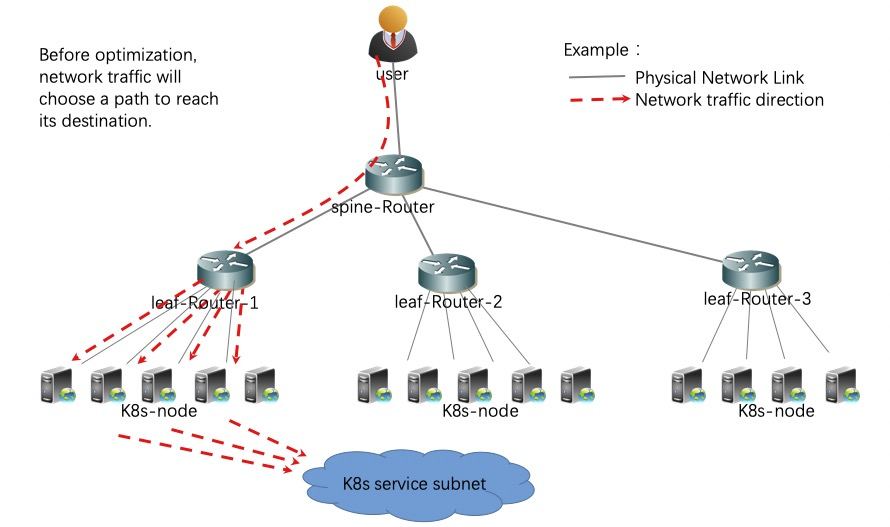
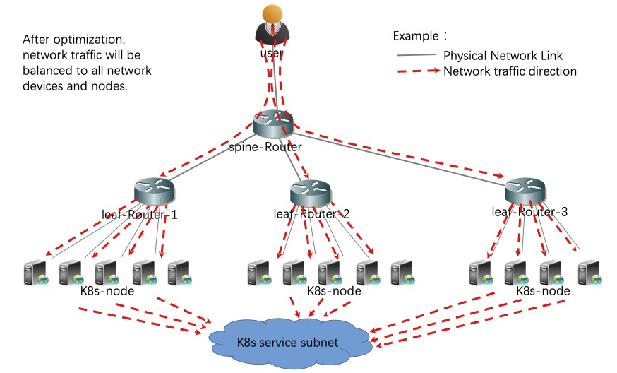

**How to optimize the neighborhood relationship and reduce the number of routes through kube-router in order to support the BGP network of large kubernetes cluster?**
 
 
 

**1 Contrast before and after enabling ECMP function of network equipment**
 
 
**1.1 Network traffic flow before ECMP is enabled** 
Before optimization, network traffic will choose a path to reach its destination.
 
The network topology is as follows:

**1.2 Network traffic sharing after ECMP enabled** 
After optimization, network traffic will be balanced to all network devices and nodes.
 
The network topology is as follows:

 

**2 How to enable BGP ECMP for network devices?** 

Taking the router equipment of the mainstream network manufacturer as an example, this paper briefly introduces how the router equipment can turn on the equivalent routing load balancing of BGP ECMP.

**2.1 Cisco Network Equipment Configuration BGP ECMP** 
可以使用下面的命令来开启EBGP ECMP：
<table><tr><td bgcolor=#000000>
[config-Router] config terminal 
[config-Router] bgp 64558 
[config-Router] maximum-paths 32 
</td></tr></table>

可以使用下面的命令来开启IBGP ECMP：
<table><tr><td bgcolor=#000000>
[config-Router] config terminal 
[config-Router] bgp 64558 
[config-Router] maximum-paths ibgp 32 
</td></tr></table>

**2.2 Huawei Network Equipment Configuration BGP ECMP** 
可以使用下面的命令来开启EBGP ECMP：
<table><tr><td bgcolor=#000000>
[Router] system view 
[Router] bgp 64558 
[Router-bgp] ipv4-family unicast 
[Router-bgp-af-ipv4] maximum load-balancing ebgp 32 
</td></tr></table>

可以使用下面的命令来开启IBGP ECMP：
<table><tr><td bgcolor=#000000>
[Router] system view 
[Router] bgp 64558 
[Router-bgp] ipv4-family unicast 
[Router-bgp-af-ipv4] maximum load-balancing ibgp 32 
</td></tr></table>
 
 
